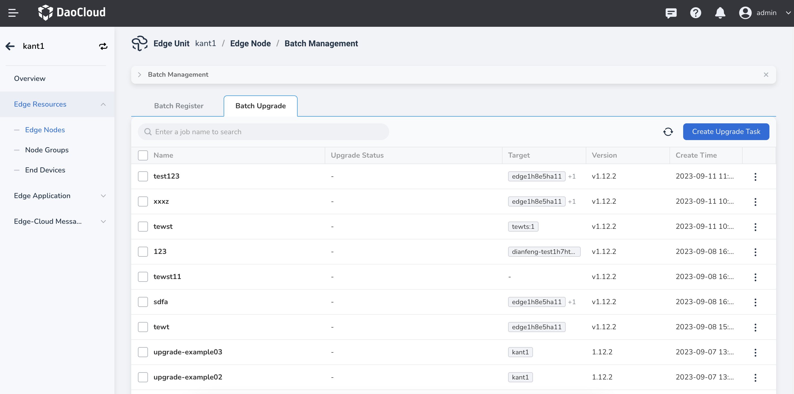
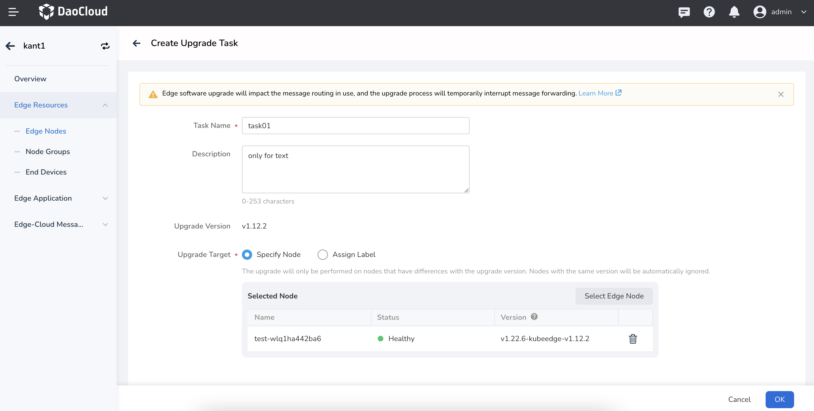

# Batch Upgrade Edge Nodes

The edge software installed on edge nodes, such as EdgeCore and MQTT, supports upgrades.
The platform periodically releases new versions, and you can upgrade their edge nodes according to their needs.

## Upgrade Instructions

- The selected nodes in the upgrade task will be uniformly upgraded to match the current CloudCore version of the cloud side.
  For example, if the current CloudCore version is 1.13 and the selected node versions are 1.12 and 1.14, the unified upgrade version will be 1.13.
- Only healthy nodes can be upgraded, including nodes in schedulable or unschedulable states.
- To ensure the stable and reliable operation of your edge node applications, it is recommended to
  perform node upgrades during a time window with minimal impact on your business.
- During the upgrade process, the application services on the edge nodes will not be interrupted.
  However, there may be temporary impacts if you are using message routing functionality.
- Avoid making changes to node configurations, such as restarting Docker or modifying network settings,
  during the upgrade process, as these actions may increase the risk of upgrade failures.

## Steps

1. On the Edge Node List page, click the `Batch Management` button to enter the `Batch Management` page.
   Select the `Batch Upgrade` tab and click the `Create Upgrade Task` button in the upper right corner.

    

    

2. Fill in the relevant parameters.

    - Task Name: The name of the batch upgrade task, which cannot be empty and has a length limit of 63 characters.
    - Description: Description of the batch upgrade task.
    - Upgrade Version: The version to upgrade to, which should match the current CloudCore version.
    - Upgrade Targets: The nodes to be upgraded, which can be specific nodes or nodes matched by labels.

    > Note: The upgrade will only be performed on nodes that have a version difference from the upgrade version. Nodes with the same version as the upgrade version will be automatically ignored.

    

## Node Upgrade Status

- Upgrading: The node is currently undergoing the upgrade operation.
- Upgrade Successful: The node has completed the upgrade operation and successfully upgraded to match
  the current CloudCore version.
- Upgrade Failed, Rollback Failed: The node upgrade failed, and the automatic rollback to the previous version also failed.
  In this case, you need to troubleshoot the failure reasons, check component logs (such as EdgeCore), and take manual actions to resolve the issue.
- Upgrade Failed, Rollback Successful: The node upgrade failed, but the system successfully rolled back to the previous version.
  You can review the failure reasons, address the issues, and then attempt the upgrade operation again.
