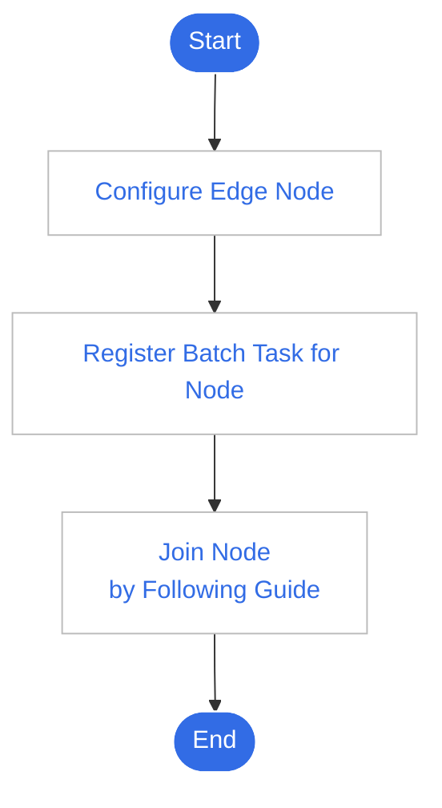

# Overview of Edge Nodes

Edge nodes are the fundamental elements of a container cluster. They can be either
cloud virtual machines or physical machines that serve as the platform for running containerized applications.

Edge applications run on the nodes in the form of Pods.

To manage edge nodes, the following steps need to be completed:

1. Prepare and configure the edge nodes. The edge nodes need to meet specific requirements,
   which can be found in the [Edge Node Access Requirements](./join-rqmt.md).

2. Create an access guide in the Cloud-Edge Collaboration module to obtain the edge node configuration file and installation program. For details, please refer to [Creating an Access Guide](./create-access-guide.md).

3. Follow the installation guide to complete the onboarding operation for the edge nodes. For details, please refer to [Edge Node Onboarding](./access-guide.md).

The usage workflow is as follows:

