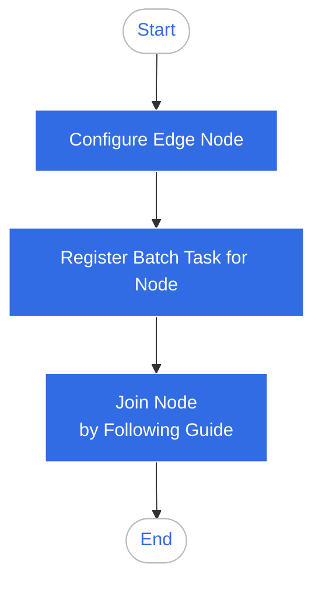

# Overview of Edge Nodes

Edge nodes are the fundamental elements of a container cluster. They can be either
cloud virtual machines or physical machines that serve as the platform for running containerized applications.

Edge applications run on the nodes in the form of Pods.

To manage edge nodes, the following steps need to be completed:

1. Prepare and configure the edge nodes. The edge nodes need to meet specific requirements,
   which can be found in the [Edge Node Access Requirements](./join-rqmt.md).

2. Create a batch task for registering the edge nodes in the cloud-edge coordination module to
   obtain the installation guide. For detailed instructions, refer to
   [Batch Registration of Edge Nodes](./batch-registration.md).

3. Follow the installation guide to obtain the installation tool and configuration files for the edge nodes,
   and complete the process of connecting and managing the edge nodes. For more details,
   see [Managing Edge Nodes](./managed-node.md).

The usage workflow is as follows:

