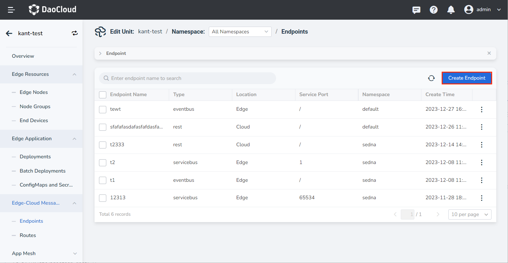
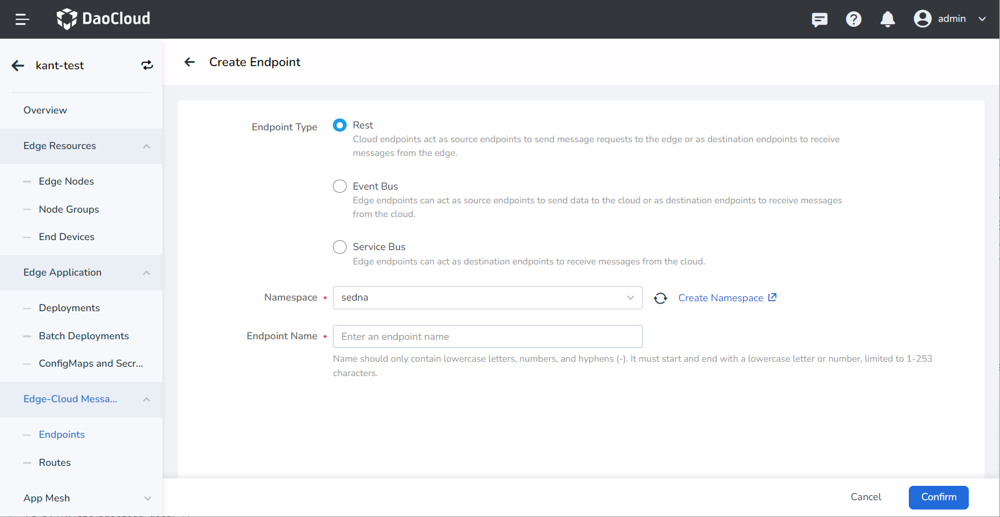
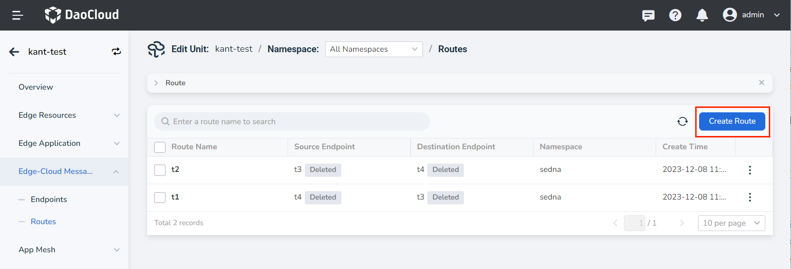
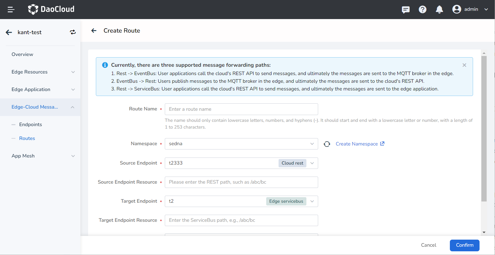
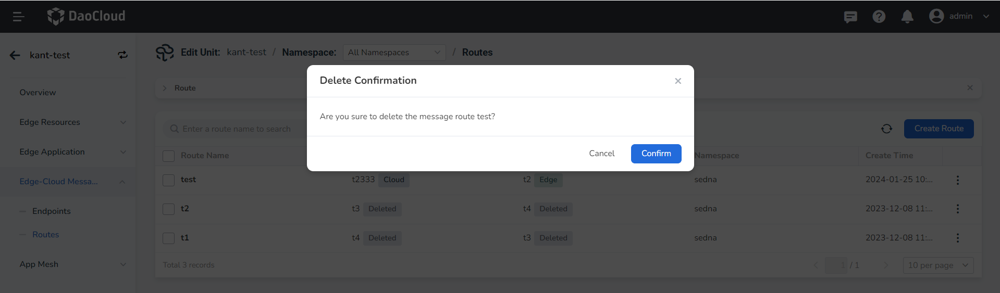

# Create Message Routes

This article describes the steps to create endpoints, routes, and delete routes.

## Create Endpoints

Follow these steps:

1. Go to the __Edge Unit__ details page and select the left-side menu __Edge-Cloud Message__ -> __Endpoints__ .

2. Click the __Create Endpoints__ button in the upper right corner of the message endpoint list.

    

3. Fill in the relevant parameters.

    - Endpoint Type: Select the type, which can be Rest (Cloud-side endpoint), Event Bus (Edge-side endpoint), or Service Bus (Edge-side endpoint).
    - Namespace: The namespace where the message endpoint is located.
    - Endpoint Name: Enter a name for the message endpoint.
    - Service Port: Only applicable to Service Bus type edge endpoints. Range: 1-65535.

4. Click __OK__ to create the message endpoint successfully and return to the message endpoint list page.

    

## Create Routes

Follow these steps:

1. Go to the __Edge Unit__ details page and select the left-side menu __Edge-Cloud Message__ -> __Routes__ .

2. Click the __Create Route__ button in the upper right corner of the message route list.

    

3. Fill in the relevant parameters.

    - Route Name: Enter a name for the message route.
    - Namespace: The namespace where the message route is located.
    - Source Endpoint: Select the source endpoint, which comes from the created message endpoints.
    - Source Endpoint Resource:
        - For Cloud Rest type source endpoint, enter the REST path, such as /abc/bc.
        - For Edge Event Bus type source endpoint, enter the topic, which consists of letters, numbers, underscores (_), hyphens (-), and slashes (/).
    - Target Endpoint: Select the target endpoint, which comes from the created message endpoints.
    - Target Endpoint Resource:
        - For Cloud Rest type target endpoint, enter the URL, such as http://127.0.0.1:8080/hello.
        - For Edge Service Bus type target endpoint, enter the Service Bus path, such as /abc/bc.

    

4. Click __OK__ to create the route rule successfully and return to the message route list page.

After creating the route rule, the system will forward messages sent to the specified resource of the source endpoint according to the corresponding rule to the specified resource of the target endpoint.

## Delete Routes

Follow these steps:

1. Go to the __Edge Unit__ details page and select the left-side menu __Edge-Cloud Message__ -> __Routes__ .

2. Click the __Remove__ button on the right side of the specific message route.

3. Click __Confirm__ to delete it successfully and return to the message route list page.

    
