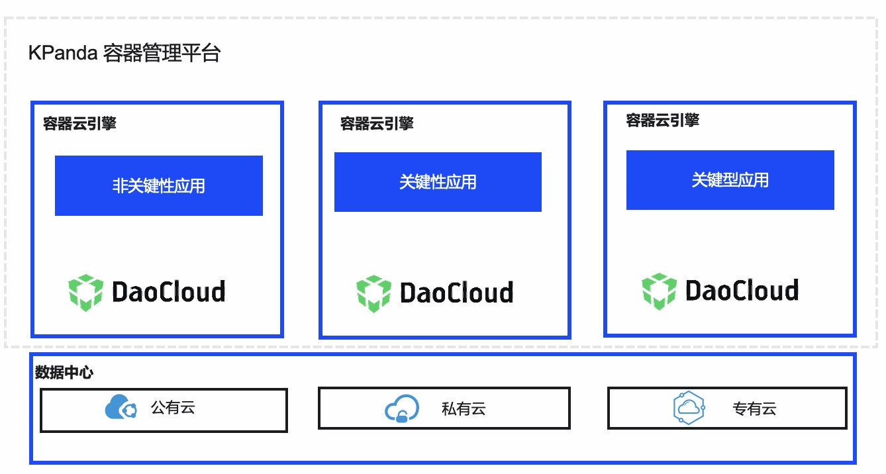
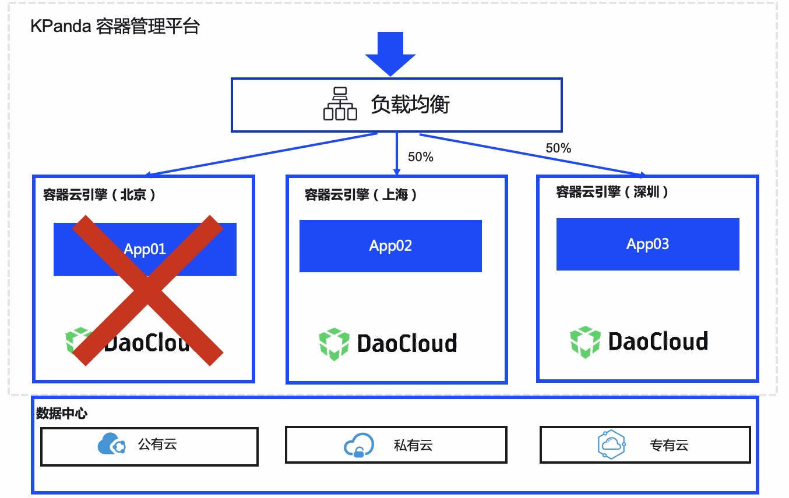
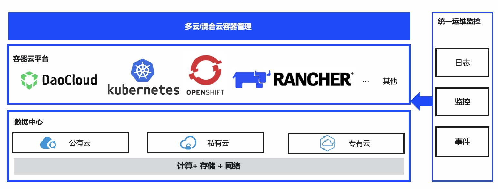

# Applicable scene

## Application multicloud deployment and cross-cloud disaster recovery

**Multicloud combined deployment**

According to the combination of cloud platforms with different cost performance, combined with different application scenarios, multicloud combination is carried out to reduce the overall cost. For industry users with high security requirements such as finance, based on the security and sensitivity requirements of business data, some business applications are deployed in the private cloud environment, while non-sensitive applications are deployed in cloud clusters for unified management .

**Cross-cloud disaster recovery backup**

In order to ensure high availability of services, services are deployed on multiple cloud container platforms in different regions at the same time, helping applications realize multi-region traffic distribution, and realizing cross-cloud application management on the same platform, reducing operation and maintenance costs. In addition, when a cloud container platform fails, business traffic is automatically switched to other cloud container platforms through a unified traffic distribution mechanism.

## Unified management across cloud clusters

**Cross-cloud cluster unified management**

Whether based on different infrastructure environments (public cloud, private cloud, and hybrid cloud), or Kubernetes platforms built by different container cloud vendors, the container management platform can be managed in a unified manner.

Reduce additional management costs caused by different infrastructures and different cloud providers, unify the management process, and reduce costs.

**Unified operation and maintenance across cloud clusters**

Different cloud container providers provide customers with different cloud platform monitoring based on different Kubernetes distributions. It is difficult to realize unified platform monitoring and operation and maintenance. Cluster-based unified management realizes integrated monitoring services, and realizes multi-dimensional, cross-cloud unified monitoring and operation and maintenance.

## Elastic scaling to deal with traffic peaks

**Cluster elastic expansion and contraction**

To deal with traffic peaks for enterprise customers, when the resources of the Kubernetes container platform where business applications are deployed have reached the threshold, it is necessary to combine the underlying IaaS elastic expansion and contraction capabilities to automatically expand and shrink cluster nodes, so as to cope with business peaks with large traffic volumes, and to deal with business troughs Periodic capacity reduction to save costs.

**Elastic expansion and contraction of applications**

E-commerce customers encounter double 11 and other promotions, time-limited flash sales and other activities, and the business visits increase rapidly. It is necessary to expand the application computing resources in time, and automatically adjust according to the expansion and contraction policies set by the user. The number of business container groups increases with the business visits. It increases with the rise, and decreases with the decline of business visits.