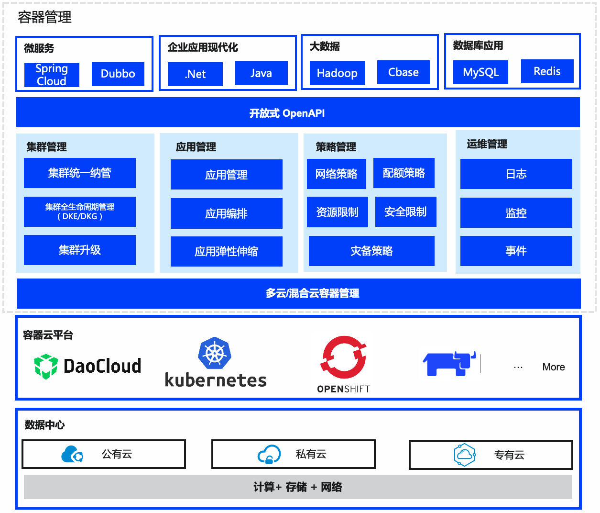

# What is Container Management (Kpanda)？

Container Management (Kpanda) is a container management platform for cloud-native applications built on Kubernetes. Based on the native multi-cluster architecture, it decouples the underlying infrastructure platform, unifies multi-cloud and multi-cluster management, simplifies the migration of enterprise applications to cloud, and reduces operation and human cost.
It facilitates the creation of Kubernetes clusters and helps enterprises quickly build enterprise-class container cloud platforms. The main features of Kpanda are as follows:

**Cluster management**

- Provide a single window to manage all versions of Kubernetes clusters, and unify management of container platforms on  any  environment, including on-premises, single cloud, multi-cloud, and hybrid cloud.

- Rapid deployment allows to quickly deploy enterprise-class Kubernetes clusters through the Web interface. It enables the rapid development of enterprise-class container cloud platforms which are compatible with the underlying physical machines and virtual machines.

- Provide one-click upgrade for clusters and Kubernetes versions, and unified upgrade management of components.

- High availability are achieved through built-in cluster disaster recovery and backup. It ensures that business systems can recover in case of host failure, server outages, natural disasters, etc., improving the stability of the production environment and minimizing the risk of business interruption.

- Full lifecycle management of clusters provides the full lifecycle management of self-built cloud native clusters.

- Open API provides native Kubernetes OpenAPI capabilities.

**Application management**

- One-stop deployment decouples the underlying Kubernetes platform. One-stop deployment and operation of applications provides full lifecycle management of applications.

- Workload scaling allows manual/automatic workload scaling through the interface, and custom scaling policies to cope with traffic peaks.

- Full lifecycle of applications supports management of full lifecycle (such as view, update, delete, rollback, time view, and upgrade).

- Manage cross-cluster workloads on a single platform.

**Policy management**

Support namespace or cluster-level policies for network, quota, resource limit, disaster recovery, and security.

- Network policy supports configuring network policies at namespace or cluster level to restrict the rules of communication between container groups and network "entities".

- Quota policy supports configuring quota policies at namespace or cluster level to limit the use of resources in namespaces.

- Resource limit policy supports configuring resource limit policies at namespace or cluster level to restrict the use of resources by applications in the corresponding namespace.

- Disaster recovery policy supports configuring disaster recovery policies at namespace or cluster level to realize disaster recovery and backup at namespace level, ensuring clusters' security.

- Security policy supports configuring disaster recovery policies at namespace or cluster level, and defining different isolation levels for Pods.

**Product logical architecture**

[[Free Trial Now](../../dce/license0.md){ .md-button .md-button--primary }
