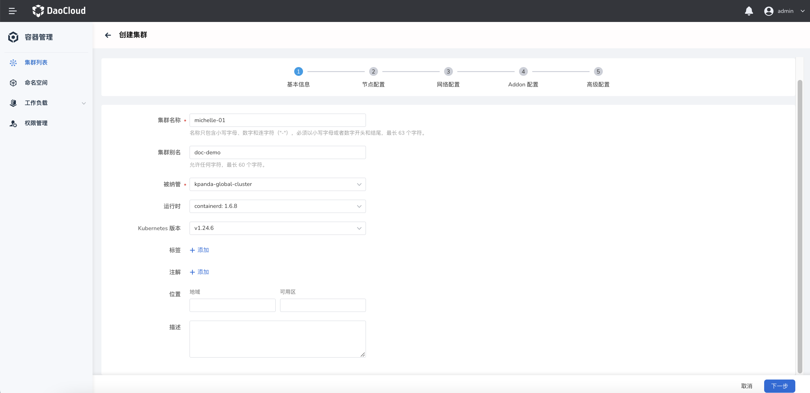
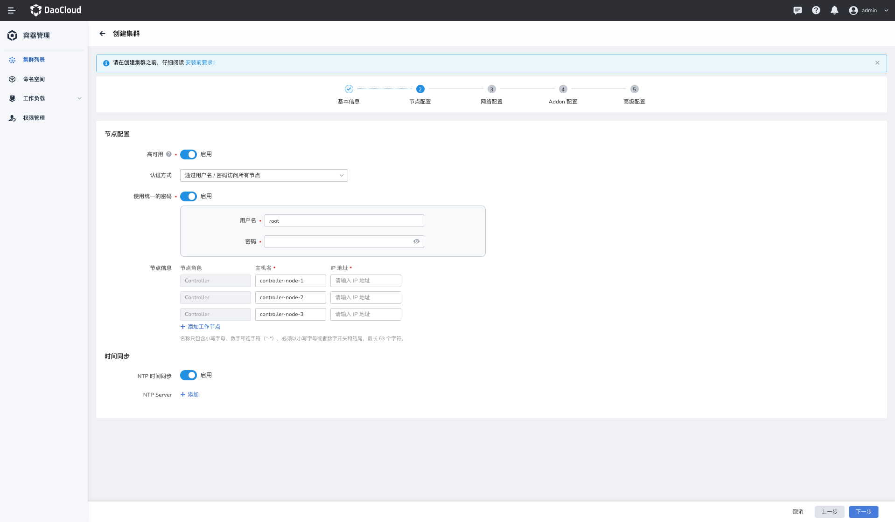
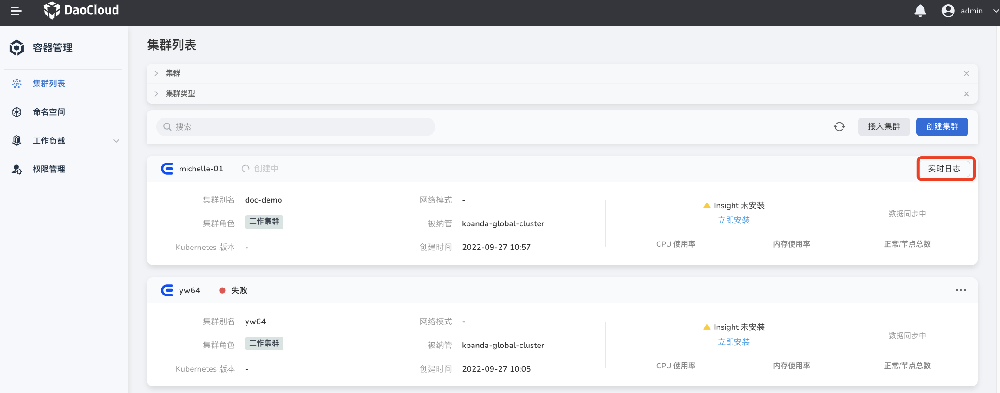

# Create worker cluster

In the DCE 5.0 container management module, [cluster role] (./ClusterRole.md#cluster role) is divided into four categories: global service cluster, management cluster, working cluster, and access cluster. Among them, the access cluster can only be accessed from third-party vendors, see [Join ACluster](JoinACluster.md).

This page describes how to create a worker cluster.

## prerequisites

Certain prerequisites must be met before creating a cluster:

- Kubernetes 1.21+
- The destination host needs to allow IPv4 forwarding. If the Pod and Service are using IPv6, the destination server needs to allow IPv6 forwarding.
- DCE does not provide the firewall management function for now, you need to pre-define the firewall rules of the target host by yourself. To avoid problems during cluster creation, it is recommended to disable the firewall of the target host.
- If running as a non-root user, pre-elevate the user on the target hosts and make sure the username and password are the same on all target hosts.

## Steps

1. On the `Cluster List` page, click the `Create Cluster` button.

    

2. Fill in the basic information of the cluster and click `Next`.

    

3. Fill in the node configuration information and click `Next`.

    - If you use SSH keys to connect to all nodes of the cluster to be created, you need to pre-configure node SSH keys. See [Authenticating Nodes Using SSH Keys](../Nodes/NodeConfig.md).
    - If high availability is enabled, the default controller node is 3;
    - If high availability is turned off, the default controller node is 1;
    - It is recommended to use high availability mode in production environment.

        

4. Fill in the network configuration information and click `Next`.

    

5. Fill in the plug-in configuration information and click `Next`.

    

6. Fill in the advanced configuration information and click `OK`.

    - `kubelet_max_pods`: Set the maximum number of Pods per node, the default is 110.
    - `hostname_overide`: Reset the hostname, it is recommended to use the default value, and use the name generated by the system as the hostname by default.
    - `kubernetes_audit`: Kubernetes audit log, enabled by default.
    - `auto_renew_certificate`: Automatically renew the Kubernetes control plane certificate on the first Monday of each month, enabled by default.
    - `disable_firewalld&ufw`: Disable the firewall to prevent the node from being inaccessible during the installation.
    - `Insecure_registries`: Private container registry configuration. When using a private image registry to create a cluster, in order to avoid certificate issues causing the container engine to deny access, you need to fill in the address of the private image registry here to bypass the certificate authentication of the container engine and obtain the image.

        

## Complete creation

After filling in the correct information and completing the above steps, the page will prompt that the cluster is being created.

!!! note

    Creating a cluster takes a long time, so you need to wait patiently. In the meantime, you can click the `Back to Cluster List` button to return to the cluster list page and wait for the cluster creation to complete.
    To view the current status, click `Real-time Log`.

