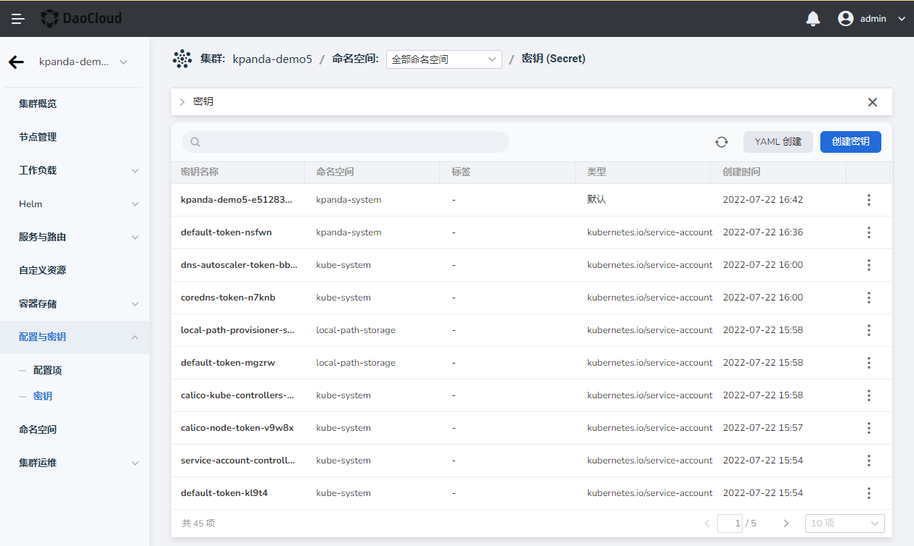
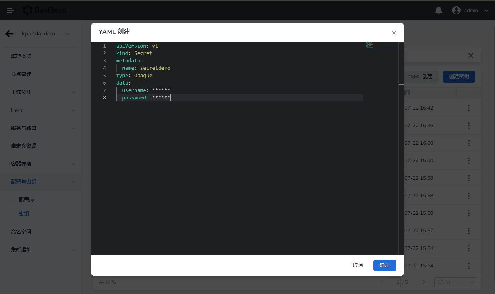

# Create key

A secret is a resource object used to store and manage sensitive information such as passwords, OAuth tokens, SSH, TLS credentials, etc. Using keys means you don't need to include sensitive secrets in your application code.

Key usage scenarios:

- Used as an environment variable of the container to provide some necessary information required during the running of the container.
- Use secrets as pod data volumes.
- As the identity authentication credential for the container registry when the kubelet pulls the container image.

Two creation methods are supported:

- Graphical creation
- Created via YAML

## prerequisites

- Container management platform [connected to Kubernetes cluster](../Clusters/JoinACluster.md) or [created Kubernetes cluster](../Clusters/CreateCluster.md), and can access the UI interface of the cluster

- A [Namespace Creation](../Namespaces/createtens.md), [User Creation](../../../ghippo/04UserGuide/01UserandAccess/User.md) has been completed, and the user Authorization is the [`NS Edit`](../Permissions/PermissionBrief.md#ns-edit) role, for details, please refer to [Namespace Authorization](../Permissions/Cluster-NSAuth.md)

### Graphical creation

1. Click the name of a cluster on the `Cluster List` page to enter `Cluster Details`.

    

2. In the left navigation bar, click `Configuration and Key` -> `Key`, and click the `Create Key` button in the upper right corner.

    

3. Fill in the configuration information on the `Create Key` page, and click `OK`.

    

    Note when filling in the configuration:

    - The name of the key must be unique within the same namespace
    - Key type:
        - Default (Opaque): Kubernetes default key type, which supports arbitrary data defined by users.
        - TLS (kubernetes.io/tls): credentials for TLS client or server data access.
        - container registry information (kubernetes.io/dockerconfigjson): Credentials for container registry access.
        - username and password (kubernetes.io/basic-auth): Credentials for basic authentication.
        - Custom: the type customized by the user according to business needs.
    - Key data: the data stored in the key, the parameters that need to be filled in are different for different data
        - When the key type is default (Opaque)/custom: multiple key-value pairs can be filled in.
        - When the key type is TLS (kubernetes.io/tls): you need to fill in the certificate certificate and private key data. Certificates are self-signed or CA-signed credentials used for authentication. A certificate request is a request for a signature and needs to be signed with a private key.
        - When the key type is container registry information (kubernetes.io/dockerconfigjson): you need to fill in the account and password of the private container registry.
        - When the key type is username and password (kubernetes.io/basic-auth): Username and password need to be specified.

### Created via YAML

1. Click the name of a cluster on the `Cluster List` page to enter `Cluster Details`.

    

2. In the left navigation bar, click `Configuration and Key`->`Key`, and click the `YAML Create` button in the upper right corner.

    

3. Fill in the YAML configuration on the `YAML Creation` page, and click `OK`.

    

    **Example key:**

    ```yaml
    apiVersion: v1
    kind: Secret
    metadata:
      name: secretdemo
    type: Opaque
    data:
      username: ****
      password: ****
    ```

Next step: [use-secret](use-secret.md).