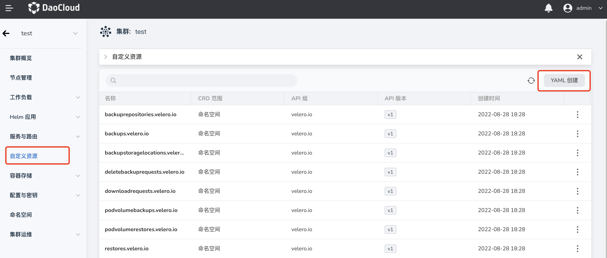
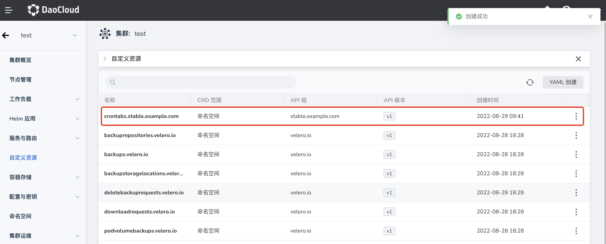
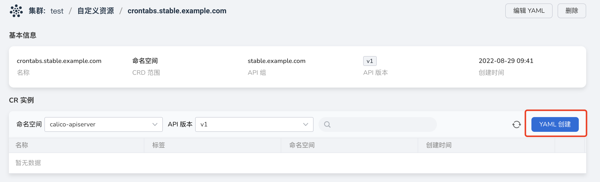
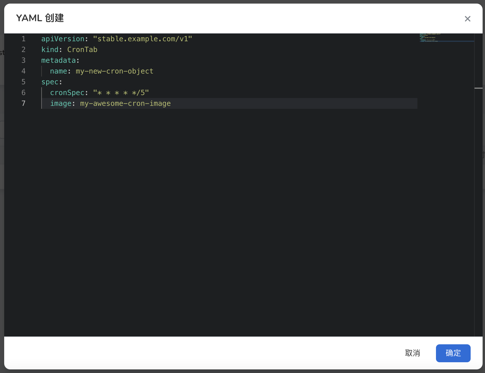

# Create Custom Resource (CRD)

In Kubernetes, all objects are abstracted as resources, such as Pod, Deployment, Service, Volume, etc. are the default resources provided by Kubernetes.
This provides important support for our daily operation and maintenance and management work, but in some special scenarios, the existing preset resources cannot meet the needs of the business.
Therefore, we hope to expand the capabilities of the Kubernetes API, and CustomResourceDefinition (CRD) was born based on this requirement.

The container management platform supports interface-based management of custom resources, and its main functions are as follows:

- Obtain the list and detailed information of custom resources under the cluster
- Create custom resources based on YAML
- Create a custom resource example CR (Custom Resource) based on YAML
- Delete custom resources

## Prerequisites

- Container management platform [connected to Kubernetes cluster](../Clusters/JoinACluster.md) or [created Kubernetes](../Clusters/CreateCluster.md), and can access the UI interface of the cluster

- A [namespace creation](../Namespaces/createtens.md), [user creation](../.../../../../ghippo/04UserGuide/01UserandAccess/User.md), and authorize the user as [`Cluster Admin`](../Permissions/PermissionBrief.md#cluster-admin) role, for details, please refer to [Namespace Authorization](../Permissions/Cluster-NSAuth.md )

## Create custom resources via YAML

1. Click on a cluster name to enter `Cluster Details`.

    

2. In the left navigation bar, click `Custom Resource`, and click the `Create with YAML` button in the upper right corner.

    

3. On the `Create with YAML` page, fill in the YAML statement and click `OK`.

    

4. Return to the custom resource list page, and you can view the custom resource named `crontabs.stable.example.com` just created.

    

**Custom resource example:**

```yaml
apiVersion: apiextensions.k8s.io/v1
kind: CustomResourceDefinition
metadata:
  name: crontabs.stable.example.com
spec:
  group: stable.example.com
  versions:
    - name: v1
      served: true
      storage: true
      schema:
        openAPIV3Schema:
          type: object
          properties:
            spec:
              type: object
              properties:
                cronSpec:
                  type: string
                image:
                  type: string
                replicas:
                  type: integer
  scope: Namespaced
  names:
    plural: crontabs
    singular: crontab
    kind: CronTab
    shortNames:
    - ct
```

## Create a custom resource example via YAML

1. Click on a cluster name to enter `Cluster Details`.

    

2. In the left navigation bar, click `Custom Resource`, and click the `Create with YAML` button in the upper right corner.

    

3. Click the custom resource named `crontabs.stable.example.com`, enter the details, and click the `Create with YAML` button in the upper right corner.

    

4. On the `Create with YAML` page, fill in the YAML statement and click `OK`.

    

5. Return to the details page of `crontabs.stable.example.com`, and you can view the custom resource named `my-new-cron-object` just created.

**CR Example:**

```yaml
apiVersion: "stable.example.com/v1"
kind: CronTab
metadata:
  name: my-new-cron-object
spec:
  cronSpec: "* * * * */5"
  image: my-awesome-cron-image
```