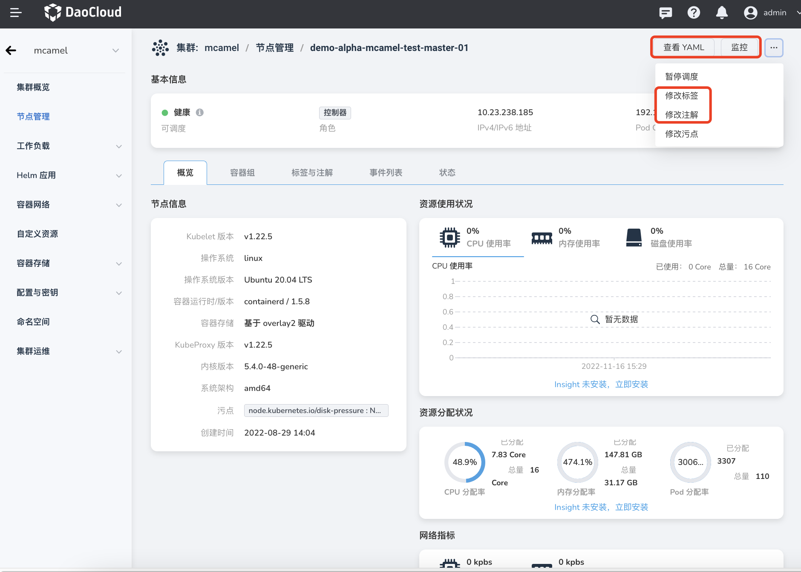

---
hide:
  - toc
---

# Node details

After accessing or creating a cluster, you can view the information of each node in the cluster, including node status, labels, resource usage, Pod, monitoring information, etc.

1. On the `Cluster List` page, click the name of the target cluster.

    

2. Click `Node Management` on the left navigation bar to view the node status, role, label, CPU/memory usage, IP address, and creation time.

    

3. Click the node name to enter the node details page to view more information, including overview information, container group information, label annotation information, event list, status, etc.

    

    In addition, you can also view the node's YAML file, monitoring information, labels and annotations, etc.

    