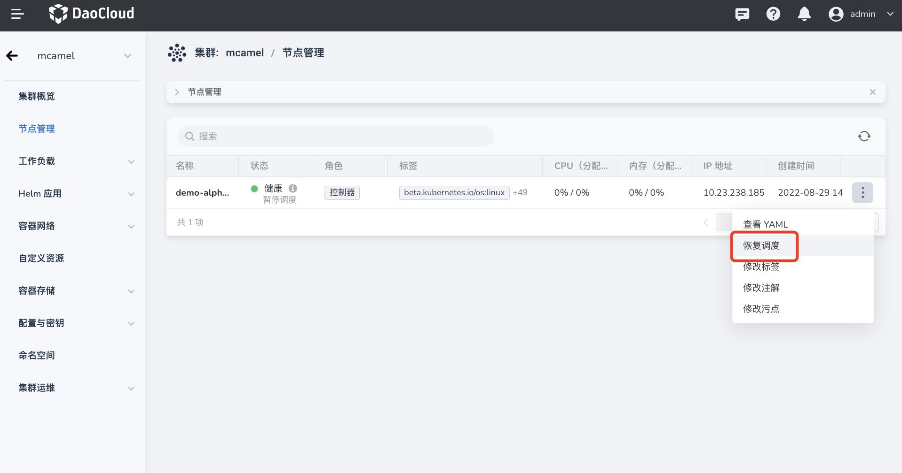

---
hide:
  - toc
---

# Node scheduling

Supports suspending or resuming scheduling of nodes. Pausing scheduling means stopping the scheduling of Pods to the node. Resuming scheduling means that Pods can be scheduled to that node.

1. On the `Cluster List` page, click the name of the target cluster.

    

2. Click `Node Management` on the left navigation bar, click the `ⵗ` operation icon on the right side of the node, and click the `Pause Scheduling` button to suspend scheduling the node.

    

3. Click the `ⵗ` operation icon on the right side of the node, and click the `Resume Scheduling` button to resume scheduling the node.

    

The node scheduling status may be delayed due to network conditions. Click the refresh icon on the right side of the search box to refresh the node scheduling status.

