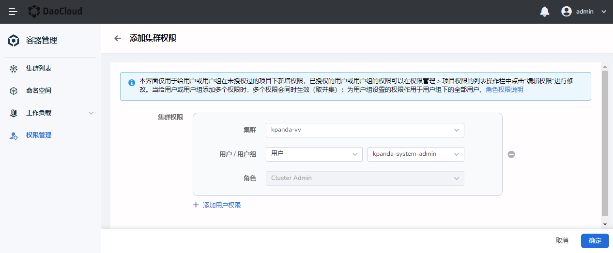
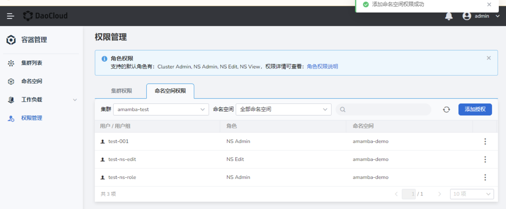

# Cluster and Namespace Authorization

Container management implements authorization based on global authority management and global user/user group management. If you need to grant users the highest authority for container management (you can create, manage, and delete all clusters), please refer to [What are users and access control](.. /../../ghippo/04UserGuide/01UserandAccess/iam.md).

## Prerequisites

Before authorizing users/user groups, complete the following preparations:

- The user/user group to be authorized has been created in the global management, please refer to [User](../../../ghippo/04UserGuide/01UserandAccess/User.md).

- Only [`Kpanda Owner`](../../../ghippo/04UserGuide/01UserandAccess/global.md) and [`Cluster Admin`](PermissionBrief.md#cluster-admin) of the current cluster have cluster authorization ability. For details, please refer to [Permission Description](PermissionBrief.md).

- Only [`Kpanda Owner`](../../../ghippo/04UserGuide/01UserandAccess/global.md), [`Cluster Admin`](PermissionBrief.md#cluster-admin) for the current cluster, currently named The [`NS Admin`](PermissionBrief.md#ns-admin) of the space has the namespace authorization capability.

## Cluster Authorization

1. After the user logs in to the platform, click `Privilege Management` under `Container Management` on the left menu bar, which is located on the `Cluster Permissions` tab by default.

    

2. Click the `Add Authorization` button.

    

3. On the `Add Cluster Permission` page, select the target cluster, the user/user group to be authorized, and click `OK`.

    At present, the only supported cluster role is `Cluster Admin`. For details about permissions, please refer to [Permission Description](PermissionBrief.md). If you need to authorize multiple users/user groups at the same time, you can click `Add User Permissions` to add multiple times.

    

4. Return to the cluster permission management page, and a message appears on the screen: `Cluster permission added successfully`.

    

## Namespace Authorization

1. After the user logs in to the platform, click `Privilege Management` under `Container Management` on the left menu bar, and click the `Namespace Permissions` tab.

    

2. Click the `Add Authorization` button. On the `Add Namespace Permission` page, select the target cluster, target namespace, and user/user group to be authorized, and click `OK`.

    The currently supported namespace roles are NS Admin, NS Edit, and NS View. For details about permissions, please refer to [Permission Description](PermissionBrief.md). If you need to authorize multiple users/user groups at the same time, you can click `Add User Permission` to add multiple times. Click `OK` to complete the permission authorization.

    

3. Return to the namespace permission management page, and a message appears on the screen: `Cluster permission added successfully`.

    

    !!! tip

        If you need to delete or edit permissions later, you can click `⋮` on the right side of the list and select `Edit` or `Delete`.

        