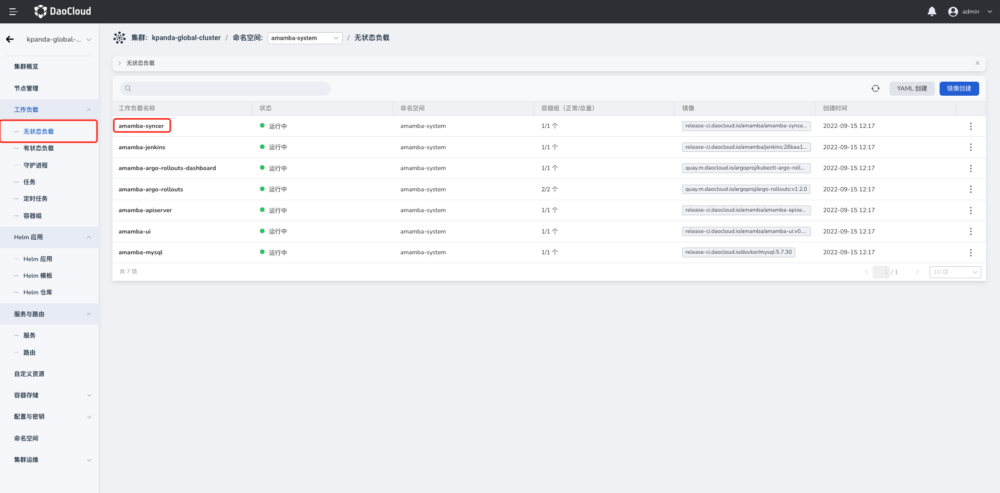
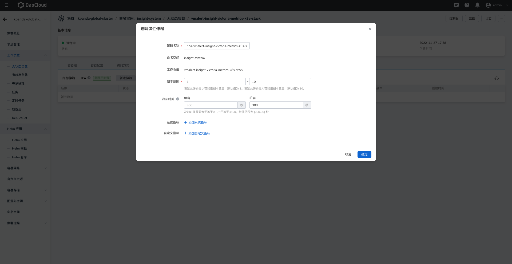

# Horizontal Pod Autoscaling (HPA)

DaoCloud Enterprise 5.0 supports elastic scaling of Pod resources based on indicators (Horizontal Pod Autoscaling, HPA).
Users can dynamically adjust the number of copies of Pod resources by setting CPU utilization, memory usage, and custom indicators.
For example, after setting an auto scaling policy based on the CPU utilization indicator for the workload, when the CPU utilization of the Pod exceeds/belows the indicator threshold you set, the workload controller will automatically increase/decrease the number of Pod replicas.

This article describes how to configure auto scaling based on built-in metrics and custom metrics for workloads.

!!! note

     1. HPA is only applicable to Deployment and StatefulSet, and only one HPA can be created per workload.
     2. If you create an HPA policy based on CPU utilization, you must set the configuration limit (Limit) for the workload in advance, otherwise the CPU utilization cannot be calculated.
     3. If built-in indicators and multiple custom indicators are used at the same time, HPA will calculate the number of scaling copies required based on multiple indicators, and take the larger value (but not exceed the maximum number of copies configured when setting the HPA policy) for elastic scaling .

## Built-in indicator elastic scaling strategy

The system has two built-in elastic scaling indicators of CPU and memory to meet users' basic business usage scenarios.

### Prerequisites

Before configuring the built-in index auto scaling policy for the workload, the following prerequisites need to be met:

- The container management platform [has joined the Kubernetes cluster](../Clusters/JoinACluster.md) or [has created the Kubernetes cluster](../Clusters/CreateCluster.md), and can access the UI interface of the cluster.

- A [Creation of a Namespace](../Namespaces/createtens.md), a [Creation of a Stateless Workload](../Workloads/CreateDeploymentByImage.md), or a [Creation of a Stateful Workload](. ./Workloads/CreateStatefulSetByImage.md).

- The current operating user should have [`NS Edit`](../Permissions/PermissionBrief.md#ns-edit) or higher permissions, please refer to [Namespace Authorization](../Namespaces/createns.md) for details.

- Completed [`metrics-server plugin install`](Install-metrics-server.md).

### Steps

Refer to the following steps to configure the built-in index auto scaling policy for the workload.

1. Click `Cluster List` on the left navigation bar to enter the cluster list page. Click on a cluster name to enter the `Cluster Details` page.

     

2. On the cluster details page, click `Workload` in the left navigation bar to enter the workload list, and then click a workload name to enter the `Workload Details` page.

     

3. Click the Auto Scaling tab to view the auto scaling configuration of the current cluster.

     

4. After confirming that the cluster has [installed the `metrics-server` plug-in](Install-metrics-server.md), and the plug-in is running normally, you can click the `New Scaling` button.

     

5. Create custom indicator auto scaling policy parameters.

     

     - Policy name: Enter the name of the auto scaling policy. Please note that the name can contain up to 63 characters, and can only contain lowercase letters, numbers, and separators ("-"), and must start and end with lowercase letters or numbers, such as hpa- my-dep.
     - Namespace: The namespace where the payload resides.
     - Workload: The workload object that performs auto scaling.
     - Target CPU Utilization: The CPU usage of the Pod under the workload resource. The calculation method is: the request (request) value of all Pod resources/workloads under the workload. When the actual CPU usage is greater/lower than the target value, the system automatically reduces/increases the number of Pod replicas.
     - Target Memory Usage: The memory usage of the Pod under the workload resource. When the actual memory usage is greater/lower than the target value, the system automatically reduces/increases the number of Pod replicas.
     - Replica range: the elastic scaling range of the number of Pod replicas. The default interval is 1 - 10.

6. After completing the parameter configuration, click the `OK` button to automatically return to the elastic scaling details page. Click `⋮` on the right side of the list to edit, delete, and view related events.

     

## Custom indicator elastic scaling strategy

When the built-in CPU and memory indicators of the system cannot meet the actual needs of your business, you can configure ServiceMonitoring to add custom indicators, and achieve elastic scaling based on the custom indicators.

### Prerequisites

Before configuring a custom index auto scaling policy for a workload, the following prerequisites must be met:

- The container management platform [has joined the Kubernetes cluster](../Clusters/JoinACluster.md) or [has created the Kubernetes cluster](../Clusters/CreateCluster.md), and can access the UI interface of the cluster.

- A [Creation of a Namespace](../Namespaces/createtens.md), a [Creation of a Stateless Workload](../Workloads/CreateDeploymentByImage.md), or a [Creation of a Stateful Workload](. ./Workloads/CreateStatefulSetByImage.md).

- The current operating user should have [`NS Edit`](../Permissions/PermissionBrief.md#ns-edit) or higher permissions, please refer to [Namespace Authorization](../Namespaces/createns.md) for details.

- Completed [`metrics-server plugin install`](Install-metrics-server.md).
- Installation of the Insight plug-in is complete.
- The installation of the Prometheus-adapter plugin has been completed.

### Steps

Refer to the following steps to configure an index auto-scaling policy for a workload.

1. Click `Cluster List` on the left navigation bar to enter the cluster list page. Click on a cluster name to enter the `Cluster Details` page.

     

2. On the cluster details page, click `Workload` in the left navigation bar to enter the workload list, and then click a workload name to enter the `Workload Details` page.

     

3. Click the Auto Scaling tab to view the auto scaling configuration of the current cluster.

     
4. After confirming that the cluster has [`metrics-server`](Install-metrics-server.md), Insight, and Prometheus-adapter plug-ins installed and the plug-ins are running normally, click the `New Scaling` button.

!!! note

     If the relevant plug-in is not installed or the plug-in is in an abnormal state, you will not be able to see the creation of custom metrics auto scaling entry on the page.

     
5. Create custom indicator auto scaling policy parameters.

     

     - Policy name: Enter the name of the auto scaling policy. Please note that the name can contain up to 63 characters, and can only contain lowercase letters, numbers, and separators ("-"), and must start and end with lowercase letters or numbers, such as hpa- my-dep.
     - Namespace: The namespace where the payload resides.
     - Workload: The workload object that performs auto scaling.
     - Resource type: A custom indicator type for monitoring, including Pod and Service.
     - Metrics: custom metric names created using ServiceMonitoring or custom metric names built into the system.
     - Data type: the method used to calculate the indicator value, including target value and target average value. When the resource type is Pod, only the target average value is supported.