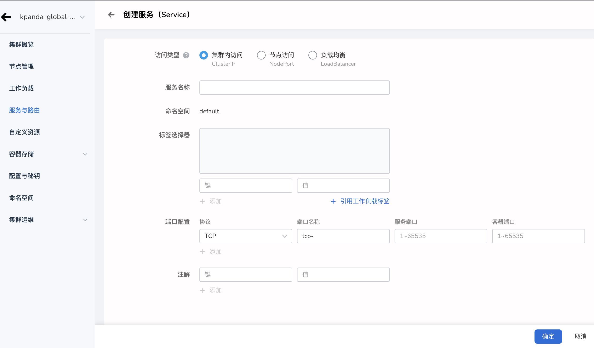

# Create a service (Service)

In a Kubernetes cluster, each Pod has an internal independent IP address, but Pods in the workload may be created and deleted at any time, and directly using the Pod IP address cannot provide external services.

This requires creating a service through which you get a fixed IP address, decoupling the front-end and back-end of the workload, and allowing external users to access the service. At the same time, the service also provides the Load Balancer function, enabling users to access workloads from the public network.

## Prerequisites

- Container management platform [connected to Kubernetes cluster](../Clusters/JoinACluster.md) or [created Kubernetes](../Clusters/CreateCluster.md), and can access the cluster UI interface.

- A [Namespace Creation](../Namespaces/createtens.md), [User Creation](../../../ghippo/04UserGuide/01UserandAccess/User.md) has been completed, and the user Authorization is the [`NS Edit`](../Permissions/PermissionBrief.md#ns-edit) role, for details, please refer to [Namespace Authorization](../Permissions/Cluster-NSAuth.md).

- When there are multiple containers in a single instance, please make sure that the ports used by the containers do not conflict, otherwise the deployment will fail.

### Create service

1. After successfully logging in as the `NS Edit` user, click `Cluster List` in the upper left corner to enter the `Cluster List` page. In the list of clusters, click a cluster name.

     

2. In the left navigation bar, click `Service and Routing` to enter the service list, and click the `Create Service` button in the upper right corner.

     

     !!! tip
    
         It is also possible to create a service via `YAML`.

3. Open the `Create Service` page, select an access type, and refer to the following three parameter tables for configuration.

     

#### Create a cluster access (ClusterIP) type service

Click `Intra-Cluster Access (ClusterIP)`, which refers to exposing services through the internal IP of the cluster. The services selected for this option can only be accessed within the cluster. This is the default service type. Refer to the configuration parameters in the table below.

| parameter | description | example value |
| ---------- | :------------------------------------- ---------------------- | :------- |
| Access type | `Type` Required `Meaning` Specify the method of Pod service discovery, here select intra-cluster access (ClusterIP). | ClusterIP |
| Service Name | `Type` Required `Meaning` Enter the name of the new service.  `Note` Please enter a string of 4 to 63 characters, which can contain lowercase English letters, numbers and dashes (-), and start with a lowercase English letter and end with a lowercase English letter or number. | Svc-01 |
| Namespace | `Type` Required `Meaning` Select the namespace where the new service is located. For more information about namespaces, please refer to [Namespace Overview](../Namespaces/createns.md).  `Note` Please enter a string of 4 to 63 characters, which can contain lowercase English letters, numbers and dashes (-), and start with a lowercase English letter and end with a lowercase English letter or number. | default |
| Label selector | `Type` Required `Meaning` Add a label, the Service selects a Pod according to the label, and click "Add" after filling. You can also refer to the label of an existing workload. Click `Reference workload label`, select the workload in the pop-up window, and the system will use the selected workload label as the selector by default. | app:job01 |
| Port configuration| `Type` Required `Meaning` To add a protocol port for a service, you need to select the port protocol type first. Currently, it supports TCP and UDP. For more information about the protocol, please refer to [Protocol Overview](../../../dce/what-is-dce.md).  **Port Name**: Enter the name of the custom port.  **Service port (port)**: The access port for Pod to provide external services.  **Container port (targetport)**: The container port that the workload actually monitors, used to expose services to the cluster. | |
| Annotation | `Type` Optional `Meaning` Add annotation for service  | |
   
#### Create a node access (NodePort) type service

Click `NodePort`, which means exposing the service via IP and static port (`NodePort`) on each node. The `NodePort` service is routed to the automatically created `ClusterIP` service. You can access a `NodePort` service from outside the cluster by requesting `<Node IP>:<Node Port>`. Refer to the configuration parameters in the table below.

| parameter | description | example value |
| ---------- | :------------------------------------- ---------------------- | :------- |
| Access type | `Type` Required `Meaning` Specify the method of Pod service discovery, here select node access (NodePort). | NodePort |
| Service Name | `Type` Required `Meaning` Enter the name of the new service.  `Note` Please enter a string of 4 to 63 characters, which can contain lowercase English letters, numbers and dashes (-), and start with a lowercase English letter and end with a lowercase English letter or number. | Svc-01 |
| Namespace | `Type` Required `Meaning` Select the namespace where the new service is located. For more information about namespaces, please refer to [Namespace Overview](../Namespaces/createns.md).  `Note` Please enter a string of 4 to 63 characters, which can contain lowercase English letters, numbers and dashes (-), and start with a lowercase English letter and end with a lowercase English letter or number. | default |
| Label selector | `Type` Required `Meaning` Add a label, the Service selects a Pod according to the label, and click "Add" after filling. You can also refer to the label of an existing workload. Click `Reference workload label`, select the workload in the pop-up window, and the system will use the selected workload label as the selector by default. | |
| Port configuration| `Type` Required `Meaning` To add a protocol port for a service, you need to select the port protocol type first. Currently, it supports TCP and UDP. For more information about the protocol, please refer to [Protocol Overview](../../../dce/what-is-dce.md).  **Port Name**: Enter the name of the custom port.  **Service port (port)**: The access port for Pod to provide external services. *By default, the service port is set to the same value as the container port field for convenience. * **Container port (targetport)**: The container port actually monitored by the workload.  **Node port (nodeport)**: The port of the node, which receives traffic from ClusterIP transmission. It is used as the entrance for external traffic access. | |
| Annotation | `Type` Optional `Meaning` Add annotation for service  | |

#### Create a service of type LoadBalancer

Click `Load Balancer`, which refers to using the cloud provider's load balancer to expose services to the outside. External load balancers can route traffic to automatically created `NodePort` services and `ClusterIP` services. Refer to the configuration parameters in the table below.

| parameter | description | example value | |
| ------------ | :---------------------------------- ------------------------ | :------- | ---- |
| Access type | `Type` Required `Meaning` Specify the method of Pod service discovery, here select node access (NodePort). | NodePort | |
| Service Name | `Type` Required `Meaning` Enter the name of the new service.  `Note` Please enter a string of 4 to 63 characters, which can contain lowercase English letters, numbers and dashes (-), and start with a lowercase English letter and end with a lowercase English letter or number. | Svc-01 | |
| Namespace | `Type` Required `Meaning` Select the namespace where the new service is located. For more information about namespaces, please refer to [Namespace Overview](../Namespaces/createns.md).  `Note` Please enter a string of 4 to 63 characters, which can contain lowercase English letters, numbers and dashes (-), and start with a lowercase English letter and end with a lowercase English letter or number. | default | |
| External Traffic Policy | `Type` Required `Meaning` Set external traffic policy.  **Cluster**: Traffic can be forwarded to Pods on other nodes in the cluster.  **Local**: The traffic is only sent to the local Pod.  `Note` Please enter a string of 4 to 63 characters, which can contain lowercase English letters, numbers and dashes (-), and start with a lowercase English letter and end with a lowercase English letter or number. | | |
| Label selector | `Type` Required `Meaning` Add a label, the Service selects a Pod according to the label, and click "Add" after filling. You can also refer to the label of an existing workload. Click `Reference workload label`, select the workload in the pop-up window, and the system will use the selected workload label as the selector by default. | | |
| Load balancing address | [Type] Required  [Meaning] Load balancing address provided by the cloud provider | | |
| Port configuration| `Type` Required `Meaning` To add a protocol port for a service, you need to select the port protocol type first. Currently, it supports TCP and UDP. For more information about the protocol, please refer to [Protocol Overview](../../../dce/what-is-dce.md).  **Port Name**: Enter the name of the custom port.  **Service port (port)**: The access port for Pod to provide external services. By default, the service port is set to the same value as the container port field for convenience.  **Container port (targetport)**: The container port actually monitored by the workload.  **Node port (nodeport)**: The port of the node, which receives traffic from ClusterIP transmission. It is used as the entrance for external traffic access. | | |
| Annotation | `Type` Optional `Meaning` Add annotation for service  | | |

### Complete service creation

After configuring all parameters, click the `OK` button to return to the service list automatically. On the right side of the list, click `︙` to modify or delete the selected service.

