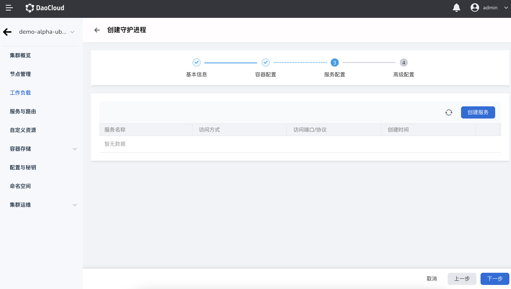

# Create a daemon set from the mirror

A DaemonSet ensures that all or some nodes have a replica of a Pod running. When a node joins the cluster, a Pod is also added for it. These Pods are also recycled when a node is removed from the cluster. Deleting a DaemonSet will delete all Pods it created.

Some typical uses of daemonsets include:

- Run cluster daemons on each node.

- Run a log collection daemon on each node.

- Run a monitoring daemon on each node.

A simple usage is to start a DaemonSet on all nodes for each type of daemon. A slightly more complex usage is to deploy multiple DaemonSets for the same daemon process. Each DaemonSet has different flags and has different memory, CPU requirements for different hardware types.

## prerequisites

Before creating a DaemonSet from a mirror, the following prerequisites need to be met:

- The container management platform [has joined the Kubernetes cluster](../Clusters/JoinACluster.md) or [has created the Kubernetes cluster](../Clusters/CreateCluster.md), and can access the UI interface of the cluster.

- A [Namespace Creation](../Namespaces/createtens.md), [User Creation](../../../ghippo/04UserGuide/01UserandAccess/User.md) has been done, the user should have [`NS Edit`](../Permissions/PermissionBrief.md#ns-edit) or higher permission, please refer to [Namespace Authorization](../Namespaces/createns.md) for details.

- When there are multiple containers in a single instance, please make sure that the ports used by the containers do not conflict, otherwise the deployment will fail.

Refer to the following steps to create a DaemonSet.

## Mirror creation

1. After successfully logging in as the `NS Edit` user, click `Cluster List` in the upper left corner to enter the cluster list page. Click on a cluster name to enter `Cluster Details`.

     

2. Click `Workload` in the left navigation bar to enter the workload list, click the `Daemon Process` tab, and click the `Image creation` button in the upper right corner.

     

3. The `Create Daemon` page will be displayed.

### Basic information configuration

On the `Create Daemon Process` page, after entering the information according to the table below, click `Next`.

- Workload name: Enter the name of the new workload, which must be unique. Please enter a string of 4 to 63 characters, which can contain lowercase English letters, numbers and dashes (-), and start with a lowercase English letter and end with a lowercase English letter or number. For example daemonset-01.
- Cluster: Select the cluster where the newly created workload resides. When a workload is created within a cluster, the workload is created in the current cluster. Clusters cannot be changed. When a workload is created outside a cluster, the workload is created on the selected cluster. For example Cluster-01.
- Namespace: Select the namespace where the newly created workload resides. For more information about namespaces, please refer to [Namespace Overview](../Namespaces/createns.md). If you do not set a namespace, the system will use the default namespace by default. For example Namespace-01.
- Description: Enter the description information of the workload and customize the content. The number of characters should not exceed 512. This is a stateful load, mainly used to run Nginx service.

### Container configuration

Container configuration is only configured for a single container. To add multiple containers to a container group, click `+` on the right to add multiple containers.

After completing all the container configuration information below, click Next.

=== "Basic information (required)"

     

     After entering the information as follows, click `Confirm`.

     - Container Name: Enter a name for the newly created container. Please enter a string of 4 to 63 characters, which can contain lowercase English letters, numbers and dashes (-), and start with a lowercase English letter and end with a lowercase English letter or number. For example nginx-01.
     - Container image: The name of the image selected from the image warehouse, and manual input of the image name is also supported (the name must be an existing image name in the image warehouse, otherwise it will not be available). For example nginx.
     - Update policy: When the container is updated, the image pull policy. After it is enabled, the workload will pull the image again every time it is restarted/upgraded, otherwise it will only pull the image when there is no image with the same name and version on the node. Default: Always pull mirrors.
     - Privileged container: By default, the container cannot access any device on the host. After enabling the privileged container, the container can access all devices on the host and enjoy all the permissions of the running process on the host. Enabled by default.
     - CPU Quotas: Minimum and maximum usage of container CPU resources. Requests: The minimum CPU value that the container needs to use. Limit: The maximum CPU allowed to be used by the container. It is recommended to set the upper limit of the container quota to avoid system failure caused by excessive container resources. Default is 0.25, 0.25.
     - Memory quota: The minimum and maximum usage of container memory resources. Application: The minimum memory value that the container needs to use. Limit: The maximum amount of memory the container is allowed to use. It is recommended to set the upper limit of the container quota to avoid system failure caused by excessive container resources. The default is 512 MB, 512 MB.

=== "Lifecycle (optional)"

     The container life cycle configuration is used to set the commands that need to be executed when the container starts, after starting, and before stopping. For details, please refer to [Container Lifecycle Configuration](PodConfig/lifescycle.md).

     

=== "Health Check (optional)"

     Container health checks are used to determine the health status of containers and applications. Helps improve app usability. For details, please refer to [Container Health Check Configuration](PodConfig/healthcheck.md).

     

=== "Environment variables (optional)"

     Container environment variable configuration is used to configure container parameters in Pods, add environment flags or pass configurations to Pods, etc. For details, please refer to [Container Environment Variable Configuration](PodConfig/EnvironmentVariables.md).

     

=== "Data storage (optional)"

     Container data storage configuration is used to configure container mounted data volumes and data persistence settings. For details, please refer to [Container Data Storage Configuration](PodConfig/EnvironmentVariables.md).

     

=== "Security settings (optional)"

     Set container permissions according to the table below to protect the system and other containers from them.

     

=== "Container logs (optional)"

     Set the container log collection policy and configure the log directory. Used to collect container logs for unified management and analysis. For details, please refer to [Container Log Configuration](PodConfig/EnvironmentVariables.md).
    
     

### Service configuration

Set the workload access method, and you can set the service access method.

1. Click the `Create Service` button.

     

2. Choose to access various information of the service. For details, please refer to [Creating Services](../ServicesandRoutes/CreatingServices.md).

     

3. Click `OK` and click `Next`.

### Advanced configuration

In addition to basic information configuration, DCE also provides a wealth of advanced configurations, which can configure functions such as workload upgrade policies, scheduling policies, tags and annotations.

=== "Upgrade policy configuration"

     

     - Upgrade method: **Rolling upgrade** will gradually replace instances of the old version with instances of the new version. During the upgrade process, business traffic will be load-balanced to the old and new instances at the same time, so the business will not be interrupted. **Replace and upgrade** will first delete the old version instance of your workload, and then install the specified new version. Business will be interrupted during the upgrade process.
     - Maximum number of invalid Pods: used to specify the upper limit of the number of Pods in the unavailable state of the Deployment during the update process. If it is equal to the number of instances, there is a risk of service. The default is 25%.
     - Maximum number of retained versions: the number of old versions retained when rolling back. The default is 10.
     - Minimum Pod availability time (s): The minimum time for a Pod to be ready. Only after this time is the Pod considered available. Default is 0.
     - Scale-in time window (s): The execution time window (0-9,999 seconds) of the command before the workload stops, the default is 30 seconds.

=== "Scheduling policy configuration"

     Users can set the tolerance time to define the tolerance time for scheduling the workload to other nodes when the node where the workload resides is damaged. It also supports scheduling nodes where workloads are deployed based on node labels and Pod labels. For details, please refer to [Scheduling Policy](../Workloads/PodConfig/SchedulingPolicy.md).

     

     - Tolerance time: When the node where the workload instance resides is unavailable, the time for rescheduling the workload instance to other available nodes, in seconds.
     - Node affinity: According to the label on the node, constrain which nodes the Pod can be scheduled on.
     - Workload Affinity: The maximum value of the part where the total number of Pods exceeds the expected number of Pod replicas during the process of updating Pods.
     - Workload anti-affinity: Constrains nodes that Pods cannot be scheduled to based on the labels of Pods already running on the node.

=== "Labels and Notes"

     You can click the `Add` button to add tags and annotations to workloads and container groups.

     

=== "DNS Configuration"

     In some scenarios, the application will have redundant DNS queries. Kubernetes provides DNS-related configuration options for applications. By configuring DNS for applications, redundant DNS queries can be effectively reduced in some scenarios and business concurrency can be increased. For details, please refer to [DNS Configuration](PodConfig/EnvironmentVariables.md).

     

     - DNS strategy: Configure DNS for applications to reduce redundant DNS queries and increase business concurrency.
         - Default: The domain name resolution file of the container uses the domain name resolution file pointed to by the `--resolv-conf` parameter of kubelet. This configuration can only resolve external domain names registered on the Internet, but cannot resolve cluster internal domain names, and there is no invalid DNS query.
         - ClusterFirstWithHostNet: The domain name file of the host to which the application is connected.
         - ClusterFirst: application docking with Kube-DNS/CoreDNS.
         - None: New option value introduced in Kubernetes v1.9 (Beta in v1.10). After setting to None, dnsConfig must be set. At this time, the domain name resolution file of the container will be completely generated through the configuration of dnsConfig.
     - Domain name server: According to the label on the node, constrain which nodes the Pod can be scheduled to.
     - Search domains: DNS search domain list for domain name query. When specified, the provided search domain list will be merged into the search field of the domain name resolution file generated based on dnsPolicy, and duplicate domain names will be deleted. Kubernetes allows up to 6 search domains.
     - Options: Configuration options for DNS, where each object can have a name attribute (required) and a value attribute (optional). in this fieldThe content will be merged into the options field of the domain name resolution file generated based on dnsPolicy. If some options of dnsConfig options conflict with the options of the domain name resolution file generated based on dnsPolicy, they will be overwritten by dnsConfig.
     - Host alias: the alias set for the host.

## complete creation

After confirming that all parameters have been entered, click the `Create` button to complete the workload creation. Wait for the workload status to change to `Running`.
If the workload status is abnormal, please refer to [Workload Status](../Workloads/PodConfig/workload-status.md) for specific exception information.