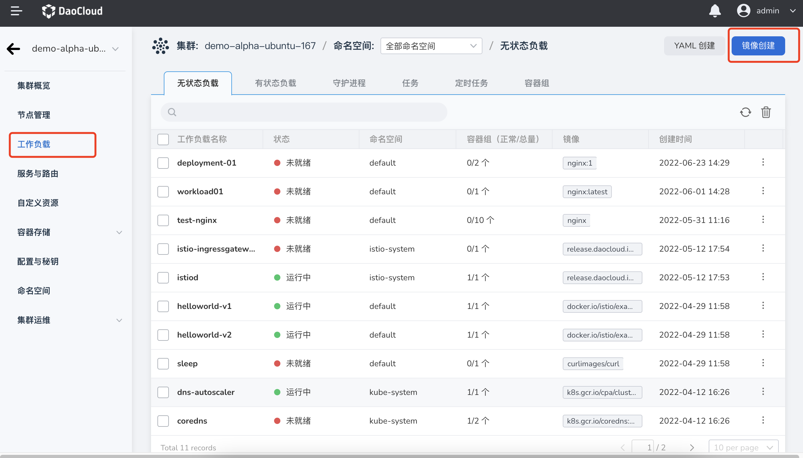
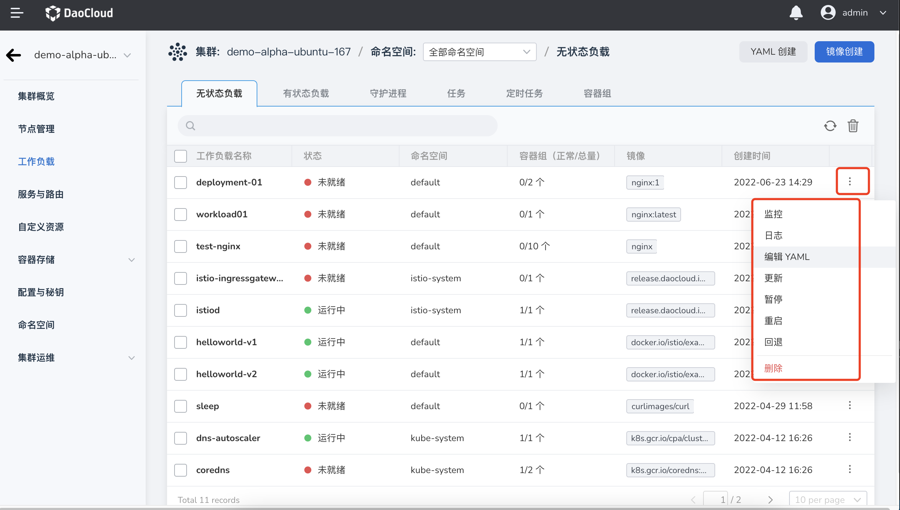

# Create a stateless load (Deployment)

A stateless load (Deployment) is an application running on Kubernetes that does not save any data and state.
Like other workloads, stateless workloads are composed of Pods. Through the Daocloud container management platform, you can easily manage workloads on multi-cloud and multi-cluster based on the permissions you have, including the creation, update, deletion, elastic scaling, restart, and version rollback of stateless workloads. Full lifecycle management.

This article describes how to create stateless workloads through image.

## Prerequisites

Before using image to create stateless workloads, the following prerequisites need to be met:

- The container management platform [has joined the Kubernetes cluster](../Clusters/JoinACluster.md) or [has created the Kubernetes cluster](../Clusters/CreateCluster.md), and can access the UI interface of the cluster.

- Completed a [Namespace Creation](../Namespaces/createtens.md), [User Creation](../../../ghippo/04UserGuide/01UserandAccess/User.md), and created a Grant [`NS Edit`](../Permissions/PermissionBrief.md#ns-edit) or higher permissions, please refer to [Namespace Authorization](../Namespaces/createns.md) for details.

- When there are multiple containers in a single instance, please make sure that the ports used by the containers do not conflict, otherwise the deployment will fail.

## Image creation

Follow the steps below to create a stateless workload using image.

### Basic information configuration

1. After successfully logging in as the `NS Edit` user, click `Cluster List` on the left navigation bar to enter the cluster list page. Click on a cluster name to enter the `Cluster Details` page.

     

2. On the cluster details page, click `Workload` in the left navigation bar to enter the workload list, and click the `Image creation` button in the upper right corner of the page.

     

3. On the `Create Stateless Load` page, enter the basic information according to the table below, and click `Next`.

     

     - Workload name: Enter the name of the new workload, which must be unique. Please note that the name can be up to 63 characters, can only contain lowercase letters, numbers, and separators ("_"), and must start and end with lowercase letters or numbers, such as deployment-01.
     - Cluster: Select the cluster where the newly created workload resides. When a workload is created within a cluster, the workload is created in the current cluster. Clusters cannot be changed. When a workload is created outside the cluster, the workload is created on the selected cluster, for example Cluster-01.
     - Namespace: Select the namespace where the newly created workload resides. For more information about namespaces, please refer to [Namespace Overview](../Namespaces/createns.md). If you do not set a namespace, the system will use the default namespace by default.
     - Number of Instances: Enter the number of Pod instances for the workload. If you do not set the number of instances, the system will create 2 Pod instances by default.
     - Description: Enter the description information of the workload and customize the content. The number of characters should not exceed 512. For example: This is a stateless load, mainly used to run the Nginx service.

### Container configuration

When configuring container-related parameters, you must correctly configure the container name and image parameters, otherwise you will not be able to proceed to the next step. If you need to add multiple containers to a container group, click `+` on the right to add multiple containers.

After completing all the container configuration information below, click Next.

=== "Basic information (required)"

     

     After entering the information as follows, click `Confirm`.

     - Container name: Please note that the maximum length of the name is 63 characters. It can only contain lowercase letters, numbers and separators ("_"), and must start and end with lowercase letters or numbers. For example nginx-01.
     - Container image: Select the image registry and enter the image name or image address to select the image. Please note that the image name must be an existing image name in the container registry, otherwise it will not be available). For example, you can select `Public Image registry` and enter "nginx" to deploy the nginx image.
     - Update policy: [image pull policy](https://kubernetes.io/docs/concepts/containers/images/#image-pull-policy) when performing updates on containers. By default, the "always pull image policy" is not enabled, that is, the local image is pulled every time the workload restarts/upgrades, and when the image does not exist locally, it will be re-pulled from the container registry. If you enable the `always pull image policy`, the image will be re-pulled from the registry by default.
     - Privileged container: By default, the container cannot access any device on the host. After enabling the privileged container, the container can access all devices on the host and enjoy all the permissions of the running process on the host. Enabled by default.
     - CPU Quota: Minimum and maximum usage of container CPU resources. Requests: The minimum amount of CPU the container needs to use. Limit: The maximum amount of CPU allowed to be used by the container. Please configure CPU quotas for containers as needed to avoid resource waste and system failures caused by excessive container resources. Default is 0.25, 0.25.
     - Memory quota: the minimum and maximum usage of container memory resources. Application: The minimum amount of content that needs to be used in the container. Limit: The maximum amount of memory allowed to be used by the container. Please configure CPU quotas for containers as needed to avoid resource waste and system failures caused by excessive container resources. The default is 512 MB, 512 MB.
     - GPU quota: To configure GPU usage quotas for the cluster, the administrator needs to install GPU cards and driver plug-ins on the cluster nodes in advance, and enable the GPU feature on **Cluster Settings** before you can configure GPU quotas for the cluster. The GPU quota setting supports setting exclusive use of the entire GPU card or some vGPUs for the container. For example, if you have an 8-core GPU card, you can enter the number `8` to let the container own the entire length of the card, or you can enter the number `1` to configure a 1-core vGPU for the container.

=== "Lifecycle (optional)"

     The container lifecycle configuration is used to set the commands that need to be executed when the container starts, after starting, and before stopping. For details, please refer to [Container Lifecycle Configuration](PodConfig/lifescycle.md).

     

=== "Health Check (optional)"

     Container health checks are used to determine the health status of containers and applications. Helps improve app usability. For details, please refer to [Container Health Check Configuration](PodConfig/healthcheck.md).

     

=== "Environment variables (optional)"

     Container environment variable configuration is used to configure container parameters in Pods, add environment variables to Pods or pass configurations, etc. For details, please refer to [Container Environment Variable Configuration](PodConfig/EnvironmentVariables.md).

     

=== "Data storage (optional)"

     Container data storage configuration is used to configure container mounted data volumes and data persistence settings. For details, please refer to [Container Data Storage Configuration](PodConfig/EnvironmentVariables.md).

     

=== "Security settings (optional)"

     Containers are securely isolated through Linux's built-in account authority isolation mechanism. You can limit container permissions by using account UIDs (digital identity tokens) with different permissions. To use root account privileges, please enter `0`.

     

### Service configuration

Configure [Services](../ServicesandRoutes/CreatingServices.md) for the stateless load, so that the stateless load can be accessed externally.

1. Click the `Create Service` button.

     

2. Refer to [Creating Services](../ServicesandRoutes/CreatingServices.md) to configure service parameters.

     

3. Click `OK` and click `Next`.

### Advanced configuration

In addition to basic information configuration, the Daocloud container management platform also provides a wealth of advanced configurations, which can configure advanced functions such as workload upgrade policies, scheduling policies, labels and annotations.

=== "Upgrade Strategy"

     

     - Upgrade method: **Rolling upgrade** will gradually replace instances of the old version with instances of the new version. During the upgrade process, business traffic will be load-balanced to the old and new instances at the same time, so the business will not be interrupted. **Rebuild and upgrade** will first delete the old version instance of your workload, and then install the specified new version. Business will be interrupted during the upgrade process.
     - Maximum number of invalid Pods: used to specify the upper limit of the number of Pods in the unavailable state of the Deployment during the update process. If it is equal to the number of instances, there is a risk of service. Default is 25%.
     - Max Surge: The maximum or ratio of the portion of the total number of Pods that exceeds the expected number of replicas of a Pod during a Pod update. Default is 25%.
     - Maximum number of retained versions: the number of old versions retained when rolling back. The default is 10.
     - Minimum Pod availability time (s): The minimum time for a Pod to be ready. Only after this time is the Pod considered available. The default is 0 seconds.
     - Upgrade max duration (s): The maximum duration to wait for the deployment to proceed before marking the deployment as failed, default 600 seconds.
     - Scale-in time window (s): The execution time window (0-9,999 seconds) of the command before the workload stops, the default is 30 seconds.

=== "Scheduling Policy"

     Users can set the tolerance time to define the tolerance time for scheduling the workload to other nodes when the node where the workload resides is damaged. It also supports scheduling nodes where workloads are deployed based on node labels and Pod labels. For details, please refer to [Scheduling Policy](PodConfig/SchedulingPolicy.md).

     

     - Tolerance time: When the node where the workload instance resides is unavailable, the time for rescheduling the workload instance to other available nodes, in seconds.
     - Node affinity: According to the label on the node, constrain which nodes the Pod can be scheduled on.
     - Workload Affinity: The maximum value of the part where the total number of Pods exceeds the expected number of Pod replicas during the process of updating Pods.
     - Workload anti-affinity: Based on the labels of the **Pod** that is already running on the node, constrain the nodes that the Pod cannot be scheduled to.

=== "Labels and Notes"

     You can click the `Add` button to add tags and annotations to workloads and container groups.

     

=== "DNS Configuration"

     In some scenarios, the application will have redundant DNS queries. Kubernetes provides DNS-related configuration options for applications. By configuring DNS for applications, redundant DNS queries can be effectively reduced in some scenarios and business concurrency can be increased. For details, please refer to [DNS Configuration](PodConfig/EnvironmentVariables.md).

     

     - DNS strategy: Configure DNS for applications to reduce redundant DNS queries and increase business concurrency.

         - Default: The domain name resolution file of the container uses the domain name resolution file pointed to by the `--resolv-conf` parameter of kubelet. This configuration can only resolve external domain names registered on the Internet, but cannot resolve cluster internal domain names, and there is no invalid DNS query.
         - ClusterFirstWithHostNet: The domain name file of the host to which the application is connected.
         -ClusterFirst: application docking Kube-DNS/CoreDNS.
         - None: New option value introduced in Kubernetes v1.9 (Beta in v1.10). After setting to None, dnsConfig must be set. At this time, the domain name resolution file of the container will be completely generated through the configuration of dnsConfig.

     - Domain name server: According to the label on the node, constrain which nodes the Pod can be scheduled to.
     - Search domains: DNS search domain list for domain name query. When specified, the provided search domain list will be merged into the search field of the domain name resolution file generated based on dnsPolicy, and duplicate domain names will be deleted. Kubernetes allows up to 6 search domains.
     - Options: Configuration options for DNS, where each object can have a name attribute (required) and a value attribute (optional). The content in this field will be merged into the options field of the domain name resolution file generated based on dnsPolicy. If some options of dnsConfig options conflict with the options of the domain name resolution file generated based on dnsPolicy, they will be overwritten by dnsConfig.
     - Host alias: the alias set for the host.

### Complete creation

After confirming that all parameters are entered, click the `OK` button to complete the creation of the workload, and the system will automatically return to the list of `stateless workloads`.
Click `︙` on the right side of the list to perform operations such as update, delete, elastic scaling, restart, and version rollback on the workload.



Wait for the workload status to change to `Running`.
If the workload status is abnormal, please refer to [Workload Status](../Workloads/PodConfig/workload-status.md) for specific exception information.

## Create with YAML

In addition to creating a Deployment by image as described above, it can also be created by YAML.

### Basic information configuration

1. After successfully logging in as the `NS Edit` user, click `Cluster List` on the left navigation bar to enter the cluster list page. Click on a cluster name to enter the `Cluster Details` page.

     

2. On the cluster details page, click `Workload` in the left navigation bar to enter the workload list, and click the `Create with YAML` button in the upper right corner of the page.

     

3. After completing the above steps, you will jump to the detailed configuration page of `Create a stateless workload`, please refer to the following steps to complete the creation of a stateless workload.

### Input YAML

Referring to the YAML template below, create a stateless workload called `nginx-deployment`.

```yaml
apiVersion: apps/v1
kind: Deployment
metadata:
   name: nginx-deployment
spec:
   selector:
     matchLabels:
       app: nginx
   replicas: 2 # Tell the Deployment to run 2 Pods that match this template
   template:
     metadata:
       labels:
         app: nginx
     spec:
       containers:
       -name: nginx
         image: nginx:1.14.2
         ports:
         - containerPort: 80
```

### Complete creation

After confirming that all parameters have been entered, click the `OK` button to complete the workload creation and automatically return to the `Stateless Load` list.
Click `︙` on the right side of the list to perform operations such as update, delete, elastic scaling, restart, and version rollback on the workload.


Wait for the workload status to change to `Running`. If the workload status is abnormal, please refer to [Workload Status](../Workloads/PodConfig/workload-status.md) for specific exception information.