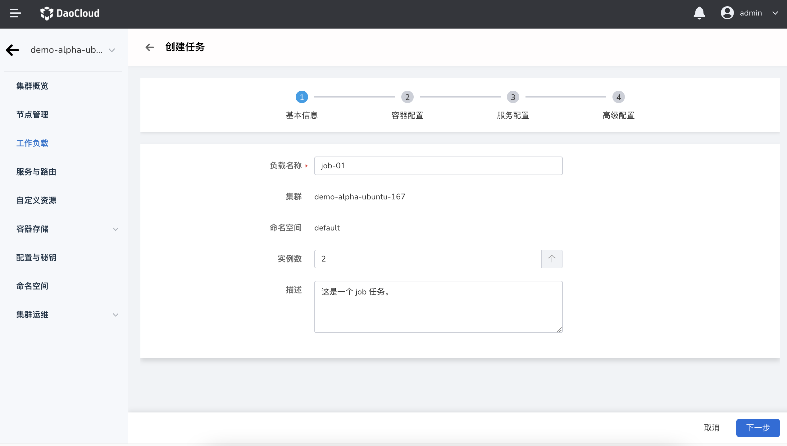
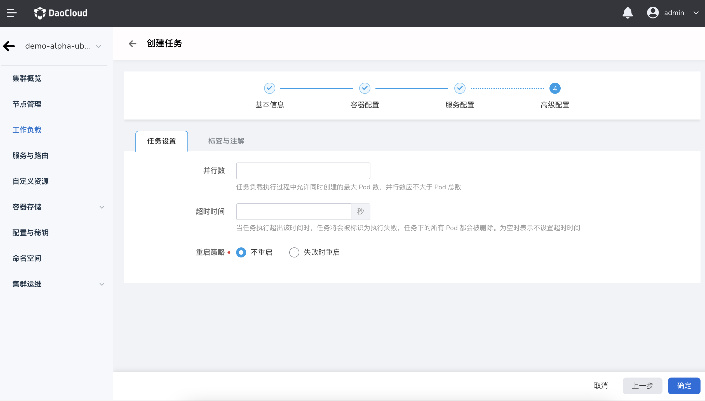

# Create task by image

Task (Job) is suitable for one-time task execution, which will create one or more Pods, and will continue to retry the execution of Pods until the specified number of Pods are successfully terminated.
As Pods complete successfully, the Job will keep track of how many Pods completed successfully. When the number reaches the specified success threshold, the Job ends.
Deleting a Job will clear all created Pods. Suspending a Job deletes all active Pods for the Job until the Job is resumed.
Job completions are marked according to `.spec.completions` settings.

- Non-parallel Job:

     - Normally only one pod is started, unless the pod fails.
     - When the Pod terminates successfully, the Job is considered complete immediately.
   
- Parallel Job with deterministic completion count:

     - The `.spec.completions` field is set to a positive value other than 0.
     - Job is used to represent the entire task. When the number of successful Pods reaches `.spec.completions`, the Job is considered completed.
     - When using `.spec.completionMode="Indexed"`, each Pod gets a different index value between 0 and `.spec.completions-1`.

- Parallel Job with work queue:

     - Do not set `spec.completions`, the default is `.spec.parallelism`.
     - Multiple Pods must coordinate with each other, or use an external service to determine which work item each Pod should process. For example, any Pod can take up to N work entries from the work queue.
     - Each Pod can independently determine whether other Pods have completed, thereby determining whether the Job is complete.
     - When **any** Pods in the Job terminate successfully, no new Pods are created.
     - Once at least 1 Pod has successfully completed and all Pods have terminated, the Job can be declared successfully completed.
     - Once any Pod exits successfully, no other Pods should perform any actions or generate any output from this task. All pods should initiate the exit process.

## Prerequisites

Before creating tasks through image, the following prerequisites must be met:

- The container management platform [has joined the Kubernetes cluster](../Clusters/JoinACluster.md) or [has created the Kubernetes cluster](../Clusters/CreateCluster.md), and can access the UI interface of the cluster.

- A [Namespace Creation](../Namespaces/createtens.md), [User Creation](../../../ghippo/04UserGuide/01UserandAccess/User.md) has been done, the user should have [`NS Edit`](../Permissions/PermissionBrief.md#ns-edit) or higher permission, please refer to [Namespace Authorization](../Namespaces/createns.md) for details.

- When there are multiple containers in a single instance, please make sure that the ports used by the containers do not conflict, otherwise the deployment will fail.

Follow the steps below to create a task.

## Image creation

1. After successfully logging in as the `NS Edit` user, click `Cluster List` in the upper left corner to enter the cluster list page. Click on a cluster name to enter `Cluster Details`.

     

2. Click `Workload` in the left navigation bar to enter the workload list, click the `Task` tab, and click the `Image creation` button in the upper right corner.

     

3. The 'Create Task' page will be displayed.

### Basic information configuration

On the `Create Task` page, enter the basic information according to the table below, and click `Next`.

- Workload name: Enter the name of the new workload, which must be unique. Please enter a string of 4 to 63 characters, which can contain lowercase English letters, numbers and dashes (-), and start with a lowercase English letter and end with a lowercase English letter or number. For example job-01.
- Cluster: Select the cluster where the newly created workload resides. When a workload is created within a cluster, the workload is created in the current cluster. Clusters cannot be changed. When a workload is created outside a cluster, the workload is created on the selected cluster. For example Cluster-01.
- Namespace: Select the namespace where the newly created workload resides. For more information about namespaces, please refer to [Namespace Overview](../Namespaces/createns.md). If you do not set a namespace, the system will use the default namespace by default. For example Namespace-01.
- Number of Instances: Enter the number of Pod instances for the workload. If you do not set the number of instances, the system will create 2 Pod instances by default.
- Description: Enter the description information of the workload and customize the content. The number of characters should not exceed 512.

### Container configuration

Container configuration is only configured for a single container. To add multiple containers to a container group, click `+` on the left to add multiple containers.

After completing all the container configuration information below, click Next.

=== "Basic information (required)"

     

     After entering the information as follows, click `Confirm`.

     - Container Name: Enter a name for the newly created container. Please enter a string of 4 to 63 characters, which can contain lowercase English letters, numbers and dashes (-), and start with a lowercase English letter and end with a lowercase English letter or number. For example backup_log.
     - Container image: The image name selected from the image registry, and also supports manual input of the image name (the name must be an existing image name in the image registry, otherwise it will not be available). If you want to connect to an external private image, you need to first [Create image registry key](../ConfigMapsandSecrets/create-secret.md), and then pull the image. For example backupjob.
     - Update policy: When the container is updated, the image pull policy. After it is enabled, the workload will pull the image again every time it is restarted/upgraded, otherwise it will only pull the image when there is no image with the same name and version on the node. Default: Always pull images.
     - Privileged container: By default, the container cannot access any device on the host. After enabling the privileged container, the container can access all devices on the host and enjoy all the permissions of the running process on the host. Enabled by default.
     - CPU Quotas: Minimum and maximum usage of container CPU resources. Requests: The minimum CPU value that the container needs to use. Limit: The maximum CPU allowed to be used by the container. It is recommended to set the upper limit of the container quota to avoid system failure caused by excessive container resources.
     - Memory quota: The minimum and maximum usage of container memory resources. Application: The minimum memory value that the container needs to use. Limit: The maximum amount of memory the container is allowed to use. It is recommended to set the upper limit of the container quota to avoid system failure caused by excessive container resources.

=== "Lifecycle (optional)"

     The container lifecycle configuration is used to set the commands that need to be executed when the container starts, after starting, and before stopping. For details, please refer to [Container Lifecycle Configuration](PodConfig/lifescycle.md).

     

=== "Health Check (optional)"

     Container health checks are used to determine the health status of containers and applications. Helps improve app usability. For details, please refer to [Container Health Check Configuration](PodConfig/healthcheck.md).

     

=== "Environment variables (optional)"

     Container environment variable configuration is used to configure container parameters in Pods, add environment flags or pass configurations to Pods, etc. For details, please refer to [Container Environment Variable Configuration](PodConfig/EnvironmentVariables.md).

     

=== "Data storage (optional)"

     Container data storage configuration is used to configure container mounted data volumes and data persistence settings. For details, please refer to [Container Data Storage Configuration](PodConfig/EnvironmentVariables.md).

     

=== "Security settings (optional)"

     Set container permissions according to the table below to protect the system and other containers from them.

     

=== "Container logs (optional)"

     Set the container log collection policy and configure the log directory. Used to collect container logs for unified management and analysis. For details, please refer to [Container Log Configuration](PodConfig/EnvironmentVariables.md).

     

### Service configuration

Set the workload access method, and you can set the service access method.

1. Click the `Create Service` button.

     

2. Choose to access various information of the service. For details, please refer to [Creating Services](../ServicesandRoutes/CreatingServices.md).

     

3. Click `OK` and click `Next`.

### Advanced configuration

In addition to basic information configuration, DCE also provides a wealth of advanced configurations, which can configure functions such as upgrade policies, scheduling policies, labels and annotations.

=== "Task Settings"

     

     - Parallel number: The maximum number of Pods allowed to be created at the same time during the execution of the task load, and the parallel number should not be greater than the total number of Pods. The default is 2.
     - Timeout period: When the task execution time exceeds this time, the task will be marked as an execution failure, and all Pods under the task will be deleted. When it is empty, it means that no timeout is set. The default is 3.

=== "Labels and Notes"

     You can click the `Add` button to add labels and annotations to the workload instance Pod.

     

## Complete creation

After confirming that all parameters have been entered, click the `Create` button to complete the workload creation. Wait for the workload status to change to `Running`.
If the workload status is abnormal, please refer to [Workload Status](../Workloads/PodConfig/workload-status.md) for specific exception information.