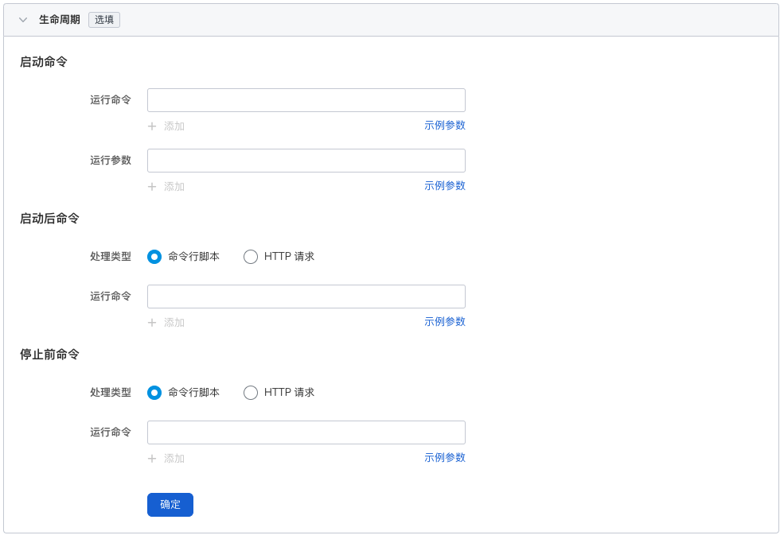
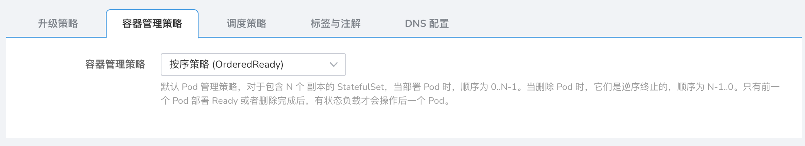
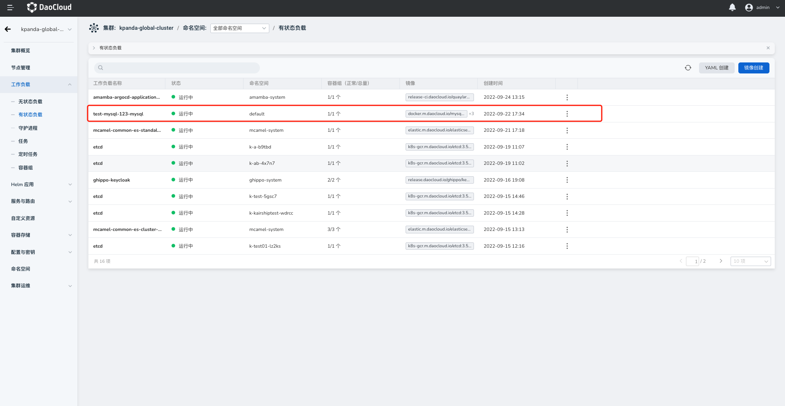
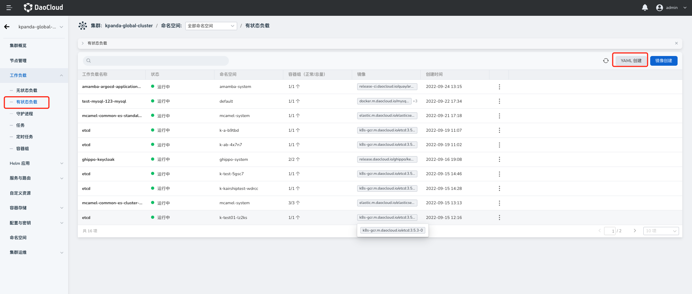

# Create a stateful load (StatefulSet)

A stateful load (StatefulSet) is an application running on Kubernetes that needs to save data and state during operation. Similar to other workloads, stateful workloads are composed of Pods. Through the Daocloud container management platform, you can easily manage workloads on multi-cloud and multi-cluster based on the permissions you have, including full life cycle management of stateful load creation, update, deletion, elastic scaling, restart, and version rollback.

This article describes how to create stateful workloads through image.

## Prerequisites

Before using image to create stateful workloads, the following prerequisites need to be met:

- The container management platform [has joined the Kubernetes cluster](../Clusters/JoinACluster.md) or [has created the Kubernetes cluster](../Clusters/CreateCluster.md), and can access the UI interface of the cluster.

- A [Namespace Creation](../Namespaces/createtens.md), [User Creation](../../../ghippo/04UserGuide/01UserandAccess/User.md) has been done, the user should have [`NS Edit`](../Permissions/PermissionBrief.md#ns-edit) or higher permission, please refer to [Namespace Authorization](../Namespaces/createns.md) for details.

- If you need to mount a storage volume for a StatefulSet, you need to create a storage volume first.

- When there are multiple containers in a single instance, please make sure that the ports used by the containers do not conflict, otherwise the deployment will fail.

## Image creation

Follow the steps below to create a stateful workload using an image.

### Basic information configuration

1. After successfully logging in as the `NS Edit` user, click `Cluster List` on the left navigation bar to enter the cluster list page. Click on a cluster name to enter `Cluster Details`.

     

2. Click `Workloads` in the left navigation bar to enter the workload list, click the `Stateful Loads` tab, and click the `Image creation` button in the upper right corner.

     

3. On the `Create Stateful Load` page, enter the information according to the table below, and click `Next`.

     

     - Workload name: Enter the name of the new workload, which must be unique. Please note that the name can be up to 63 characters, can only contain lowercase letters, numbers and separators ("_"), and must start and end with lowercase letters or numbers. For example statefulset-01.
     - Cluster: Select the cluster where the newly created workload resides. When a workload is created within a cluster, the workload is created in the current cluster. Clusters cannot be changed. When a workload is created outside a cluster, the workload is created on the selected cluster. For example Cluster-01.
     - Namespace: Select the namespace where the newly created workload resides. For more information about namespaces, please refer to [Namespace Overview](../Namespaces/createns.md). If you do not set a namespace, the system will use the default namespace by default.
     - Number of Instances: Enter the number of Pod instances for the workload. If you do not set the number of instances, the system will create 2 Pod instances by default.
     - Description: Enter the description information of the workload and customize the content. The number of characters should not exceed 512. For example: This is a stateful load, mainly used to run Mysql service.

### Container configuration

When configuring container-related parameters, you must correctly configure the container name and image parameters, otherwise you will not be able to proceed to the next step. If you need to add multiple containers to a container group, click `+` on the right to add multiple containers.

After completing all the container configuration information below, click Next.

=== "Basic information (required)"

     

     After entering the information as follows, click `Confirm`.

     - Container name: Please note that the maximum length of the name is 63 characters. It can only contain lowercase letters, numbers and separators ("_"), and must start and end with lowercase letters or numbers. For example nginx-01.
     - Container image: Select the image registry and enter the image name or image address to select the image. Please note that the image name must be an existing image name in the container registry, otherwise it will not be available). For example, you can select `Public Image registry` and enter "nginx" to deploy the nginx image.
     - Update policy: [image pull policy](https://kubernetes.io/docs/concepts/containers/images/#image-pull-policy) when performing updates on containers. By default, the "always pull image policy" is not enabled, that is, the local image is pulled every time the workload restarts/upgrades, and when the image does not exist locally, it will be re-pulled from the container registry. If you enable the `always pull image policy`, the image will be re-pulled from the registry by default.
     - Privileged container: By default, the container cannot access any device on the host. After enabling the privileged container, the container can access all devices on the host and enjoy all the permissions of the running process on the host. Enabled by default.
     - CPU Quota: Minimum and maximum usage of container CPU resources. Requests: The minimum amount of CPU the container needs to use. Limit: The maximum amount of CPU allowed to be used by the container. Please configure CPU quotas for containers as needed to avoid resource waste and system failures caused by excessive container resources. Default is 0.25, 0.25.
     - Memory quota: the minimum and maximum usage of container memory resources. Application: The minimum amount of content that needs to be used in the container. Limit: The maximum amount of memory allowed to be used by the container. Please configure CPU quotas for containers as needed to avoid resource waste and system failures caused by excessive container resources. The default is 512 MB, 512 MB.
     - GPU quota: To configure GPU usage quotas for the cluster, the administrator needs to install GPU cards and driver plug-ins on the cluster nodes in advance, and enable the GPU feature on **Cluster Settings** before you can configure GPU quotas for the cluster. The GPU quota setting supports setting exclusive use of the entire GPU card or some vGPUs for the container. For example, if you have an 8-core GPU card, you can enter the number `8` to let the container own the entire length of the card, or you can enter the number `1` to configure a 1-core vGPU for the container.

=== "Lifecycle (optional)"

     The container life cycle configuration is used to set the commands that need to be executed when the container starts, after starting, and before stopping. For details, please refer to [Container Lifecycle Configuration](PodConfig/lifescycle.md).

     

=== "Health Check (optional)"

     Container health checks are used to determine the health status of containers and applications. Helps improve app usability. For details, please refer to [Container Health Check Configuration](PodConfig/healthcheck.md).

     

=== "Environment variables (optional)"

     Container environment variable configuration is used to configure container parameters in Pods, add environment variables to Pods or pass configurations, etc. For details, please refer to [Container Environment Variable Configuration](PodConfig/EnvironmentVariables.md).

     

=== "Data storage (optional)"

     Container data storage configuration is used to configure container mounted data volumes and data persistence settings. For details, please refer to [Container Data Storage Configuration](PodConfig/EnvironmentVariables.md).

     

=== "Security settings (optional)"

     Containers are securely isolated through Linux's built-in account authority isolation mechanism. You can limit container permissions by using account UIDs (digital identity tokens) with different permissions. To use root account privileges, please enter `0`.

     

### Service configuration

Configure [Services](../ServicesandRoutes/CreatingServices.md) for stateful payloads, so that stateful payloads can be accessed externally.

1. Click the `Create Service` button.

     

2. Refer to [Creating Services](../ServicesandRoutes/CreatingServices.md) to configure service parameters.

     

3. Click `OK` and click `Next`.

### Advanced configuration

In addition to basic information configuration, the Daocloud container management platform also provides a wealth of advanced configurations, which can configure advanced functions such as workload upgrade policies, scheduling policies, labels and annotations.

=== "Upgrade Strategy"

     

     - Upgrade method: **Rolling upgrade** will gradually replace instances of the old version with instances of the new version. During the upgrade process, business traffic will be load-balanced to the old and new instances at the same time, so the business will not be interrupted. **Replace and upgrade** will first delete the old version instance of your workload, and then install the specified new version. Business will be interrupted during the upgrade process.
     - Maximum number of retained versions: the number of old versions retained when rolling back. The default is 10.
     - Scale-in time window (s): The execution time window (0-9,999 seconds) of the command before the workload stops, the default is 30 seconds.

=== "Container Management Policy"

     

     Kubernetes v1.7 and later versions can set Pod management policies through `.spec.podManagementPolicy`, which supports the following two methods:

     - **OrderedReady** (OrderedReady): The default Pod management policy. For a StatefulSet containing N replicas, when deploying Pods, the order is 0..N-1. When Pods are deleted, they are terminated in reverse order.

         The order is N-1...0. The stateful load will operate on the next Pod only after the previous Pod is deployed Ready or deleted.

     - **Parallel Policy** (Parallel): Create or delete Pods in parallel, the same as Pods of the Deployment type. (Start creating all pods without waiting for previous pods to be ready). The StatefulSet controller starts or terminates all Pods in parallel, without waiting for Pods to enter the Running and Ready state or to stop completely before starting or terminating other Pods. This option only affects the behavior of scaling operations, not updates.

=== "Scheduling Policy"

     Users can set the tolerance time to define the tolerance time for scheduling the workload to other nodes when the node where the workload resides is damaged. It also supports scheduling nodes where workloads are deployed based on node labels and Pod labels. For details, please refer to [Scheduling Policy](PodConfig/SchedulingPolicy.md).

     

     - Tolerance time: When the node where the workload instance resides is unavailable, the time for rescheduling the workload instance to other available nodes, in seconds.
     - Node affinity: According to the label on the node, constrain which nodes the Pod can be scheduled on.
     - Workload Affinity: The maximum value of the part where the total number of Pods exceeds the expected number of Pod replicas during the process of updating Pods.
     - Workload anti-affinity: Constrains nodes that Pods cannot be scheduled to based on the labels of Pods already running on the node.

=== "Labels and Notes"

     You can click the `Add` button to add tags and annotations to workloads and container groups.

     

=== "DNS Configuration"

     In some scenarios, the application will have redundant DNS queries. Kubernetes provides DNS-related configuration options for applications. By configuring DNS for applications, redundant DNS queries can be effectively reduced in some scenarios and business concurrency can be increased. For details, please refer to [DNS configuration] (PodConfig/EnvironmentVariables.md).

     

     - DNS strategy: Configure DNS for applications to reduce redundant DNS queries and increase business concurrency.
         - Default: The domain name resolution file of the container uses the domain name resolution file pointed to by the `--resolv-conf` parameter of kubelet. This configuration can only resolve external domain names registered on the Internet, but cannot resolve cluster internal domain names, and there is no invalid DNS query.
         - ClusterFirstWithHostNet: The domain name file of the host to which the application is connected.
         - ClusterFirst: application docking with Kube-DNS/CoreDNS.
         - None: New option value introduced in Kubernetes v1.9 (Beta in v1.10). After setting to None, dnsConfig must be set. At this time, the domain name resolution file of the container will be completely generated through the configuration of dnsConfig.
     - Domain name server: According to the label on the node, constrain which nodes the Pod can be scheduled to.
     - Search domains: DNS search domain list for domain name query. When specified, the provided search domain list will be merged into the search field of the domain name resolution file generated based on dnsPolicy, and duplicate domain names will be deleted. Kubernetes allows up to 6 search domains.
     - Options: Configuration options for DNS, where each object can have a name attribute (required) and a value attribute (optional). The content in this field will be merged into the options field of the domain name resolution file generated based on dnsPolicy. If some options of dnsConfig options conflict with the options of the domain name resolution file generated based on dnsPolicy, they will be overwritten by dnsConfig.
     - Host alias: the alias set for the host.

### Complete creation

After confirming that all parameters have been entered, click the `OK` button to complete the workload creation, and the system will automatically return to the `Stateless workload` list. Click `︙` on the right side of the New Workload column to perform operations such as update, delete, elastic scaling, restart, and version rollback on the workload.



Wait for the workload status to change to `Running`. If the workload status is abnormal, please refer to [Workload Status](../Workloads/PodConfig/workload-status.md) for specific exception information.

## Yaml creation

### Basic information configuration

1. After successfully logging in as the `NS Edit` user, click `Cluster List` on the left navigation bar to enter the cluster list page. Click on a cluster name to enter the `Cluster Details` page.

     

2. On the cluster details page, click `Workload` in the left navigation bar to enter the workload list, and click the `YAML Create` button in the upper right corner of the page.

     

3. After completing the above steps, you will jump to the detailed configuration page of `Create a Stateful Load`, please refer to the following steps to complete the creation of a stateful load.

### Input Yaml

Referring to the yaml template below, create a stateful payload named `test-mysql-123-mysql`.

??? note "Click to view the YAML content"

    ```yaml
    kind: StatefulSet
    apiVersion: apps/v1
    metadata:
      name: test-mysql-123-mysql
      namespace: default
      uid: d3f45527-a0ab-4b22-9013-5842a06f4e0e
      resourceVersion: '20504385'
      generation: 1
      creationTimestamp: '2022-09-22T09:34:10Z'
      ownerReferences:
        - apiVersion: mysql.presslabs.org/v1alpha1
          kind: MysqlCluster
          name: test-mysql-123
          uid: 5e877cc3-5167-49da-904e-820940cf1a6d
          controller: true
          blockOwnerDeletion: true
    spec:
      replicas: 1
      selector:
        matchLabels:
          app.kubernetes.io/managed-by: mysql.presslabs.org
          app.kubernetes.io/name: mysql
          mysql.presslabs.org/cluster: test-mysql-123
      template:
        metadata:
          creationTimestamp: null
          labels:
            app.kubernetes.io/component: database
            app.kubernetes.io/instance: test-mysql-123
            app.kubernetes.io/managed-by: mysql.presslabs.org
            app.kubernetes.io/name: mysql
            app.kubernetes.io/version: 5.7.31
            mysql.presslabs.org/cluster: test-mysql-123
          annotations:
            config_rev: '13941099'
            prometheus.io/port: '9125'
            prometheus.io/scrape: 'true'
            secret_rev: '13941101'
        spec:
          volumes:
            -name: conf
              emptyDir: {}
            - name: init-scripts
              emptyDir: {}
            - name: config-map
              configMap:
                name: test-mysql-123-mysql
                defaultMode: 420
            - name: data
              persistentVolumeClaim:
                claimName: data
          initContainers:
            -name: init
              image: docker.m.daocloud.io/bitpoke/mysql-operator-sidecar-5.7:v0.6.1
              args:
                - clone-and-init
              envFrom:
                - secretRef:
                    name: test-mysql-123-mysql-operated
              env:
                - name: MY_NAMESPACE
                  valueFrom:
                    fieldRef:
                      apiVersion: v1
                      fieldPath: metadata.namespace
                - name: MY_POD_NAME
                  valueFrom:
                    fieldRef:
                      apiVersion: v1
                      fieldPath: metadata.name
                - name: MY_POD_IP
                  valueFrom:
                    fieldRef:
                      apiVersion: v1
                      fieldPath: status.podIP
                - name: MY_SERVICE_NAME
                  value: mysql
                - name: MY_CLUSTER_NAME
                  value: test-mysql-123
                - name: MY_FQDN
                  value: $(MY_POD_NAME).$(MY_SERVICE_NAME).$(MY_NAMESPACE)
                - name: MY_MYSQL_VERSION
                  value: 5.7.31
                - name: BACKUP_USER
                  valueFrom:
                    secretKeyRef:
                      name: test-mysql-123-mysql-operated
                      key: BACKUP_USER
                      optional: true
                - name: BACKUP_PASSWORD
                  valueFrom:
                    secretKeyRef:
                      name: test-mysql-123-mysql-operated
                      key: BACKUP_PASSWORD
                      optional: true
              resources: {}
              volumeMounts:
                -name: conf
                  mountPath: /etc/mysql
                - name: config-map
                  mountPath: /mnt/conf
                - name: data
                  mountPath: /var/lib/mysql
              terminationMessagePath: /dev/termination-log
              terminationMessagePolicy: File
              imagePullPolicy: IfNotPresent
          containers:
            -name: mysql
              image: docker.m.daocloud.io/mysql:5.7.31
              ports:
                -name: mysql
                  containerPort: 3306
                  protocol: TCP
              env:
                - name: MY_NAMESPACE
                  valueFrom:fieldRef:
                      apiVersion: v1
                      fieldPath: metadata.namespace
                - name: MY_POD_NAME
                  valueFrom:
                    fieldRef:
                      apiVersion: v1
                      fieldPath: metadata.name
                - name: MY_POD_IP
                  valueFrom:
                    fieldRef:
                      apiVersion: v1
                      fieldPath: status.podIP
                - name: MY_SERVICE_NAME
                  value: mysql
                - name: MY_CLUSTER_NAME
                  value: test-mysql-123
                - name: MY_FQDN
                  value: $(MY_POD_NAME).$(MY_SERVICE_NAME).$(MY_NAMESPACE)
                - name: MY_MYSQL_VERSION
                  value: 5.7.31
                - name: ORCH_CLUSTER_ALIAS
                  value: test-mysql-123.default
                - name: ORCH_HTTP_API
                  value: http://mysql-operator.mcamel-system/api
                - name: MYSQL_ROOT_PASSWORD
                  valueFrom:
                    secretKeyRef:
                      name: test-mysql-123-secret
                      key: ROOT_PASSWORD
                      optional: false
                - name: MYSQL_USER
                  valueFrom:
                    secretKeyRef:
                      name: test-mysql-123-secret
                      key: USER
                      optional: true
                - name: MYSQL_PASSWORD
                  valueFrom:
                    secretKeyRef:
                      name: test-mysql-123-secret
                      key: PASSWORD
                      optional: true
                - name: MYSQL_DATABASE
                  valueFrom:
                    secretKeyRef:
                      name: test-mysql-123-secret
                      key: DATABASE
                      optional: true
              resources:
                limits:
                  cpu: '1'
                  memory: 1Gi
                requests:
                  cpu: 100m
                  memory: 512Mi
              volumeMounts:
                - name: conf
                  mountPath: /etc/mysql
                - name: data
                  mountPath: /var/lib/mysql
              livenessProbe:
                exec:
                  command:
                    - mysqladmin
                    - '--defaults-file=/etc/mysql/client.conf'
                    - ping
                initialDelaySeconds: 60
                timeoutSeconds: 5
                periodSeconds: 5
                successThreshold: 1
                failureThreshold: 3
              readinessProbe:
                exec:
                  command:
                    - /bin/sh
                    - '-c'
                    - >-
                      test $(mysql --defaults-file=/etc/mysql/client.conf -NB -e
                      'SELECT COUNT(*) FROM sys_operator.status WHERE
                      name="configured" AND value="1"') -eq 1
                initialDelaySeconds: 5
                timeoutSeconds: 5
                periodSeconds: 2
                successThreshold: 1
                failureThreshold: 3
              lifecycle:
                preStop:
                  exec:
                    command:
                      - bash
                      - /etc/mysql/pre-shutdown-ha.sh
              terminationMessagePath: /dev/termination-log
              terminationMessagePolicy: File
              imagePullPolicy: IfNotPresent
            - name: sidecar
              image: docker.m.daocloud.io/bitpoke/mysql-operator-sidecar-5.7:v0.6.1
              args:
                - config-and-serve
              ports:
                - name: sidecar-http
                  containerPort: 8080
                  protocol: TCP
              envFrom:
                - secretRef:
                    name: test-mysql-123-mysql-operated
              env:
                - name: MY_NAMESPACE
                  valueFrom:
                    fieldRef:
                      apiVersion: v1
                      fieldPath: metadata.namespace
                - name: MY_POD_NAME
                  valueFrom:
                    fieldRef:
                      apiVersion: v1
                      fieldPath: metadata.name
                - name: MY_POD_IP
                  valueFrom:
                    fieldRef:
                      apiVersion: v1
                      fieldPath: status.podIP
                - name: MY_SERVICE_NAME
                  value: mysql
                - name: MY_CLUSTER_NAME
                  value: test-mysql-123
                - name: MY_FQDN
                  value: $(MY_POD_NAME).$(MY_SERVICE_NAME).$(MY_NAMESPACE)
                - name: MY_MYSQL_VERSION
                  value: 5.7.31
                - name: XTRABACKUP_TARGET_DIR
                  value: /tmp/xtrabackup_backupfiles/
              resources:
                limits:
                  cpu: '1'
                  memory: 1Gi
                requests:
                  cpu: 10m
                  memory: 64Mi
              volumeMounts:
                - name: conf
                  mountPath: /etc/mysql
                - name: data
                  mountPath: /var/lib/mysql
              readinessProbe:
                httpGet:
                  path: /health
                  port: 8080
                  scheme: HTTP
                initialDelaySeconds: 30
                timeoutSeconds: 5
                periodSeconds: 5
                successThreshold: 1
                failureThreshold: 3terminationMessagePath: /dev/termination-log
              terminationMessagePolicy: File
              imagePullPolicy: IfNotPresent
            - name: metrics-exporter
              image: prom/mysqld-exporter:v0.13.0
              args:
                - '--web.listen-address=0.0.0.0:9125'
                - '--web.telemetry-path=/metrics'
                - '--collect.heartbeat'
                - '--collect.heartbeat.database=sys_operator'
              ports:
                - name: prometheus
                  containerPort: 9125
                  protocol: TCP
              env:
                - name: MY_NAMESPACE
                  valueFrom:
                    fieldRef:
                      apiVersion: v1
                      fieldPath: metadata.namespace
                - name: MY_POD_NAME
                  valueFrom:
                    fieldRef:
                      apiVersion: v1
                      fieldPath: metadata.name
                - name: MY_POD_IP
                  valueFrom:
                    fieldRef:
                      apiVersion: v1
                      fieldPath: status.podIP
                - name: MY_SERVICE_NAME
                  value: mysql
                - name: MY_CLUSTER_NAME
                  value: test-mysql-123
                - name: MY_FQDN
                  value: $(MY_POD_NAME).$(MY_SERVICE_NAME).$(MY_NAMESPACE)
                - name: MY_MYSQL_VERSION
                  value: 5.7.31
                - name: USER
                  valueFrom:
                    secretKeyRef:
                      name: test-mysql-123-mysql-operated
                      key: METRICS_EXPORTER_USER
                      optional: false
                - name: PASSWORD
                  valueFrom:
                    secretKeyRef:
                      name: test-mysql-123-mysql-operated
                      key: METRICS_EXPORTER_PASSWORD
                      optional: false
                - name: DATA_SOURCE_NAME
                  value: $(USER):$(PASSWORD)@(127.0.0.1:3306)/
              resources:
                limits:
                  cpu: 100m
                  memory: 128Mi
                requests:
                  cpu: 10m
                  memory: 32Mi
              livenessProbe:
                httpGet:
                  path: /metrics
                  port: 9125
                  scheme: HTTP
                initialDelaySeconds: 30
                timeoutSeconds: 30
                periodSeconds: 30
                successThreshold: 1
                failureThreshold: 3
              terminationMessagePath: /dev/termination-log
              terminationMessagePolicy: File
              imagePullPolicy: IfNotPresent
            - name: pt-heartbeat
              image: docker.m.daocloud.io/bitpoke/mysql-operator-sidecar-5.7:v0.6.1
              args:
                - pt-heartbeat
                - '--update'
                - '--replace'
                - '--check-read-only'
                - '--create-table'
                - '--database'
                - sys_operator
                - '--table'
                - heartbeat
                - '--utc'
                - '--defaults-file'
                - /etc/mysql/heartbeat.conf
                - '--fail-successive-errors=20'
              env:
                - name: MY_NAMESPACE
                  valueFrom:
                    fieldRef:
                      apiVersion: v1
                      fieldPath: metadata.namespace
                - name: MY_POD_NAME
                  valueFrom:
                    fieldRef:
                      apiVersion: v1
                      fieldPath: metadata.name
                - name: MY_POD_IP
                  valueFrom:
                    fieldRef:
                      apiVersion: v1
                      fieldPath: status.podIP
                - name: MY_SERVICE_NAME
                  value: mysql
                - name: MY_CLUSTER_NAME
                  value: test-mysql-123
                - name: MY_FQDN
                  value: $(MY_POD_NAME).$(MY_SERVICE_NAME).$(MY_NAMESPACE)
                - name: MY_MYSQL_VERSION
                  value: 5.7.31
              resources:
                limits:
                  cpu: 100m
                  memory: 64Mi
                requests:
                  cpu: 10m
                  memory: 32Mi
              volumeMounts:
                - name: conf
                  mountPath: /etc/mysql
              terminationMessagePath: /dev/termination-log
              terminationMessagePolicy: File
              imagePullPolicy: IfNotPresent
          restartPolicy: Always
          terminationGracePeriodSeconds: 30
          dnsPolicy: ClusterFirst
          securityContext:
            runAsUser: 999
            fsGroup: 999
          affinity:
            podAntiAffinity:
              preferredDuringSchedulingIgnoredDuringExecution:
                - weight: 100
                  podAffinityTerm:
                    labelSelector:
                      matchLabels:
                        app.kubernetes.io/component: database
                        app.kubernetes.io/instance: test-mysql-123
                        app.kubernetes.io/managed-by: mysql.presslabs.org
                        app.kubernetes.io/name: mysql
                        app.kubernetes.io/version: 5.7.31
                        mysql.presslabs.org/cluster: test-mysql-123
                    topologyKey: kubernetes.io/hostname
          schedulerName: default-scheduler
      volumeClaimTemplates:
        - kind: PersistentVolumeClaim
          apiVersion: v1
          metadata:
            name: data
            creationTimestamp: null
            ownerReferences:
              - apiVersion: mysql.presslabs.org/v1alpha1
                kind: MysqlCluster
                name: test-mysql-123
                uid: 5e877cc3-5167-49da-904e-820940cf1a6d
                controller: true
          spec:
            accessModes:
              - ReadWriteOnce
            resources:
              limits:
                storage: 1Gi
              requests:
                storage: 1Gi
            storageClassName: local-path
            volumeMode: Filesystem
          status:
            phase: Pending
      serviceName: mysql
      podManagementPolicy: OrderedReady
      updateStrategy:
        type: RollingUpdate
        rollingUpdate:
          partition: 0
      revisionHistoryLimit: 10
    status:
      observedGeneration: 1
      replicas: 1
      readyReplicas: 1
      currentReplicas: 1
      updatedReplicas: 1
      currentRevision: test-mysql-123-mysql-6b8f5577c7
      updateRevision: test-mysql-123-mysql-6b8f5577c7
      collisionCount: 0
      availableReplicas: 1
    ```

### Complete creation

After confirming that all parameters have been entered, click the `OK` button to complete the workload creation and automatically return to the `Stateful Load` list.
Click `︙` on the right side of the New Workload column to perform operations such as update, delete, elastic scaling, restart, and version rollback on the workload.


Wait for the workload status to change to `Running`. If the workload status is abnormal, please refer to [Workload Status](../Workloads/PodConfig/workload-status.md) for specific exception information.
