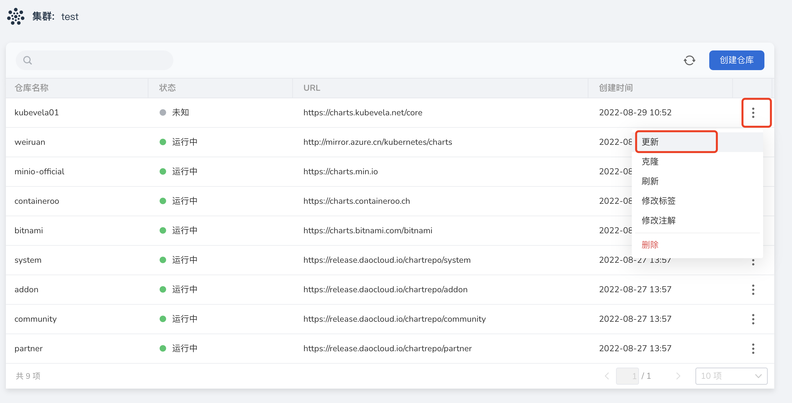

# Manage Helm repository

The Helm repository is a repository for storing and publishing Charts. The Helm application module supports HTTP(s) protocol to access Chart packages in the repository. By default, the system has 4 built-in Helm warehouses as shown in the table below to meet common needs in the production process of enterprises.

| Warehouse | Description | Example |
| --------- | --------------------------------------- --------------------- | ------------ |
| partner | Various high-quality features provided by ecological partners Chart | tidb |
| system | Chart that must be relied upon by system core functional components and some advanced functions. For example, insight-agent must be installed to obtain cluster monitoring information | Insight |
| addon | Common Chart in business scenarios | cert-manager |
| community | The most popular open source components in the Kubernetes community Chart | Istio |

In addition to the above preset repositories, you can also add third-party Helm repositories yourself. This article will introduce how to add and update third-party Helm repositories.

## prerequisites

- Container management platform [connected to Kubernetes cluster](../Clusters/JoinACluster.md) or [created Kubernetes cluster](../Clusters/CreateCluster.md), and can access the UI interface of the cluster

- Completed a [Namespace Creation](../Namespaces/createtens.md), [User Creation](../../../ghippo/04UserGuide/01UserandAccess/User.md), and created a Grant [`NS Admin`](../Permissions/PermissionBrief.md#ns-admin) or higher permissions, please refer to [Namespace Authorization](../Permissions/Cluster-NSAuth.md) for details.

- If using a private warehouse, the current operating user should have read and write permissions to the private warehouse.

## Introduce third-party Helm repository

The following takes the public mirror warehouse of Kubevela as an example to introduce and manage the Helm warehouse.

1. Find the cluster that needs to be imported into the third-party Helm warehouse, click the cluster name, and enter `Cluster Details`.

    

2. In the left navigation bar, click `Helm Application` -> `Helm Warehouse` to enter the Helm Warehouse page.

    

3. Click the `Create Warehouse` button on the Helm Warehouse page to enter the Create Warehouse page, and configure relevant parameters according to the table below.

    - Warehouse name: Set the warehouse name. Up to 63 characters, can only contain lowercase letters, numbers and separator `-`, and must start and end with lowercase letters or numbers, such as kubevela
    - Warehouse address: the http(s) address used to point to the target Helm warehouse. For example <https://charts.kubevela.net/core>
    - Authentication method: The method used for identity verification after connecting to the warehouse address. For public repositories, you can choose `None`, private repositories need to enter username/password for identity verification
    - Tags: Add tags for this Helm repository. For example key: repo4; value: Kubevela
    - Annotations: Add annotations to the Helm repository. For example key: repo4; value: Kubevela
    - Description: Add a description for this Helm repository. Example: This is a Kubevela public Helm repository

    

4. Click `OK` to complete the creation of the Helm repository. The page will automatically jump to the list of Helm repositories.

    

## Update the Helm repository

When the address information of the Helm warehouse changes, the address, authentication method, label, annotation, and description information of the Helm warehouse can be updated.

1. Find the cluster where the warehouse to be updated is located, click the cluster name, and enter `Cluster Details`.

    

2. In the left navigation bar, click `Helm Application` -> `Helm Warehouse` to enter the Helm warehouse list page.

    

3. Find the Helm repository that needs to be updated on the repository list page, click the `⋮` button on the right side of the list, and click `Update` in the pop-up menu.

    

4. Update on the `Edit Helm Repository` page, and click `OK` when finished.

    

5. Return to the Helm warehouse list, and the screen prompts that the update is successful.

## Delete the Helm repository

In addition to importing and updating warehouses, you can also delete unnecessary warehouses, including system preset warehouses and third-party warehouses.

1. Find the cluster where the warehouse to be deleted is located, click the cluster name, and enter `Cluster Details`.

    

2. In the left navigation bar, click `Helm Application` -> `Helm Warehouse` to enter the Helm warehouse list page.

    

3. Find the Helm repository that needs to be updated on the repository list page, click the `⋮` button on the right side of the list, and click `Delete` in the pop-up menu.

    

4. Enter the warehouse name to confirm, and click `Delete`.

    

5. Return to the list of Helm repositories, and the screen prompts that the deletion is successful.