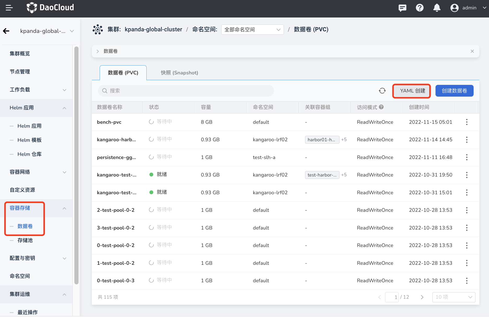
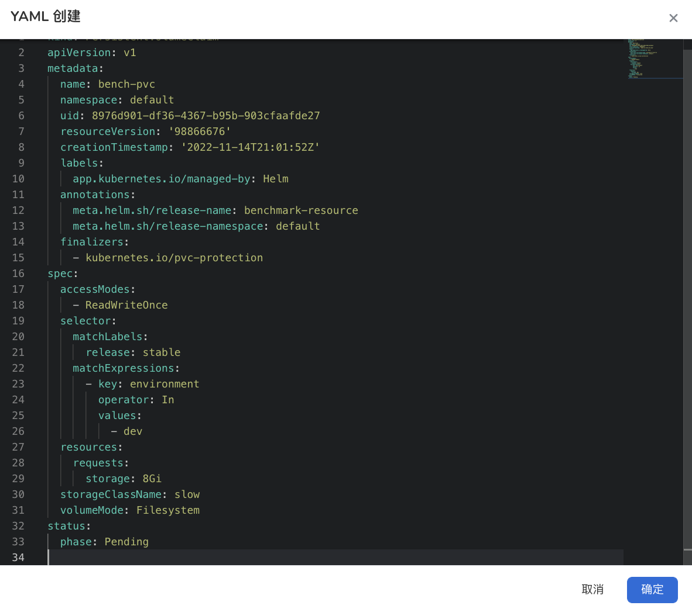
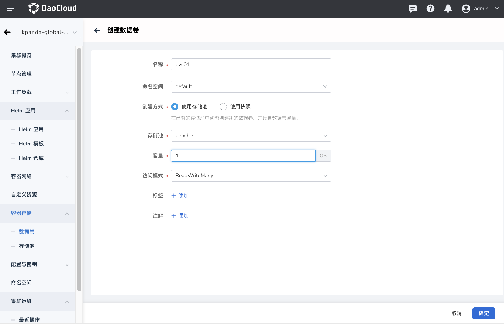
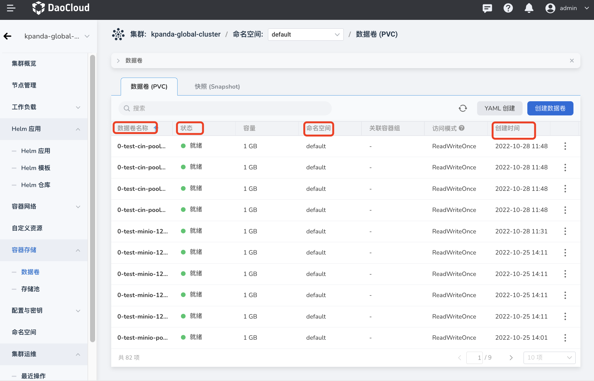
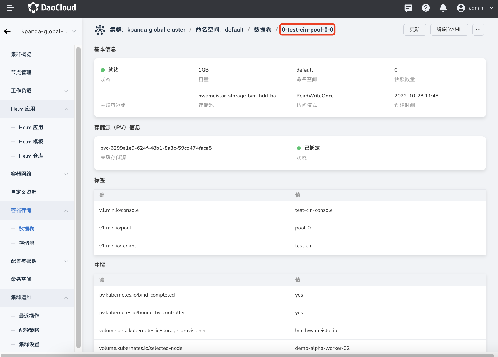
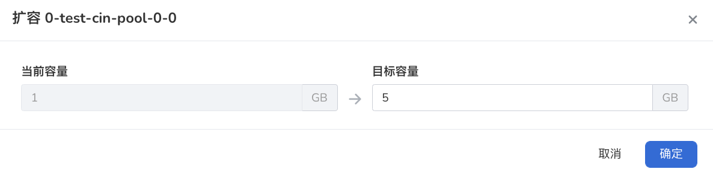
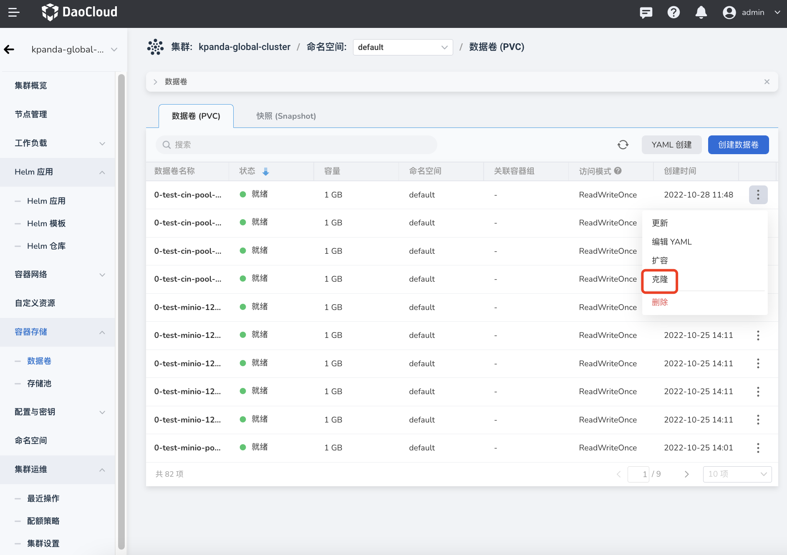
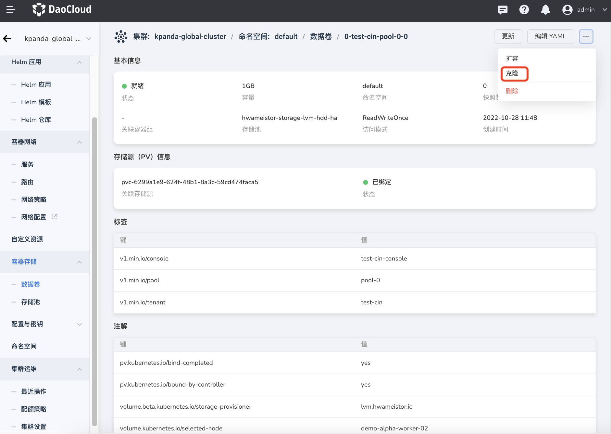
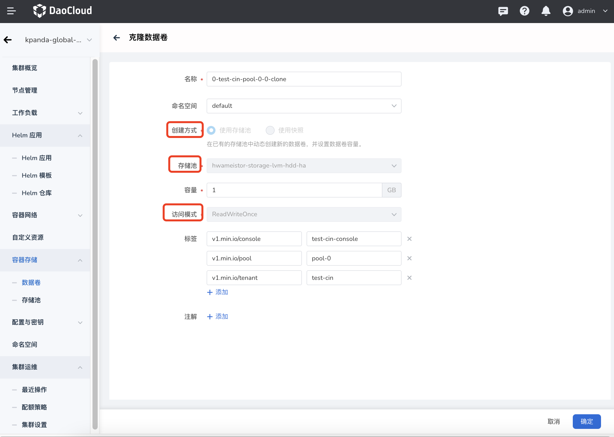
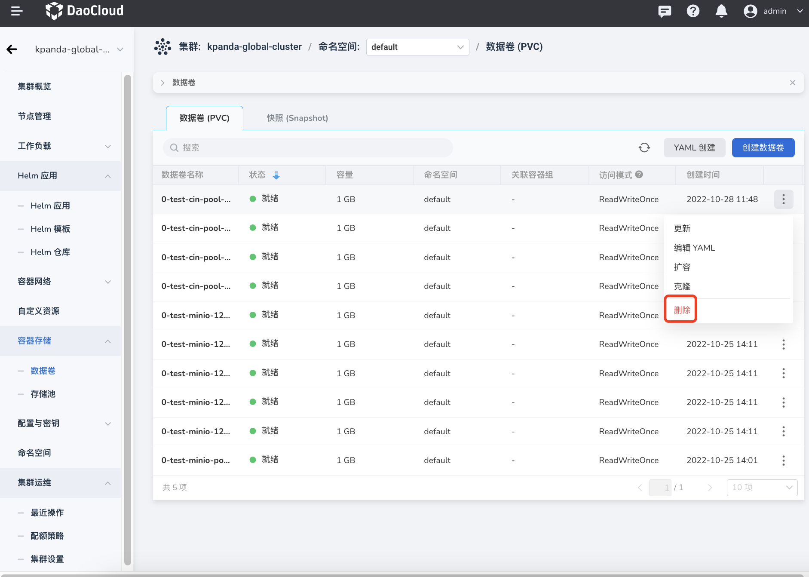

# data volume

The data volume (Volume) is used by the workload created by the user. It is a resource object that persists the workload data. The data volume saves the data directory that can be accessed by the container in the Pod.

## Create data volume

Currently, there are two ways to create data volumes: YAML and form. These two ways have their own advantages and disadvantages, and can meet the needs of different users.

There are fewer steps and more efficient creation through YAML, but the threshold requirement is high, and you need to be familiar with the YAML file configuration of the data volume.

It is more intuitive and easier to create through the form, just fill in the corresponding values ​​according to the prompts, but the steps are more cumbersome.

### YAML creation

1. Click the name of the target cluster in the cluster list, and then click `Container Storage`->`Data Volume`->`YAML Creation` in the left navigation bar.

    

2. Enter or paste the prepared YAML file in the pop-up box, and click `OK` at the bottom of the pop-up box.

    

### Form Creation

1. Click the name of the target cluster in the cluster list, and then click `Container Storage`->`Data Volume`->`Create Data Volume` in the left navigation bar.

    

2. Fill in the basic information.

    - Data volume names, namespaces, storage pools, and access modes cannot be changed after creation.
    - Use a storage pool: dynamically create a new data volume in an existing storage pool, and set the capacity of the data volume.
    - Use snapshot: Create a new data volume based on the snapshot of the data volume. The capacity of the data volume cannot be modified during creation. If you need to expand the capacity, please operate after the creation is complete.

        

## View data volume

1. Click the name of the target cluster in the cluster list, and then click `Container Storage`->`Data Volume` in the left navigation bar.

    - On this page, you can view all data volumes in the current cluster, as well as information such as the status, capacity, and namespace of each data volume.

    - Supports sequential or reverse sorting by data volume name, status, namespace, and creation time.

        

2. Click the name of the data volume to view the basic configuration, storage source information, labels, comments and other information of the data volume.

    

## Expand data volume

Whether the data volume supports capacity expansion mainly depends on whether the underlying CSI storage plug-in supports capacity expansion.

1. Enter the clone page: There are two ways

    - On the data volume list page, find the data volume that needs to be expanded, and select `Expansion` under the operation bar on the right.

        

    - Click the name of the data volume, enter the details page of the data volume, click the operation button in the upper right corner of the page and select `Expansion`.

        

2. Enter the new capacity and click `OK`.

    

## Clone data volume

By cloning a data volume, a new data volume can be recreated based on the configuration of the cloned data volume.

1. Enter the clone page: There are two ways

    - On the data volume list page, find the data volume to be cloned, and select `Clone` under the operation bar on the right.

        

    - Click the name of the data volume, enter the details page of the data volume, click the operation button in the upper right corner of the page and select `Clone`.

        

2. Use the original configuration directly, or modify it as needed, and click `OK` at the bottom of the page.

    - Only the name, namespace, capacity, label, and annotation of the data are modified.
    - It is not supported to modify the creation method, storage pool, and access mode. If you need to modify these configurations, you need to recreate a data volume.

        

## Update data volume

There are two ways to update data volumes. Support for updating data volumes via forms or YAML files.

- On the data volume list page, find the data volume that needs to be updated, select `Update` under the operation bar on the right to update through the form, select `Edit YAML` to update through YAML.

    

- Click on the name of the data volume to enter the details page of the data volume, select `Update` in the upper right corner of the page to update through the form, select `Edit YAML` to update through YAML.

    

## Delete data volume

There are two ways to delete data volumes. Support for updating data volumes via forms or YAML files.

- On the data volume list page, find the data to be deleted, and select `Delete` under the operation bar on the right.

    

- Click the name of the data volume, enter the details page of the data volume, click the operation button in the upper right corner of the page, and select `Delete`.

    