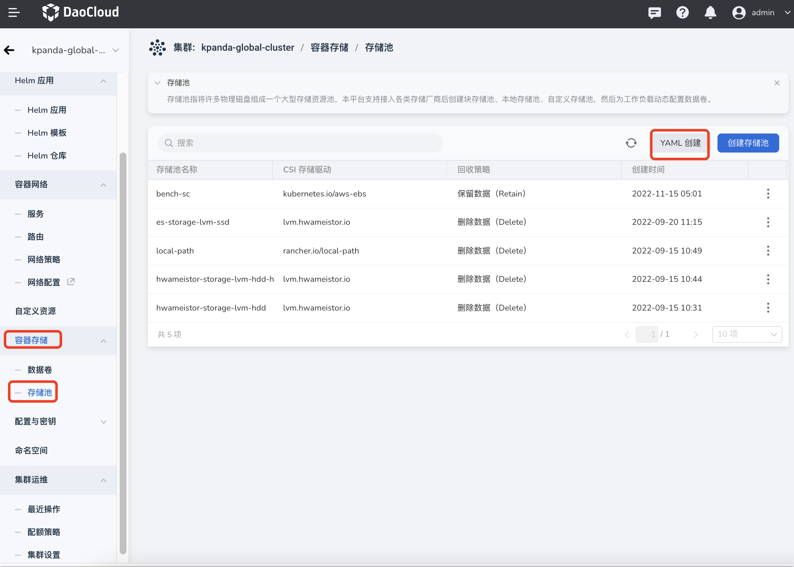
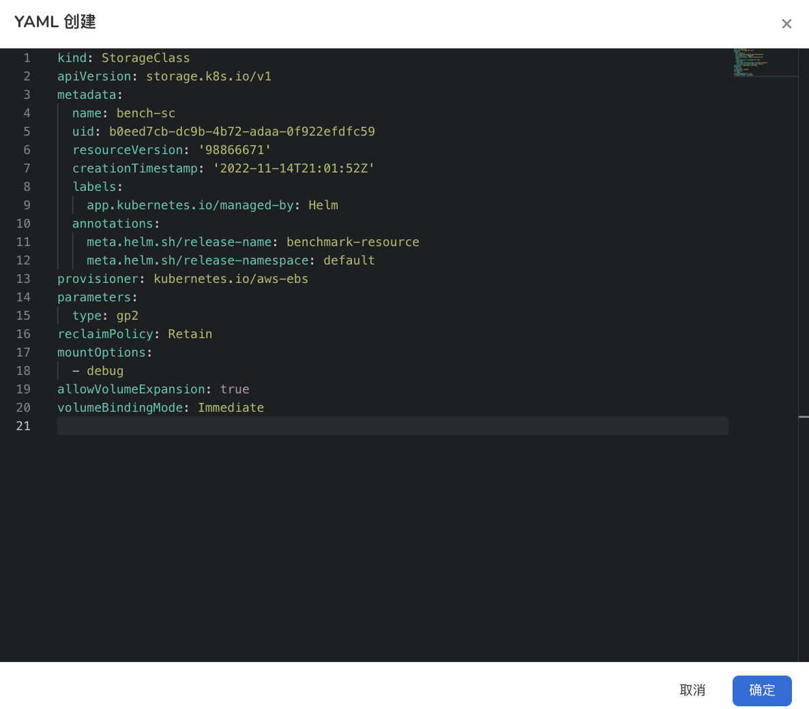
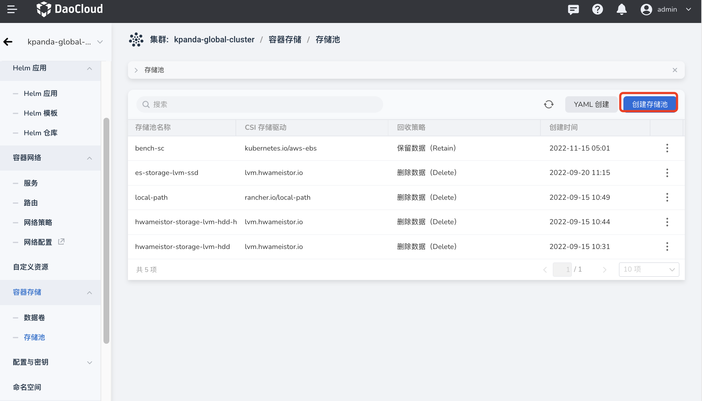
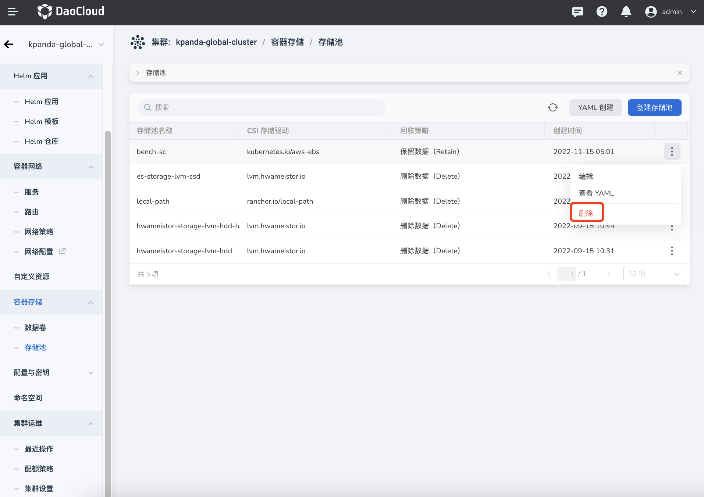

# storage pool

A storage pool refers to a large storage resource pool composed of many physical disks. This platform supports the creation of block storage pools, local storage pools, and custom storage pools after accessing various storage vendors, and then dynamically configures data volumes for workloads.

## Create storage pool

Currently, it supports creating storage pools through YAML and forms. These two methods have their own advantages and disadvantages, and can meet the needs of different users.

There are fewer steps and more efficient creation through YAML, but the threshold requirement is high, and you need to be familiar with the YAML file configuration of the storage pool.

It is more intuitive and easier to create through the form, just fill in the corresponding values ​​according to the prompts, but the steps are more cumbersome.

### Create with YAML

1. Click the name of the target cluster in the cluster list, and then click `Container Storage`->`Storage Pool`->`Create with YAML` in the left navigation bar.

    

2. Enter or paste the prepared YAML file in the pop-up box, and click `OK` at the bottom of the pop-up box.

    

### Form Creation

1. Click the name of the target cluster in the cluster list, and then click `Container Storage`->`Storage Pool`->`Create Storage Pool` in the left navigation bar.

    

2. Fill in the basic information.

    - CSI storage driver: based on the standard Kubernetes Container Storage Interface (Container Storage Interface) plug-in
    - Recycling strategy: When deleting a data volume, delete the data in the data volume and the data source together, or keep the data and the data source.

        

## Update storage pool

On the storage pool list page, find the storage pool that needs to be updated, and select Edit under the operation bar on the right to update the storage pool.

!!! info

    Select `View YAML` to view the YAML file of the storage pool, but editing is not supported.

## Delete storage pool

On the storage pool list page, find the storage pool to be deleted, and select Delete in the operation column on the right.

