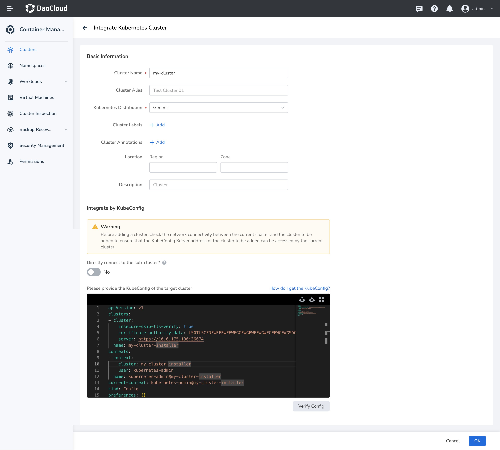
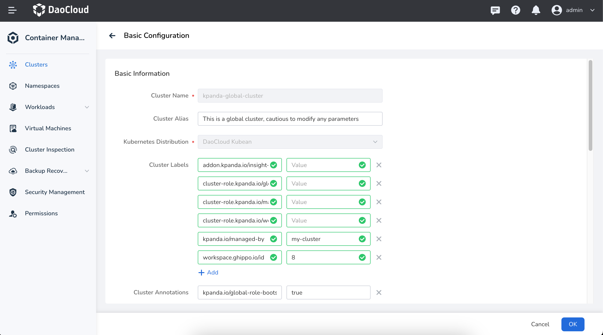

# Scaling the Worker Nodes of the Global Service Cluster

This page introduces how to manually scale the worker nodes of the global service cluster in offline mode.
By default, it is not recommended to scale the [global service cluster](../user-guide/clusters/cluster-role.md#global-service-cluster) after deploying DCE 5.0.
Please ensure proper resource planning before deploying DCE 5.0.

!!! note

    The controller node of the global service cluster do not support scaling.

## Prerequisites

- DCE platform deployment has been completed through [bootstrap node](../../install/commercial/deploy-arch.md),
  and the kind cluster on the bootstrap node is running normally.
- You must log in with a user account that has admin privileges on the platform.

## Get kubeconfig for the kind cluster on the bootstrap node

1. Run the following command to log in to the bootstrap node:

    ```bash
    ssh root@bootstrap-node-ip-address
    ```

2. On the bootstrap node, run the following command to get the `CONTAINER ID` of the kind cluster:

    ```bash
    [root@localhost ~]# podman ps

    # Expected output:
    CONTAINER ID  IMAGE                                      COMMAND     CREATED      STATUS      PORTS                                                                                                         NAMES
    220d662b1b6a  docker.m.daocloud.io/kindest/node:v1.26.2              2 weeks ago  Up 2 weeks  0.0.0.0:443->30443/tcp, 0.0.0.0:8081->30081/tcp, 0.0.0.0:9000-9001->32000-32001/tcp, 0.0.0.0:36674->6443/tcp  my-cluster-installer-control-plane
    ```

3. Run the following command to enter a container in the kind cluster:

    ```bash
    podman exec -it {CONTAINER ID} bash
    ```

    Replace `{CONTAINER ID}` with your actual container ID.

4. Inside the container of the kind cluster, run the following command to get the kubeconfig
   information for the kind cluster:

    ```bash
    kubectl config view --minify --flatten --raw
    ```

    After the console output, copy the kubeconfig information of the kind cluster for the next step.

## Create `cluster.kubean.io` resources in the kind cluster on the bootstrap node

1. Use the command `podman exec -it {CONTAINER ID} bash` to enter the kind cluster container.

1. Inside the kind cluster container, run the following command to get the **kind cluster name**:

    ```bash
    kubectl get clusters
    ```

1. Copy and run the following command within the kind cluster to create the `cluster.kubean.io` resource:

    ```bash
    kubectl apply -f - <<EOF
    apiVersion: kubean.io/v1alpha1
    kind: Cluster
    metadata:
      labels:
        clusterName: kpanda-global-cluster
      name: kpanda-global-cluster
    spec:
      hostsConfRef:
        name: my-cluster-hosts-conf
        namespace: kubean-system
      kubeconfRef:
        name: my-cluster-kubeconf
        namespace: kubean-system
      varsConfRef:
        name: my-cluster-vars-conf
        namespace: kubean-system
    EOF
    ```

    !!! note

        The default cluster name for `spec.hostsConfRef.name`, `spec.kubeconfRef.name`, and `spec.varsConfRef.name` is `my-cluster`. Please replace it with the **kind cluster name** obtained in the previous step.

1. Run the following command in the kind cluster to verify if the `cluster.kubean.io` resource
   is created successfully:

    ```bash
    kubectl get clusters
    ```

    Expected output is:

    ```console
    NAME                    AGE
    kpanda-global-cluster   3s
    my-cluster              16d
    ```

## Update the containerd configuration in the kind cluster on the bootstrap node

1. Run the following command to log in to one of the controller nodes of the global service cluster:

    ```bash
    ssh root@<global-service-cluster-controller-node-IP>
    ```

2. On the global service cluster controller node, run the following command to copy the containerd
   configuration file __config.toml__ from the controller node to the bootstrap node:

    ```bash
    scp /etc/containerd/config.toml root@<bootstrap-node-IP>:/root
    ```

3. On the bootstrap node, select the **insecure registry section** from the containerd configuration file
   __config.toml__ that was copied from the controller node, and add it to the **config.toml** in the kind cluster.

    An example of the insecure registry section is as follows:

    ```toml
    [plugins."io.containerd.grpc.v1.cri".registry]
      [plugins."io.containerd.grpc.v1.cri".registry.mirrors]
        [plugins."io.containerd.grpc.v1.cri".registry.mirrors."10.6.202.20"]
          endpoint = ["https://10.6.202.20"]
        [plugins."io.containerd.grpc.v1.cri".registry.configs."10.6.202.20".tls]
          insecure_skip_verify = true
    ```

    !!! note

        Since the `config.toml` file in the kind cluster cannot be modified directly,
        you can first copy the file out to modify it and then copy it back to the kind cluster.
        The steps are as follows:

        1. Run the following command on the bootstrap node to copy the file out:

            ```bash
            podman cp {CONTAINER ID}:/etc/containerd/config.toml ./config.toml.kind
            ```

        2. Run the following command to edit the `config.toml` file:

            ```bash
            vim ./config.toml.kind
            ```

        3. After modifying the file, copy it back to the kind cluster by running the following command:

            ```bash
            podman cp ./config.toml.kind {CONTAINER ID}:/etc/containerd/config.toml
            ```

            **{CONTAINER ID}** should be replaced with your actual container ID.

1. Run the following command within the kind cluster to restart the containerd service:

    ```bash
    systemctl restart containerd
    ```

## Integrate a Kind cluster into the DCE 5.0 cluster list

1. Log in to DCE 5.0, navigate to Container Management, and on the right side of the cluster list,
   click the __Integrate Cluster__ button.

2. In the integration configuration section, fill in and edit the kubeconfig of the Kind cluster.

    ```yaml
    apiVersion: v1
    clusters:
    - cluster:
        insecure-skip-tls-verify: true # (1)!
        certificate-authority-data: LS0TLSCFDFWEFEWFEWFGGEWGFWFEWGWEGFEWGEWGSDGFSDSD
        server: https://my-cluster-installer-control-plane:6443 # (2)!
    name: my-cluster-installer
    contexts:
    - context:
        cluster: my-cluster-installer
        user: kubernetes-admin
    name: kubernetes-admin@my-cluster-installer
    current-context: kubernetes-admin@my-cluster-installer
    kind: Config
    preferences: {}
    users:
    ```

    1. Skip TLS verification; this line needs to be added manually.
    2. Replace it with the IP of the Kind node, and change port 6443 to the port mapped to the node (you can run the command `podman ps|grep 6443` to check the mapped port).

    

3. Click the __OK__ to complete the integration of the Kind cluster.

## Add Labels to the Global Service Cluster

1. Log in to DCE 5.0, navigate to Container Management, find the __kapnda-global-cluster__ ,
   and in the right-side, find the __Basic Configuration__ menu options.

2. In the Basic Configuration page, add the label `kpanda.io/managed-by=my-cluster` for the global service cluster:

!!! note

    The value in the label `kpanda.io/managed-by=my-cluster` corresponds to the name of the cluster
    specified during the integration process, which defaults to `my-cluster`.
    Please adjust this according to your actual situation.

    

## Add nodes to the global service cluster

1. Go to the node list page of the global service cluster, find the __Integrate Node__ button
   on the right side of the node list, and click to enter the node configuration page.

2. After filling in the IP and authentication information of the node to be integrated,
   click __Start Check__ . Once the node check is completed, click __Next__ .

3. Add the following custom parameters in the __Custom Parameters__ section:

    ```bash
    download_run_once: false
    download_container: false
    download_force_cache: false
    download_localhost: false
    ```

    

4. Click the __OK__ button and wait for the node to be added.
