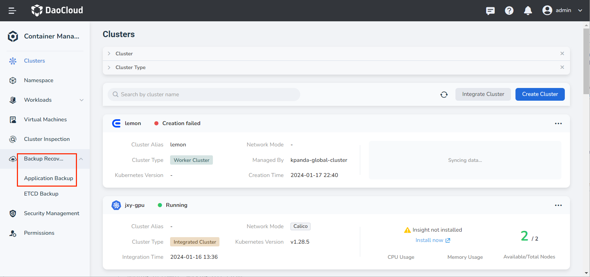

# Limited Scenario Migration from DCE 4.0 to DCE

This article introduces the DCE 4.0 -> DCE migration process in some scenarios.

## Environment Preparation

1. An available DCE 4.0 environment.
1. An available DCE environment.
1. A Kubernetes cluster available for data restoration, hereinafter referred to as the __restoration cluster__ .

## Prerequisites

1. Install the CoreDNS plugin on DCE 4.0.

1. Migrate DCE 4.0 to DCE. Refer to [Integrate DCE 4.0](../user-guide/clusters/integrate-cluster.md) for the migration steps.
   The DCE 4.0 cluster migrated to DCE is hereinafter referred to as the __backup cluster__ .

    !!! note

        When integrating the cluster, select __DaoCloud DCE4__ as the distribution.

1. Install Velero on the managed DCE 4.0 cluster. Refer to [Install Velero](../user-guide/backup/install-velero.md) for installation steps.

1. Migrate the restoration cluster to DCE, which can be done either by creating a cluster or by integrating a cluster.

1. Install Velero on the restoration cluster. Refer to [Install Velero](../user-guide/backup/install-velero.md) for installation steps.

!!! note

    - The object storage configuration must be consistent between the Velero installed in the managed DCE 4.0 cluster and the Velero installed in the restoration cluster.
    - If you need to perform Pod migration, turn on the __Migration Plugin Configuration__ switch in the form parameters (**velero 5.2.0+** supports this configuration).


## Optional Configuration

If you need to perform Pod migration, execute the following steps after the prerequisites are completed. They can be ignored for non-Pod migration scenarios.

!!! note

    The following steps are all executed in the restoration cluster managed by DCE.

### Configure the Velero Plugin

1. After the Velero plugin is installed, you can execute the following YAML file to complete the configuration of the Velero plugin.

    !!! note

        When installing the Velero plugin, you must turn on the __Migration Plugin Configuration__ switch in the form parameters.

    ??? note "Click to view the complete YAML example"

        ```yaml
        apiVersion: v1
        kind: ConfigMap
        metadata:
          name: velero-plugin-for-migration # (1)!
          namespace: velero # (2)!
          labels: # (3)!
            velero.io/plugin-config: "velero-plugin-for-migration" # (4)!
            velero.io/velero-plugin-for-migration: RestoreItemAction # (5)!
        data:
          velero-plugin-for-migration: '{"resourcesSelector":{"includedNamespaces":["kube-system"],"excludedNamespaces":["default"],"includedResources":["pods","deployments","ingress"],"excludedResources":["secrets"],"skipRestoreKinds":["endpointslice"],"labelSelector":"app:dao-2048"},"resourcesConverter":[{"ingress":{"enabled":true,"apiVersion":"extensions/v1beat1"}}],"resourcesOperation":[{"kinds":["pod"],"domain":"labels","operation":{"add":{"key1":"values","key2":""},"remove":{"key3":"values","key4":""},"replace":{"key5":["source","dest"],"key6":["","dest"],"key7":["source",""]}}},{"kinds":["deployment","daemonset"],"domain":"annotations","scope":"resourceSpec","operation":{"add":{"key1":"values","key2":""},"remove":{"key3":"values","key4":""},"replace":{"key5":["source","dest"],"key6":["","dest"],"key7":["source",""]}}}]}'
        ```

        1. any name can be used; Velero uses the labels (below) to identify it rather than the name
        2. must be in the velero namespace
        3. the below labels should be used verbatim in your ConfigMap
        4. this value-less label identifies the ConfigMap as config for a plugin (i.e. the built-in restore item action plugin)
        5. this label identifies the name and kind of plugin that this ConfigMap is for.

    !!! note

        - Do not modify the name of the plugin configuration ConfigMap, and it must be created in the velero namespace.
        - When filling in the plugin configuration, pay attention to distinguishing whether you are filling in resource resources or kind.
        - After modifying the plugin configuration, restart the velero pod.
        - The YAML below is a display style for the plugin configuration, and it needs to be converted to JSON and added to the ConfigMap.

    Refer to the following YAML and comments for how to configure __velero-plugin-for-migration__:

    ```yaml
    resourcesSelector: # (1)!
      includedNamespaces: # (2)!
        - kube-system
      excludedNamespaces: # (3)!
        - default
      includedResources:  # (4)!
        - pods
        - deployments
        - ingress
      excludedResources:  # (5)!
        - secrets
      skipRestoreKinds:
        - endpointslice  # (6)!
      labelSelector: 'app:dao-2048'
    resourcesConverter: # (7)!
      - ingress:
          enabled: true
          apiVersion: extensions/v1beat1
    resourcesOperation: # (8)!
      - kinds: ['pod'] # (9)!
        domain: labels # (10)!
        operation:
          add:
            key1: values # (11)!
            key2: ''
          remove:
            key3: values # (12)!
            key4: ''     # (13)!
          replace:
            key5:   # (14)!
              - source
              - dest
            key6:   # (15)!
              - ""
              - dest
            key7:   # (16)!
              - source
              - ""
      - kinds: ['deployment', 'daemonset'] # (17)!
        domain: annotations  # (18)!
        scope: resourceSpec  # (19)!
        operation:
          add:
            key1: values # (20)!
            key2: ''
          remove:
            key3: values # (21)!
            key4: ''     # (22)!
          replace:
            key5:   # (23)!
              - source
              - dest
            key6:   # (24)!
              - ""
              - dest
            key7:   # (25)!
              - source
              - ""
    ```

    1. The resources that the plugin needs to handle or ignore
    2. The plugin excludes the namespaces included in the backup
    3. The plugin does not handle the namespaces included in the backup
    4. The plugin handles the resources included in the backup
    5. The plugin does not handle the resources included in the backup
    6. The restore plugin skips the resources included in the backup, that is, it does not perform the restore operation. This resource needs to be included in includedResources to be captured by the plugin. This field needs to be filled with the resource kind, and is case insensitive
    7. The resources that the restore plugin needs to convert. Configuring the conversion of specific resource fields is not supported
    8. The restore plugin modifies the annotations/labels of the resource/template
    9. Fill in the resource kind included in the backup, and is case insensitive
    10. Handle the resource labels
    11. Add labels key1:values
    12. Remove labels key3:values, matching key and values
    13. Remove labels key4, matching only the key and not the values
    14. Replace labels key5:source -> key5:dest
    15. Replace labels key6: -> key6:dest, not matching key6 values
    16. Replace labels key7:source -> key7:""
    17. Fill in the resource kind included in the backup, and is case insensitive
    18. Handle the resource template annotations
    19. Handle the annotations or labels of the resource template spec, depending on the domain configuration
    20. Add annotations key1:values
    21. Remove annotations key3:values, matching key and values
    22. Remove annotations key4, matching only the key and not the values
    23. Replace annotations key5:source -> key5:dest
    24. Replace annotations key6: -> key6:dest, not matching key6 values
    25. Replace annotations key7:source -> key7:""

2. After obtaining the above configuration, the velero-plugin-for-dce plugin performs chained operations on resources according to the configuration. For example, after ingress is processed by resourcesConverter, it will also be processed by resourcesOperation.

### Image Repository Replacement

If the image address has changed, you can configure the mapping by creating a ConfigMap in the Velero namespace to complete the replacement of the image address.

Migration resources to which this configuration applies: pod/deployment/statefulsets/daemonset/replicaset/replicationcontroller/job/cronjob.

!!! note

    - The ConfigMap is created in the Velero namespace in the restoration cluster.
    - Only one ConfigMap with the label velero.io/change-image-name: RestoreItemAction can be configured.
    - The mapping rule only matches the first rule that fits, corresponding to the case in the ConfigMap.

```yaml
apiVersion: v1
kind: ConfigMap
metadata:
  name: change-image-name-config # (1)!
  namespace: velero # (2)!
  labels: # (3)!
    velero.io/plugin-config: "" # (4)!
    velero.io/change-image-name: RestoreItemAction # (5)!
data:
  "case1":"1.1.1.1:5000,2.2.2.2:3000" # (6)!
  "case2":"5000,3000"
  "case3":"abc:test,edf:test"
  "case5":"test,latest"
  "case4":"1.1.1.1:5000/abc:test,2.2.2.2:3000/edf:test"
  "case5":"dev/,test/" # (7)!
```

1. any name can be used; Velero uses the labels (below) to identify it rather than the name
2. must be in the velero namespace
3. the below labels should be used verbatim in your ConfigMap
4. this value-less label identifies the ConfigMap as config for a plugin (i.e. the built-in restore item action plugin)
5. this label identifies the name and kind of plugin that this ConfigMap is for.
6. add 1+ key-value pairs here, where the key can be any words that ConfigMap accepts.
   the value should be `<old_image_name_sub_part><delimiter><new_image_name_sub_part>`
   for current implementation the `<delimiter>` can only be "," eg: in case your old image name is 1.1.1.1:5000/abc:test
7. Please note that image name may contain more than one part that matching the replacing words.
   eg: in case your old image names are `dev/image1:dev` and `dev/image2:dev`,
   you want change to `test/image1:dev` and `test/image2:dev` the suggested replacing rule is:
   this will avoid unexpected replacement to the second "dev".

## Migration Scenarios

### Resource and Data Migration

The following uses business application migration as an example.

#### Migration Scenario: Backup and Restore of a StatefulSet + PVC Stateful Application

Known prerequisites: A stateful application (StatefulSet), such as etcd, has been deployed in a namespace in the backup cluster, and a PVC is mounted.

**Backup**

First back up the resources that need to be backed up in the backup cluster. The process is as follows. Before that, you can read [Application Backup](../user-guide/backup/deployment.md) first:

1. Enter the Container Management module, click __Backup Recovery__ -> __Application Backup__ on the left navigation bar, and enter the __Application Backup__ list page.

    

2. On the __Application Backup__ list page, select the backup cluster. Click __Backup Plan__ in the upper right corner to create a new backup plan.

3. Refer to the instructions below to fill in the backup configuration.

    - Name: The name of the new backup plan.
    - Source Cluster: The cluster where the application backup plan is to be executed.
    - Object Storage Location: The access path of the object storage configured when installing velero on the source cluster.
    - Namespace: The namespaces that need to be backed up, multiple selections are supported.
    - Advanced Configuration: Back up specific resources in the namespace based on resource labels, such as an application, or do not back up specific resources in the namespace based on resource labels during backup.

!!! note

    - If you need to back up resources of multiple or all namespaces in batches, select multiple or all namespaces in the namespace option.
    - If you need to back up specific resources in a namespace, set labels for resource filtering.
        


**Restore**

After the data of the backup cluster is backed up, restore the resources and data in the restoration cluster. The operation steps are as follows:

1. Enter the Container Management module, click __Backup Recovery__ -> __Application Backup__ on the left navigation bar, and enter the __Application Restore__ list page.

2. On the __Application Restore__ list page, select the restoration cluster. Click __Restore Backup__ in the upper right corner to create a restore backup task.

    

3. Fill in the backup restore configuration and execute the backup.

    
      
    !!! note

        - The above migration process also applies to the following resources:
            - Auxiliary resources of the workload, such as secret and configmap
            - Multi-service scenarios: Helm application + Redis
        - If RBAC is configured for namespace resources and cluster resources, the corresponding RBAC of that category will also be migrated to DCE after the resources are migrated successfully.

### Image Repository Image Migration

The following describes the steps for image repository image migration.

1. Integrate the DCE 4.0 image repository with the Kangaroo repository integration (admin). Refer to [Repository Integration](../../kangaroo/integrate/integrate-admin/integrate-admin.md) for the operation steps.

    

    !!! note

        - Use the VIP address IP of dce-registry as the repository address.
        - Use the account and password of the DCE 4.0 administrator.

2. Create or integrate a Harbor repository in the administrator interface to migrate the source images.

    

3. Enter the Harbor repository instance, configure the target repository and synchronization rules. After the rules are triggered, Harbor will automatically pull images from dce-registry.

    

    
  
4. Click the name of the synchronization rule to enter the synchronization task details page, where you can view whether the image synchronization is successful.

    

### Network Policy Migration

#### Calico Network Policy Migration

Refer to the resource and data migration process to migrate the Calico service in DCE 4.0 to DCE.
Due to the different IPPool names, services may become abnormal. After migration, manually delete the annotations in the service YAML to ensure that the service starts properly.

!!! note
	
    - In DCE 4.0, the name is default-ipv4-ippool.
    - In DCE, the name is default-pool.

```yaml
annotations:
  dce.daocloud.io/parcel.net.type: calico
  dce.daocloud.io/parcel.net.type: default-ipv4-ippool
```


#### Parcel Underlay Network Policy Migration

The following describes the steps for Parcel Underlay network policy migration.

!!! note
    - During migration, the IP addresses created in DCE should be consistent with the IP addresses used in DCE 4.0, and the number of replicas created should also be consistent.

1. Install the Helm application spiderpool in the __restoration cluster__ . Refer to [Install Spiderpool](../../network/modules/spiderpool/install/install.md) for the installation process.

    

2. Go to the details page of the __restoration cluster__ and select __Container Network__ -> __Network Configuration__ from the left menu.

    

3. Check the IP addresses used in DCE4, and create the same subnet IP addresses and IP pool as in DCE4 in the DCE5.0 __Static IP Pool__ . For the use of subnets and IP pools, refer to [Create a Subnet and IP Pool](../../network/config/ippool/createpool.md).

    

    

    After the subnet is created, create an IP pool in the subnet details page and add the IP start address and the number of IPs.

    

4. Create a macvlan-type Multus CR instance and select the IP pool that was just created. For specific usage, refer to [Create a Multus CR](../../network/config/multus-cr.md)

    

5. Go to the **Custom Resources** page and manually change the `detectIPConflict` field of `spidermultusconfigs.spiderpool.spidernet.io` to `true`, which enables IP conflict detection.

     

6. Go to **Workloads** -> **Container NIC Configuration**, select the macvlan-type Multus CR that was just created for the NIC, and select the created IP pool for the NIC IP pool, then click OK to complete the creation. If the container group is Running at this point, it means it can be accessed normally.

     

     

7. Create the velero dce plugin configmap.

    ```yaml
    ---
      resourcesSelector:
        includedResources:
        - pods
        - deployments
      resourcesConverter:
      resourcesOperation:
      - kinds:
        - pod
        domain: annotations
        operation:
          replace:
            cni.projectcalico.org/ipv4pools:
            - '["default-ipv4-ippool"]'
            - default-pool
      - kinds:
        - deployment
        domain: annotations
        scope: resourceSpec
        operation:
          remove:
            dce.daocloud.io/parcel.egress.burst:
            dce.daocloud.io/parcel.egress.rate:
            dce.daocloud.io/parcel.ingress.burst:
            dce.daocloud.io/parcel.ingress.rate:
            dce.daocloud.io/parcel.net.type:
            dce.daocloud.io/parcel.net.value:
            dce.daocloud.io/parcel.ovs.network.status:
          add:
            ipam.spidernet.io/subnets: ' [ { "interface": "eth0", "ipv4": ["d5"] } ]'
            v1.multus-cni.io/default-network:  kube-system/d5multus
    ```

8. Verify whether the migration is successful.

    1. Check whether there are annotations in the application YAML.

        ```yaml
        annotations:
          ipam.spidernet.io/subnets: ' [ { "interface": "eth0", "ipv4": ["d5"] } ]'
          v1.multus-cni.io/default-network: kube-system/d5multus
        ```

    2. Check whether the Pod IP is within the configured IP pool.
