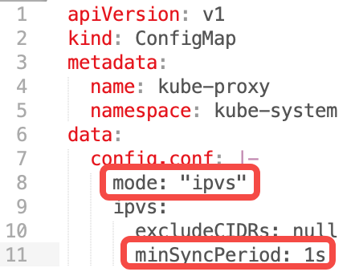
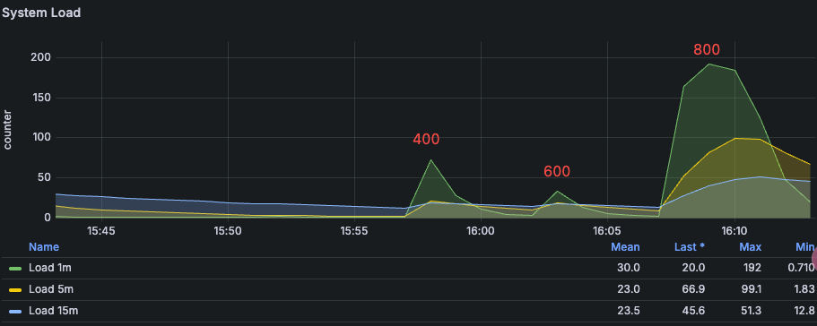
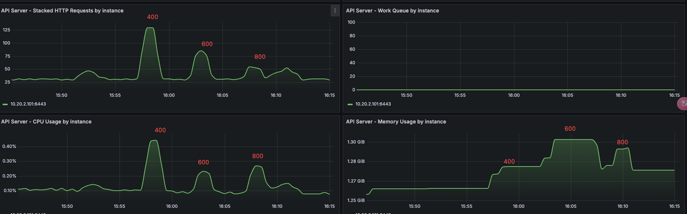
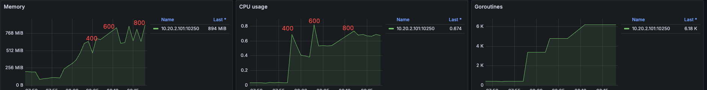
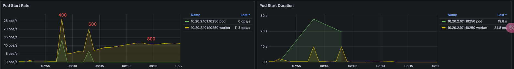

# Maximizing Pods Running on a Single Physical Node

This document outlines best practices for configuring the maximum number of Pods that can run on nodes within a Kubernetes cluster. It covers resource planning, configuration adjustments, testing process and results, node failure migration issues, and implementation recommendations.

## Hardware Configuration

- **3 VMs as Kubernetes control plane nodes** : 8 CPU cores, 16 GB RAM, 100 GB disk each  
- **1 physical machine as a Kubernetes worker node** : 80 CPU cores, 512 GB RAM  
- **Operating system** : Oracle Linux 9.5

## Additional Configuration Tuning

### System Parameters

```bash
sysctl -w fs.inotify.max_user_watches=655360
sysctl -w fs.inotify.max_user_instances=81920
sysctl -w fs.inotify.max_queued_events=655360
```

### kubelet Configuration

```yaml title="/var/lib/kubelet/config.yaml"
- eventBurst: 100 # default is 100
- eventRecordQPS: 50 # default is 50
- maxPods: 800 # default is 110
- podsPerCore: 10 # default is 0, limits Pods per CPU core
- serializeImagePulls: false # disable serial image pulls
- maxParallelImagePulls: 10 # max parallel image pulls to improve Pod creation QPS
```

Resource reservations for kubelet to avoid registration to node:

```yaml
kubeReserved: {cpu: "2", memory: "2Gi", ephemeral-storage: "10Gi"}
systemReserved: {cpu: "2", memory: "2Gi", ephemeral-storage: "10Gi"}
```

### containerd

```toml
# /etc/containerd/config.toml
[plugins."io.containerd.grpc.v1.cri"]
 max_concurrent_downloads = 10 # concurrent image downloads (default 3), adjust as needed
```

### kube-apiserver

```bash
--max-requests-inflight=4000 # increase concurrent request limit (default 400)
--max-mutating-requests-inflight=2000 # increase concurrent write requests (default 200)
--watch-cache=true # enable watch cache
--watch-cache-sizes=pod#1000 # increase watch cache capacity
--http2-max-streams-per-connection=1000 # raise HTTP/2 stream limit (default is 250 in Go)
```

### kube-controller-manager

```bash
--concurrent-service-syncs=10 # default is 1
--concurrent-deployment-syncs=50 # default is 5
--concurrent-replicaset-syncs=50 # default is 5
--http2-max-streams-per-connection=1000 # raise HTTP/2 stream limit (optional)
```

### kube-scheduler

```bash
--http2-max-streams-per-connection=1000 # raise HTTP/2 stream limit (optional)
```

### Networking Configuration

#### Calico Tuning

1. Set `ipipMode` to `CrossSubnet` and `vxlanMode` to `Never` in the IPPool:

    ```bash
    calicoctl patch ippool default-ippool -p '{"spec": {"ipipMode": "CrossSubnet","vxlanMode": "Never"}}'
    ```

2. Minimum Calico-node resource limits: 2 CPU cores, 1 GB memory

3. Calico updates iptables and ipset rules using both periodic and event triggers. Adjust intervals to reduce CPU usage:
   - `iptablesRefreshInterval=30s` (default is 10s)
   - `ipsetsRefreshInterval=120s` (default is 90s)

    ```bash
    calicoctl patch felixconfiguration default -p '{"spec": {"iptablesRefreshInterval": "30s","ipsetsRefreshInterval": "120s"}}'
    ```

4. Ensure the `calico-node` uses the correct iptables backend in high kernel versions (> 3.13):

    ```bash
    kubectl set env daemonSet/calico-node -n kube-system FELIX_IPTABLESBACKEND=Auto
    ```

5. Set the IP pool subnet mask to `/16` and BlockSize to `/26` to avoid IP exhaustion.  
   > These must be set during cluster installation; they cannot be changed afterward.

6. Kernel network tuning for large-scale clusters:

| Sysctl Parameters | Description |
|------------------|-------------|
| `net.ipv4.neigh.default.gc_thresh1=0`<br>`net.ipv4.neigh.default.gc_thresh2=512`<br>`net.ipv4.neigh.default.gc_thresh3=8192`<br>`net.ipv6.neigh.default.gc_thresh1=0`<br>`net.ipv6.neigh.default.gc_thresh2=512`<br>`net.ipv6.neigh.default.gc_thresh3=8192` | Minimum ARP neighbor cache entries. Automatically adjusted by Spiderpool in underlay networks. |
| `net.ipv4.ip_local_port_range=1024 65535` | Local source port range |
| `net.netfilter.nf_conntrack_max=1048576` | Max connection tracking entries |
| `net.core.somaxconn=32768` | Max connections per listen socket |

#### kube-proxy Tuning

1. Set kube-proxy `mode` to `ipvs` in the configMap  
2. Set `ipvs.minSyncPeriod` to `1s` in the configMap



!!! note

    `minSyncPeriod` defines the minimum delay between syncing iptables rules.

    Default: `0s`, which causes immediate updates on Service or Endpoint changes.

    Recommended: `1s` for most clusters; increase it in large clusters.  
    If `sync_proxy_rules_duration_seconds` metrics show a high average, increasing `minSyncPeriod` may help.

## Test Procedure and Results

Gradually created 400–800 NGINX Pods across multiple namespaces (5 Pods per namespace on average).  
Measured time from Pod creation to readiness, and monitored overall platform stability and performance.

- OS-level optimizations for kubelet, ETCD, kube-apiserver, kube-controller-manager, kube-scheduler, containerd, fluent-bit, Prometheus, etc.
- Network tuning for kube-proxy and Calico

### Test Script

Deploy the following script to control the number of replicas per Deployment.

```bash title="deploy-to-ns.sh"
#!/bin/bash

NAMESPACE_PREFIX="test"
TOTAL_NS=60

DEPLOYMENT_YAML=$(cat <<EOF
<... trimmed for brevity ...>
EOF
)

for i in $(seq 1 $TOTAL_NS); do
  NS_NAME="${NAMESPACE_PREFIX}-${i}"

  if ! kubectl get namespace "$NS_NAME" &> /dev/null; then
    echo "[Error] Namespace ${NS_NAME} does not exist, skipping"
    continue
  fi

  if kubectl get deployment -n "$NS_NAME" busybox-300 &> /dev/null; then
    echo "[Skipped] Deployment already exists in ${NS_NAME}"
  else
    echo "$DEPLOYMENT_YAML" | kubectl apply -n "$NS_NAME" -f -
    echo "[Success] Deployment created in ${NS_NAME}"
  fi
done

echo "Operation completed!"
```

### System Load Changes

System load increases significantly at 800 Pods.



### kube-apiserver

Comparison of resource usage and QPS from 400 to 800 Pods. At 800, system load increased, QPS dropped.



### kubelet

CPU and memory usage by kubelet from 400 to 800 Pods:



Pod creation QPS by kubelet—peaks at ~25 for 400 Pods, then declines as load increases:



## Test Results

- **800 Pods per node**: System operated normally, no error logs from `kube-apiserver`.  
- **1000 Pods per node**: Node experienced lag, slow Pod creation, restarts in components like Prometheus.

## Conclusion

With the given configuration, it's recommended to run **no more than 600 Pods per node** to avoid hitting Pod limits during rolling updates or experiencing large-scale rescheduling during node failures.

## Potential Issues with Node Failure

Running 600+ Pods per node may introduce significant risks in case of node failure:

1. A single node failure may trigger hundreds of image downloads on new nodes, affecting cluster stability.
2. Rolling updates may briefly push a node near 1000 Pods, increasing pressure.
3. Recovery time after a node failure becomes significantly longer.
4. Probes may not be executed in time under high load, leading to false health check failures and restarts of system components.
