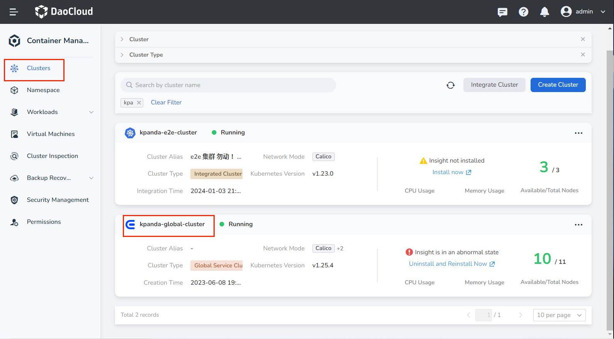
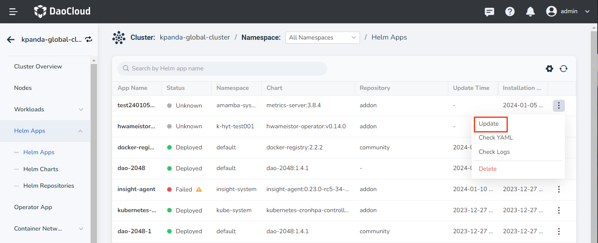

# Offline Upgrade for Container Management Module

This page explains how to install or upgrade after
[downloading the container management module](../../download/modules/kpanda.md).

!!! info

    The term `kpanda` appearing in the following commands or scripts is the internal development code name for the container management module.

## Load Images from Package

### Load Images from the Downloaded Package

You can load images using one of the two methods below. When there is an image repository in the environment, it is recommended to use chart-syncer to synchronize images to the image repository, which is more efficient and convenient.

#### Method 1: Synchronize Images Using chart-syncer

Using chart-syncer, you can upload the charts and their dependent image packages from the downloaded installation package to the image repository and helm repository used during the deployment of the installer DCE.

First, find a node that can connect to the image repository and helm repository (such as the seed node), create a `load-image.yaml` configuration file on the node, and fill in the configuration information for the image repository and helm repository.

1. Create `load-image.yaml`

    !!! note  

        All parameters in this YAML file are required.

    === "Helm repo already added"

        If the chart repo is already installed in the current environment, chart-syncer also supports exporting the charts as tgz files.

        ```yaml title="load-image.yaml"
        source:
          intermediateBundlesPath: kpanda # (1)!
        target:
          containerRegistry: 10.16.10.111 # (2)!
          containerRepository: release.daocloud.io/kpanda # (3)!
          repo:
            kind: HARBOR # (4)!
            url: http://10.16.10.111/chartrepo/release.daocloud.io # (5)!
            auth:
              username: "admin" # (6)!
              password: "Harbor12345" # (7)!
          containers:
            auth:
              username: "admin" # (8)!
              password: "Harbor12345" # (9)!
        ```

        1. Path where the .tar.gz package is located after using chart-syncer
        2. Image repository address
        3. Image repository path
        4. Helm Chart repository type
        5. Helm repository address
        6. Image repository username
        7. Image repository password
        8. Helm repository username
        9. Helm repository password

    === "Helm repo not added"

        If the helm repo is not added on the current node, chart-syncer also supports exporting the charts as tgz files and storing them in a specified path.

        ```yaml title="load-image.yaml"
        source:
          intermediateBundlesPath: kpanda # (1)!
        target:
          containerRegistry: 10.16.10.111 # (2)!
          containerRepository: release.daocloud.io/kpanda # (3)!
          repo:
            kind: LOCAL
            path: ./local-repo # (4)!
          containers:
            auth:
              username: "admin" # (5)!
              password: "Harbor12345" # (6)!
        ```

        1. Path where the .tar.gz package is located after using chart-syncer
        2. Image repository URL
        3. Image repository path
        4. Local path for the chart
        5. Image repository username
        6. Image repository password

1. Run the image synchronization command.

    ```shell
    charts-syncer sync --config load-image.yaml
    ```

#### Method 2: Load Images Using Docker or containerd

Unpack and load the image files.

1. Unpack the tar package.

    ```shell
    tar xvf kpanda.bundle.tar
    ```

    After successful unpacking, you will get 3 files:

    - hints.yaml
    - images.tar
    - original-chart

2. Load the images from the local to Docker or containerd.

    === "Docker"

        ```shell
        docker load -i images.tar
        ```

    === "containerd"

        ```shell
        ctr -n k8s.io image import images.tar
        ```

!!! note

    Each node needs to perform the Docker or containerd image loading operation. After loading, you need to tag the images to keep the Registry and Repository consistent with the installation.

### Upgrade

There are two upgrade methods. You can choose the proper upgrade plan based on the preliminary operations:

!!! note

    Starting from version v0.21.0 of kpanda, Redis supports setting a sentinel password. If using sentinel mode Redis, you need to change the --set global.db.redis.url during the upgrade. For example:
    
    - Previously: `redis+sentinel://:3wPxzWffdn@rfs-mcamel-common-redis-cluster.mcamel-system.svc.cluster.local:26379/mymaster`
    - Now: `redis+sentinel://:3wPxzWffdn@rfs-mcamel-common-redis-cluster.mcamel-system.svc.cluster.local:26379/mymaster?master_password=3wPxzWffdn`

=== "Upgrade via helm repo"

    1. Check if the container management helm repository exists.

        ```shell
        helm repo list | grep kpanda
        ```

        If the result is empty or the following prompt appears, proceed to the next step;
        otherwise, skip the next step.

        ```none
        Error: no repositories to show
        ```

    1. Add the container management helm repository.

        ```shell
        helm repo add kpanda http://{harbor url}/chartrepo/{project}
        ```

    1. Update the container management helm repository.

        ```shell
        helm repo update kpanda
        ```

    1. Choose the container management version you want to install (it is recommended to install the latest version).

        ```shell
        helm search repo kpanda/kpanda --versions
        ```

        The output will be similar to:
        
        ```none
        NAME                   CHART VERSION  APP VERSION  DESCRIPTION
        kpanda/kpanda  0.20.0          v0.20.0       A Helm chart for kpanda
        ...
        ```

    1. Back up `--set` parameters.

        Before upgrading the container management version, it is recommended to
        run the following command to back up the `--set` parameters of the old version.

        ```shell
        helm get values kpanda -n kpanda-system -o yaml > bak.yaml
        ```

    1. Update kpanda crds

        ```shell
        helm pull kpanda/kpanda --version 0.21.0 && tar -zxf kpanda-0.21.0.tgz
        kubectl apply -f kpanda/crds
        ```

    1. Run `helm upgrade`.

        Before upgrading, it is recommended to overwrite the `global.imageRegistry` field in bak.yaml with the current image repository address.

        ```shell
        export imageRegistry={your image repository}
        ```

        ```shell
        helm upgrade kpanda kpanda/kpanda \
          -n kpanda-system \
          -f ./bak.yaml \
          --set global.imageRegistry=$imageRegistry \
          --version 0.21.0
        ```

=== "Upgrade via chart package"

    1. Back up `--set` parameters.

        Before upgrading the container management version, it is recommended to run the following command to back up the `--set` parameters of the old version.

        ```shell
        helm get values kpanda -n kpanda-system -o yaml > bak.yaml
        ```

    1. Update kpanda crds

        ```shell
        kubectl apply -f ./crds
        ```

    1. Run `helm upgrade`.

        Before upgrading, it is recommended to overwrite the `global.imageRegistry` in bak.yaml with the current image repository address.

        ```shell
        export imageRegistry={your image repository}
        ```

        ```shell
        helm upgrade kpanda . \
          -n kpanda-system \
          -f ./bak.yaml \
          --set global.imageRegistry=$imageRegistry
        ```

## Upgrade via Web Interface

### Prerequisites

Run the following command before installing DCE 5.0 or upgrading the product module:

```shell
~/dce5-installer cluster-create -c /home/dce5/sample/clusterConfig.yaml -m /home/dce5/sample/manifest.yaml -d -j 14,15
```

### Steps

1. In the __Clusters__ page, search for the kpanda-global-cluster cluster and enter the cluster details.

    

2. In the left navigation bar, find Helm apps, search for kpanda to find
   the container management module, expand the right operation bar, and click the __Update__ button to upgrade.

    

### Known Issues with Web Interface Upgrade

Issue Description: When upgrading kpanda from a lower version to v0.25.1 or higher through the web interface,
there may be an image address concatenation issue leading to upgrade failure, with the following error prompt:


Solution:

When updating kpanda in Helm apps, modify the yaml file and change the repository address
to the format `repository: xxx/xxx`.

??? note "Click to view detailed YAML example"

    ```yaml
    global:
      imageRegistry: 10.6.135.222/release.daocloud.io
      imagePullSecrets: []
      storageClass: ''
      kpanda:
        imageTag: v0.25.1
        enableGhippoRoutes: true
        enableSidecar: true
      db:
        builtIn: false
        redis:
          url: >-
            redis+sentinel://rfs-mcamel-common-redis-cluster.mcamel-system.svc.cluster.local:26379/mymaster?master_password=XFDYqKEyJU
          image:
            registry: release.daocloud.io
            repository: kpanda/redis
            tag: 7.0.5-alpine
            pullPolicy: IfNotPresent
      telemetry:
        tracing:
          enabled: true
          addr: >-
            insight-agent-opentelemetry-collector.insight-system.svc.cluster.local:4317
        metrics:
          enabled: true
          path: /metrics
          port: 81
      busybox:
        image:
          registry: release.daocloud.io
          repository: library/busybox
          tag: 1.34.1
          pullPolicy: IfNotPresent
      shell:
        image:
          registry: release.daocloud.io
          repository: kpanda/kpanda-shell
          tag: v0.0.9
          pullPolicy: IfNotPresent
    controllerManager:
      labels:
        app: kpanda-controller-manager
      replicaCount: 2
      podAnnotations: {}
      podLabels:
        app: kpanda-controller-manager
      image:
        registry: release.daocloud.io
        repository: kpanda/kpanda-controller-manager
        tag: ''
        pullPolicy: IfNotPresent
        pullSecrets: []
      livenessProbe:
        enabled: true
        initialDelaySeconds: 30
        timeoutSeconds: 5
        periodSeconds: 30
        successThreshold: 1
        failureThreshold: 3
        scheme: HTTP
      readinessProbe:
        enabled: true
        initialDelaySeconds: 30
        timeoutSeconds: 5
        periodSeconds: 30
        successThreshold: 1
        failureThreshold: 3
        scheme: HTTP
      resources:
        requests:
          cpu: 200m
          memory: 200Mi
      nodeSelector: {}
      affinity:
        podAntiAffinity:
          preferredDuringSchedulingIgnoredDuringExecution:
            - weight: 60
              podAffinityTerm:
                labelSelector:
                  matchExpressions:
                    - key: app
                      operator: In
                      values:
                        - kpanda-controller-manager
                topologyKey: kubernetes.io/hostname
      tolerations: []
    apiServer:
      createDefaultOrderIndex: true
      insightAgentRegistryOverride: true
      labels:
        app: kpanda-apiserver
      replicaCount: 2
      podAnnotations: {}
      podLabels: {}
      image:
        registry: release.daocloud.io
        repository: kpanda/kpanda-apiserver
        tag: ''
        pullPolicy: IfNotPresent
        pullSecrets: []
      livenessProbe:
        enabled: true
        initialDelaySeconds: 30
        timeoutSeconds: 5
        periodSeconds: 30
        successThreshold: 1
        failureThreshold: 3
        scheme: HTTP
      readinessProbe:
        enabled: true
        initialDelaySeconds: 30
        timeoutSeconds: 5
        periodSeconds: 30
        successThreshold: 1
        failureThreshold: 3
        scheme: HTTP
      resources:
        requests:
          cpu: 200m
          memory: 200Mi
      hostNetwork: false
      nodeSelector: {}
      affinity: {}
      tolerations: []
      serviceType: ClusterIP
      nodePort: null
      configMap:
        addon:
          repo:
            - URL: http://10.6.135.222:8081
              name: addon
              password: rootpass123
              username: rootuser
    kpanda-proxy:
      enabled: true
      proxyIngress:
        replicaCount: 2
        podAnnotations: {}
        podLabels: {}
        resources:
          requests:
            cpu: 100m
            memory: 128Mi
        nodeSelector: {}
        affinity: {}
        tolerations: []
      proxyEgress:
        replicaCount: 2
        podAnnotations: {}
        podLabels: {}
        resources:
          requests:
            cpu: 100m
            memory: 128Mi
        nodeSelector: {}
        affinity: {}
        tolerations: []
    clusterpedia:
      enabled: true
      podLabels:
        sidecar.istio.io/inject: 'true'
      mysql:
        enabled: false
        image:
          registry: release.daocloud.io
          repository: kpanda/mysql
          tag: 8.0.29
        primary:
          persistence:
            enabled: false
          resources:
            limits:
              cpu: 1
              memory: 1Gi
            requests:
              cpu: 100m
              memory: 128Mi
      postgresql:
        enabled: false
        image:
          registry: release.daocloud.io
          repository: kpanda/postgresql
          tag: 15.3.0-debian-11-r7
        primary:
          persistence:
            enabled: false
          resources:
            limits:
              cpu: 1
              memory: 1Gi
            requests:
              cpu: 100m
              memory: 128Mi
      storageInstallMode: external
      externalStorage:
        type: mysql
        dsn: >-
          kpanda:@tcp(mcamel-common-kpanda-mysql-cluster-mysql-master.mcamel-system.svc.cluster.local:3306)/kpanda?charset=utf8mb4&multiStatements=true&parseTime=true
        host: ''
        port: null
        user: ''
        password: ihKhByQ2Af
        database: ''
        accessType: readwrite
        connMaxIdleSeconds: 1800
        connMaxLifetimeSeconds: 3600
        maxIdleConns: 10
        maxOpenConns: 100
      installCRDs: true
      persistenceMatchNode: None
      apiserver:
        replicaCount: 2
        podAnnotations: {}
        podLabels:
          sidecar.istio.io/inject: 'true'
        image:
          registry: release.daocloud.io
          repository: clusterpedia/apiserver
          tag: v0.7.1-rc.0
          pullPolicy: IfNotPresent
          pullSecrets: []
        featureGates:
          RemainingItemCount: false
          AllowRawSQLQuery: true
        resources: {}
        tolerations: []
      clustersynchroManager:
        replicaCount: 2
        podAnnotations: {}
        podLabels:
          sidecar.istio.io/inject: 'true'
          app: kpanda-clusterpedia-clustersynchro-manager
        image:
          registry: release.daocloud.io
          repository: clusterpedia/clustersynchro-manager
          tag: v0.7.1-rc.0
          pullPolicy: IfNotPresent
          pullSecrets: []
        featureGates:
          PruneManagedFields: true
          PruneLastAppliedConfiguration: true
          AllowSyncAllCustomResources: true
          AllowSyncAllResources: true
          HealthCheckerWithStandaloneTCP: true
        resources: {}
        nodeSelector: {}
        affinity:
          podAntiAffinity:
            preferredDuringSchedulingIgnoredDuringExecution:
              - weight: 60
                podAffinityTerm:
                  labelSelector:
                    matchExpressions:
                      - key: app
                        operator: In
                        values:
                          - kpanda-clusterpedia-clustersynchro-manager
                  topologyKey: kubernetes.io/hostname
        tolerations: []
        leaderElect:
          leaseDuration: 60s
          renewDeadline: 50s
          retryPeriod: 5s
          resourceLock: leases
      controllerManager:
        labels: {}
        replicaCount: 1
        podAnnotations: {}
        podLabels:
          sidecar.istio.io/inject: 'true'
        image:
          registry: release.daocloud.io
          repository: clusterpedia/controller-manager
          tag: v0.7.1-rc.0
          pullPolicy: IfNotPresent
          pullSecrets: []
      hookJob:
        image:
          registry: release.daocloud.io
          repository: kpanda/kpanda-shell
          tag: v0.0.9
          pullPolicy: IfNotPresent
    ui:
      enabled: true
      replicaCount: 2
      podAnnotations: {}
      podLabels: {}
      image:
        registry: release.daocloud.io
        repository: kpanda/kpanda-ui
        tag: v0.24.1
        pullPolicy: IfNotPresent
        pullSecrets: []
      resources: {}
      nodeSelector: {}
      affinity: {}
      tolerations: []
    cloudtty:
      enabled: true
      labels: {}
      replicaCount: 1
      podAnnotations: {}
      podLabels:
        sidecar.istio.io/inject: 'true'
      image:
        registry: release.daocloud.io
        repository: cloudtty/cloudshell-operator
        tag: v0.6.3
        pullPolicy: IfNotPresent
        pullSecrets: []
      resources:
        requests:
          cpu: 100m
          memory: 128Mi
      nodeSelector: {}
      affinity: {}
      tolerations: []
      cloudshellImage:
        registry: release.daocloud.io
        # Change the repository address like repository: cloudtty/cloudshell
        repository: cloudtty/cloudshell
        tag: v0.6.3
    hookJob:
      image:
        registry: release.daocloud.io
        repository: kpanda/kpanda-shell
        tag: v0.0.9
        pullPolicy: IfNotPresent
    helmJobImageOverride:
      enabled: true
      registry: release.daocloud.io
      repository: kpanda/kpanda-shell
      tag: v0.0.9
    etcdBackupRestore:
      image:
        registry: release.daocloud.io
        repository: kpanda/etcdbrctl
        tag: v0.22.0
    ```
