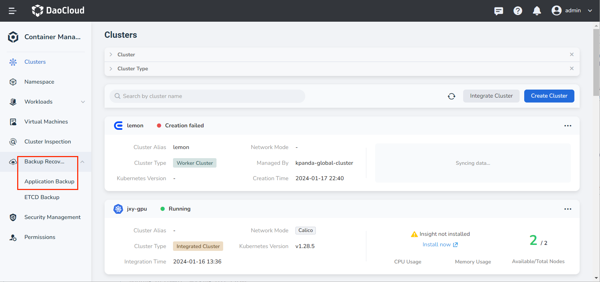
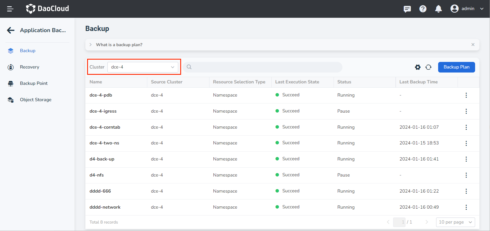
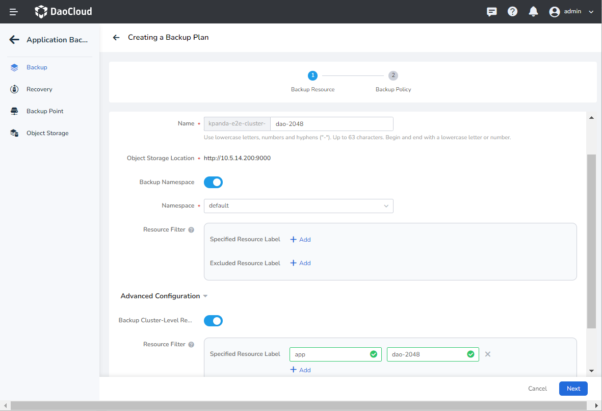
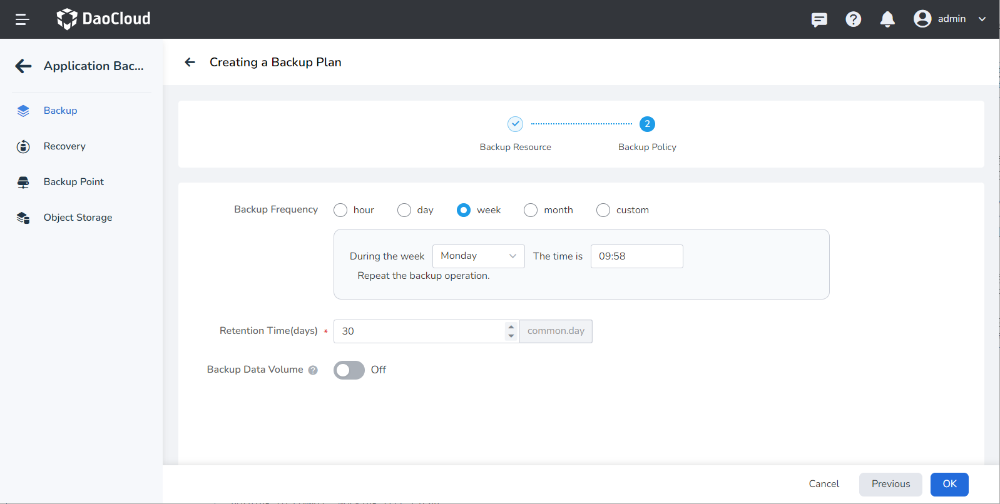
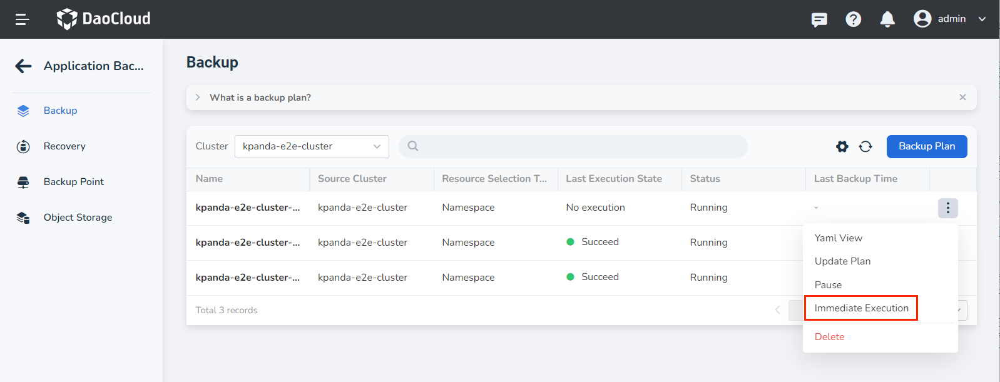
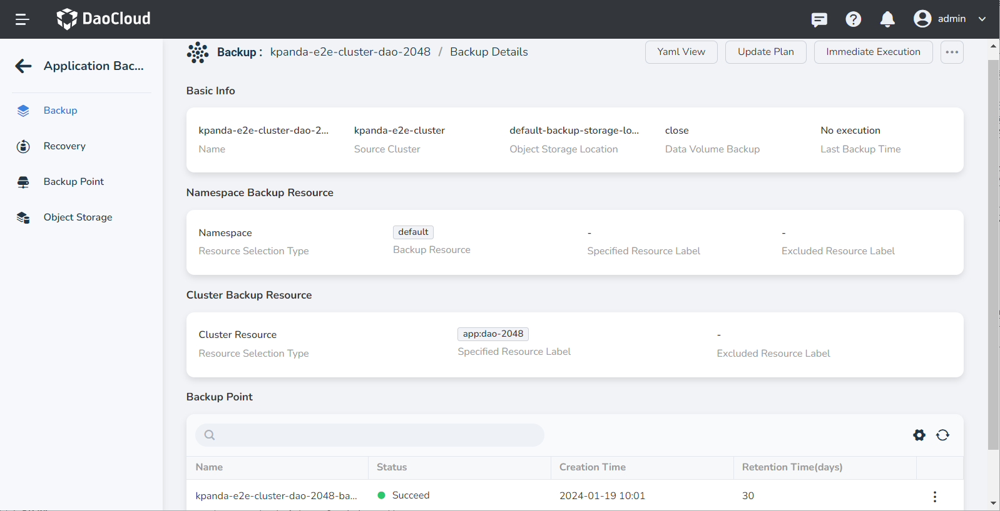

# Application Backup

This article explains how to backup applications in DCE 5.0. The demo application used in this tutorial is called __dao-2048__ , which is a deployment.

## Prerequisites

Before backing up a deployment, the following prerequisites must be met:

- [Integrate a Kubernetes cluster](../clusters/integrate-cluster.md) or [create a Kubernetes cluster](../clusters/create-cluster.md) in the [Container Management](../../intro/index.md) module, and be able to access the UI interface of the cluster.

- Create a [Namespace](../namespaces/createns.md) and a [User](../../../ghippo/user-guide/access-control/user.md).

- The current operating user should have [NS Edit](../permissions/permission-brief.md#ns-edit) or higher permissions, for details, please refer to [Namespace Authorization](../namespaces/createns.md).

- [Install the velero component](install-velero.md), and ensure the velero component is running properly.

- [Create a deployment](../workloads/create-deployment.md) (the workload in this tutorial is named __dao-2048__ ), and label the deployment with __app: dao-2048__ .

## Backup workload

Follow the steps below to backup the deployment __dao-2048__ .

1. Enter the Container Management module, click __Backup Recovery__ -> __Application Backup__ on the left navigation bar, and enter the __Application Backup__ list page.

    

2. On the __Application Backup__ list page, select the cluster where the velero and __dao-2048__ applications have been installed. Click __Backup Plan__ in the upper right corner to create a new backup cluster.

    

3. Refer to the instructions below to fill in the backup configuration.

    - Name: The name of the new backup plan.
    - Source Cluster: The cluster where the application backup plan is to be executed.
    - Object Storage Location: The access path of the object storage configured when installing velero on the source cluster.
    - Namespace: The namespaces that need to be backed up, multiple selections are supported.
    - Advanced Configuration: Back up specific resources in the namespace based on resource labels, such as an application, or do not back up specific resources in the namespace based on resource labels during backup.

        

4. Refer to the instructions below to set the backup execution frequency, and then click __Next__ .

    - Backup Frequency: Set the time period for task execution based on minutes, hours, days, weeks, and months. Support custom Cron expressions with numbers and `*` , **after inputting the expression, the meaning of the current expression will be prompted**. For detailed expression syntax rules, refer to [Cron Schedule Syntax](https://kubernetes.io/docs/concepts/workloads/controllers/cron-jobs/#cron-schedule-syntax).
    - Retention Time (days): Set the storage time of backup resources, the default is 30 days, and will be deleted after expiration.
    - Backup Data Volume (PV): Whether to back up the data in the data volume (PV), support direct copy and use CSI snapshot.
        - Direct Replication: directly copy the data in the data volume (PV) for backup;
        - Use CSI snapshots: Use CSI snapshots to back up data volumes (PVs). Requires a CSI snapshot type available for backup in the cluster.

            

5. Click __OK__ , the page will automatically return to the application backup plan list, find the newly created __dao-2048__ backup plan, and perform the __Immediate Execution__ operation.

    

6. At this point, the __Last Execution State__ of the cluster will change to __in progress__ . After the backup is complete, you can click the name of the backup plan to view the details of the backup plan.

    
