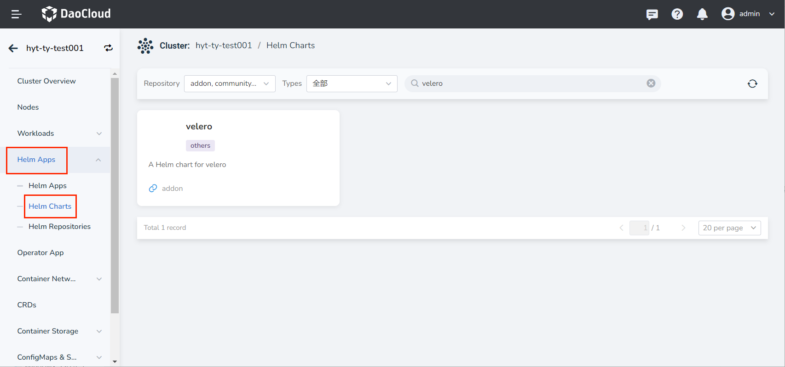
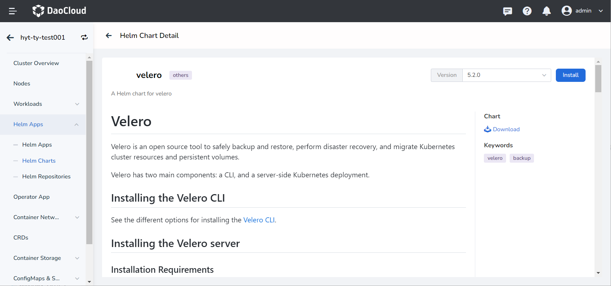
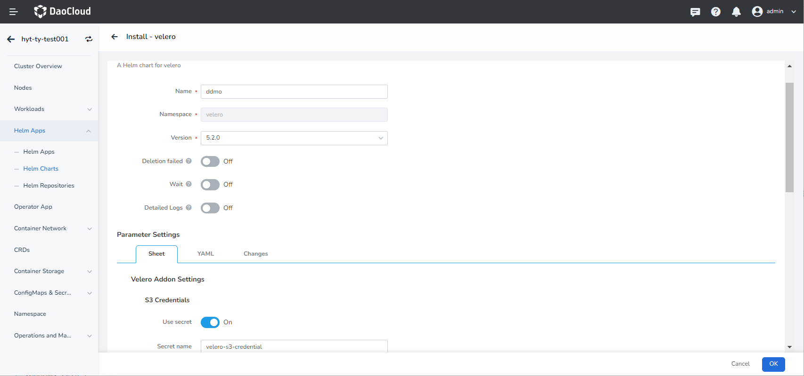
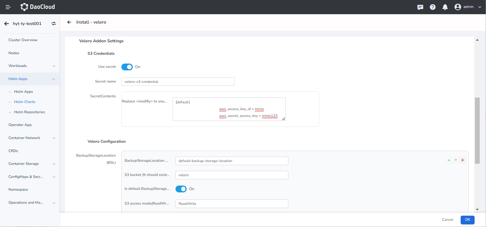

# Install the Velero Plugin

velero is an open source tool for backing up and restoring Kubernetes cluster resources. It can back up resources in a Kubernetes cluster to cloud storage services, local storage, or other locations, and restore those resources to the same or a different cluster when needed.

This section introduces how to deploy the Velero plugin in DCE 5.0 using the __Helm Apps__.

## Prerequisites

Before installing the __velero__ plugin, the following prerequisites need to be met:

- The container management module [connected to the Kubernetes cluster](../clusters/integrate-cluster.md) or [created the Kubernetes cluster](../clusters/create-cluster.md), and can access the UI interface of the cluster.

- Completed a __velero__ [namespace creation](../namespaces/createns.md).

- The current operating user should have [NS Editor](../permissions/permission-brief.md#ns-editor) or higher permissions, for details, refer to [Namespace Authorization](../namespaces/createns.md).

## Steps

Please perform the following steps to install the __velero__ plugin for your cluster.

1. On the cluster list page, find the target cluster that needs to install the __velero__ plugin, click the name of the cluster, click __Helm Apps__ -> __Helm chart__ in the left navigation bar, and enter __velero__ in the search bar to search .

    

2. Read the introduction of the __velero__ plugin, select the version and click the __Install__ button. This page will take __5.2.0__ version as an example to install, and it is recommended that you install __5.2.0__ and later versions.

    

3. Configure __basic info__ .

     - Name: Enter the plugin name, please note that the name can be up to 63 characters, can only contain lowercase letters, numbers and separators ("-"), and must start and end with lowercase letters or numbers, such as metrics-server-01.
     - Namespace: Select the namespace for plugin installation, it must be __velero__ namespace.
     - Version: The version of the plugin, here we take __5.2.0__ version as an example.
     - Wait: When enabled, it will wait for all associated resources under the application to be ready before marking the application installation as successful.
     - Deletion Failed: After it is enabled, the synchronization will be enabled by default and ready to wait. If the installation fails, the installation-related resources will be removed.
     - Detailed Logs: Turn on the verbose output of the installation process log.

        

     !!! note

         After enabling __Ready Wait__ and/or __Failed Delete__ , it takes a long time for the app to be marked as __Running__ .

4. Configure Velero chart __Parameter Settings__ according to the following instructions

    - __S3 Credentials__: Configure the authentication information of object storage (minio).

        - __Use secret__: Keep the default configuration __true__.
        - __Secret name__: Keep the default configuration __velero-s3-credential__.
        - __SecretContents.aws_access_key_id = <modifiy>__: Configure the username for accessing object storage, replace __<modifiy>__ with the actual parameter.
        - __SecretContents.aws_secret_access_key = <modifiy>__: Configure the password for accessing object storage, replace __<modifiy>__ with the actual parameter.

    !!! note " __Use existing secret__ parameter example is as follows:"

        ```yaml
        [default]
        aws_access_key_id = minio
        aws_secret_access_key = minio123
        ```

    - __BackupStorageLocation__: The location where Velero backs up data.
        - __S3 bucket__: The name of the storage bucket used to save backup data (must be a real storage bucket that already exists in minio).
        - __Is default BackupStorage__: Keep the default configuration __true__.
        - __S3 access mode__: The access mode of Velero to data, which can be selected
        - __ReadWrite__: Allow Velero to read and write backup data;
        - __ReadOnly__: Allow Velero to read backup data, but cannot modify backup data;
        - __WriteOnly__: Only allow Velero to write backup data, and cannot read backup data.

    - __S3 Configs__: Detailed configuration of S3 storage (minio).
        - __S3 region__: The geographical region of cloud storage. The default is to use the __us-east-1__ parameter, which is provided by the system administrator.
        - __S3 force path style__: Keep the default configuration __true__.
        - __S3 server URL__: The console access address of object storage (minio). Minio generally provides two services, UI access and console access. Please use the console access address here.

        

5. Click the __OK__ button to complete the installation of the __Velero__ plugin. The system will automatically jump to the __Helm Apps__ list page. After waiting for a few minutes, refresh the page, and you can see the application just installed.
