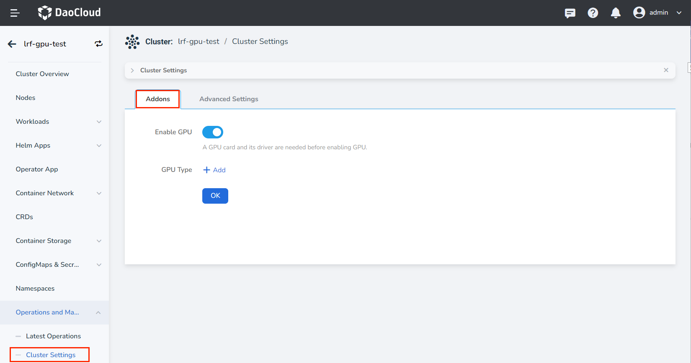
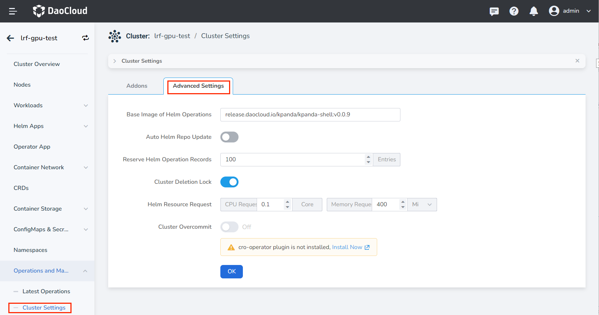

# Cluster Settings

Cluster settings are used to customize advanced feature settings for your cluster, including whether to enable GPU, helm repo refresh cycle, Helm operation record retention, etc.

- Enable GPU: GPU cards and corresponding driver plug-ins need to be installed on the cluster in advance.

    Click the name of the target cluster, and click __Operations and Maintenance__ -> __Cluster Settings__ -> __Addons__ in the left navigation bar.

    

- Helm operation basic image, registry refresh cycle, number of operation records retained, whether to enable cluster deletion protection (the cluster cannot be uninstalled directly after enabling)

    
