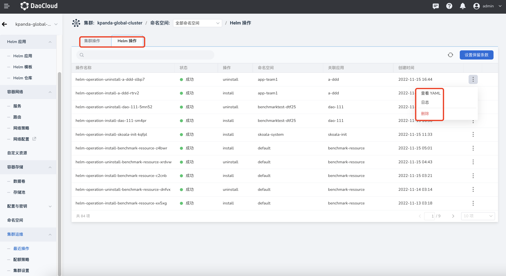
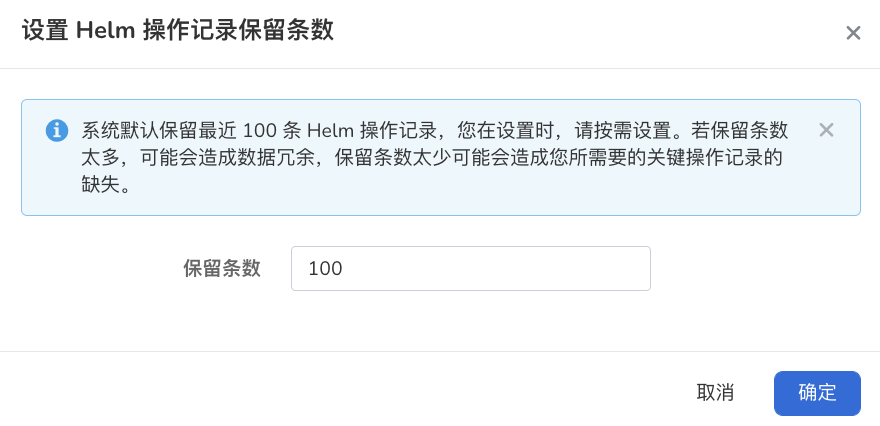

---
hide:
  - toc
---

# Recent Operations

On this page, you can view the recent cluster operation records and Helm operation records, as well as the YAML files and logs of each operation, and you can also delete a certain record.

In the cluster operation list, through the __┇__ icon on the right, you can view the YAML and logs, and you can also delete a record.

## Set the Number of Retained Helm Operations

By default, the system keeps the last 100 Helm operation records. If you keep too many entries, it may cause data redundancy, and if you keep too few entries, you may lose the key operation records you need. A reasonable number needs to be set according to the actual situation. The specific steps are as follows:

1. Click the name of the target cluster, and click __Recent Operations__ -> __Helm Operations__ -> __Set Number of Retained Items__ in the left navigation bar.

    

2. Set how many Helm operation records need to be kept, and click __OK__ .

    
