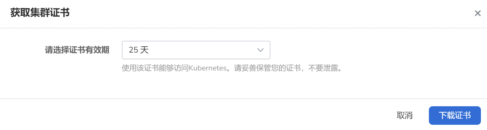

# Access Clusters

Clusters integrated or created using the DCE 5.0 [Container Management](../../intro/index.md) platform can be accessed not only through the UI interface but also in two other ways for access control:

- Access online via CloudShell
- Access via kubectl after downloading the cluster certificate

!!! note
  
    When accessing the cluster, the user should have [Cluster Admin](../permissions/permission-brief.md) permission or higher.

## Access via CloudShell

1. Enter __Clusters__ page, select the cluster you want to access via CloudShell, click the __...__ icon on the right, and then click __Console__ from the dropdown list.

    

2. Run __kubectl get node__ command in the Console to verify the connectivity between CloudShell and the cluster. If the console returns node information of the cluster, you can access and manage the cluster through CloudShell.

    <!---->

## Access via kubectl

If you want to access and manage remote clusters from a local node, make sure you have met these prerequisites:

- Your local node and the cloud cluster are in a connected network.
- The cluster certificate has been downloaded to the local node.
- The kubectl tool has been installed on the local node. For detailed installation guides, see [Installing tools](https://kubernetes.io/docs/tasks/tools/).

If everything is in place, follow these steps to access a cloud cluster from your local environment.

1. Enter __Clusters__ page, find your target cluster, click __...__ on the right, and select __Download kubeconfig__ in the drop-down list.

    

2. Set the Kubeconfig period and click __Download__ .

    

3. Open the downloaded certificate and copy its content to the __config__ file of the local node.

    By default, the kubectl tool will look for a file named __config__ in the __$HOME/.kube__ directory on the local node. This file stores access credentials of clusters. Kubectl can access the cluster with that configuration file.

4. Run the following command on the local node to verify its connectivity with the cluster:

    ```sh
    kubectl get pod -n default
    ```

    An expected output is as follows:

    ```none
    NAME                            READY   STATUS      RESTARTS    AGE
    dao-2048-2048-58c7f7fc5-mq7h4   1/1     Running     0           30h
    ```

Now you can access and manage the cluster locally with kubectl.
