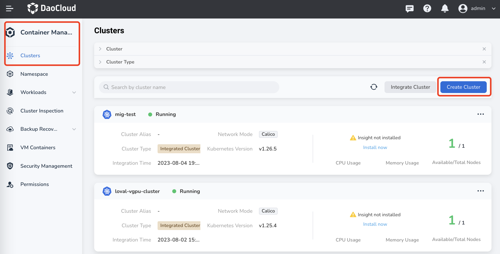
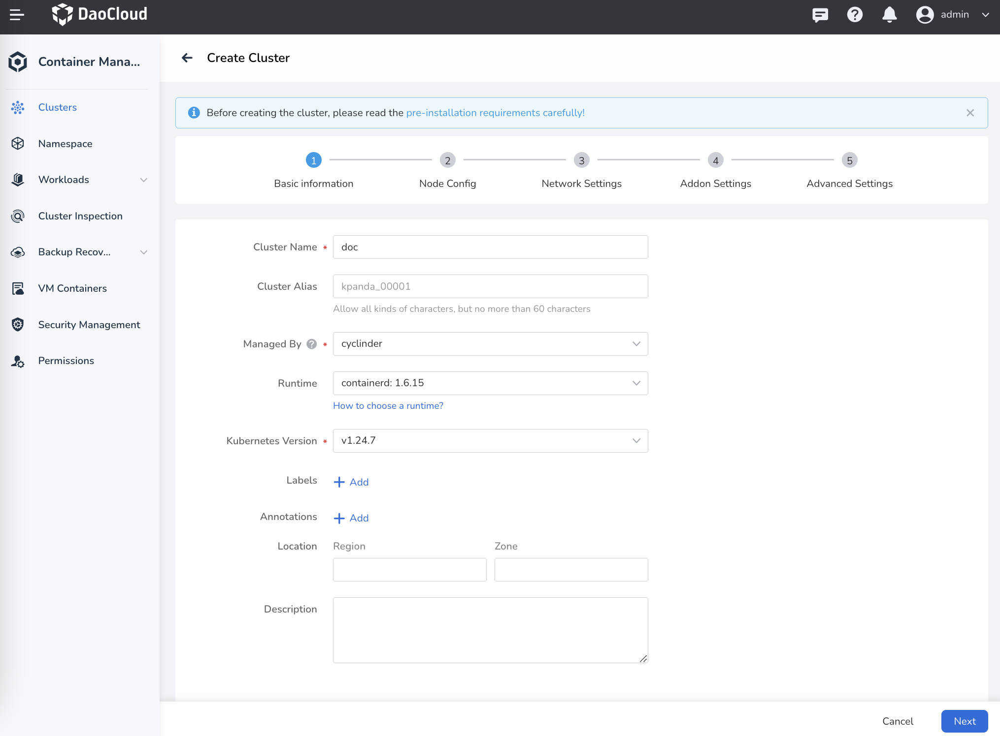
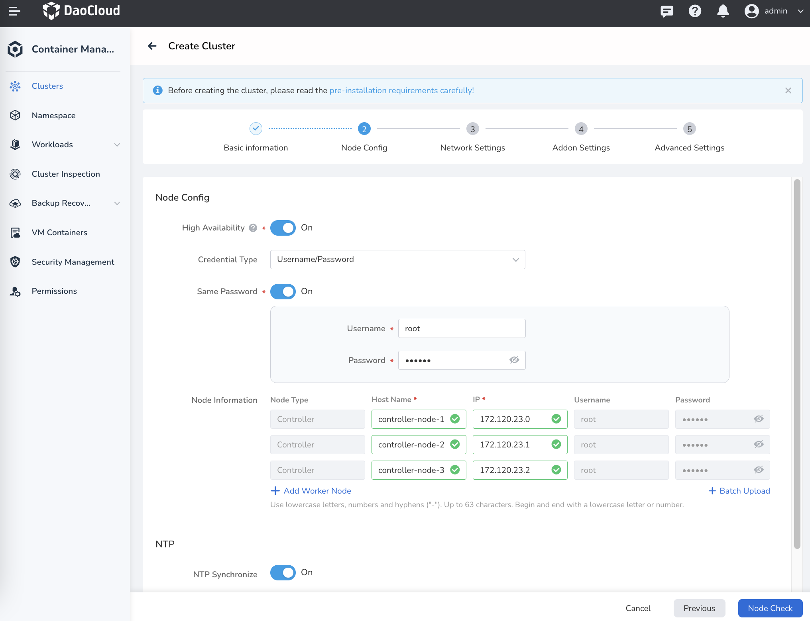

# Create Worker Clusters

This page demonstrates how to create a worker cluster.

In DCE 5.0 Container Management module, clusters can have four [roles](./cluster-role.md): global service cluster, management cluster, worker cluster, and integrated cluster. An integrated cluster can only be integrated from third-party vendors (see [Integrate Cluster](./integrate-cluster.md)).

## Prerequisites

Certain prerequisites must be met before creating a cluster:

- Prepare enough nodes to be joined into the cluster.
- Kubernetes version 1.22+. See [Supported K8s Versions](./cluster-version.md) for details.
- The target host must allow IPv4 forwarding. If using IPv6 in Pods and Services, the target server needs to allow IPv6 forwarding.
- DCE 5.0 does not provide firewall management. You need to pre-define the firewall rules of the target host by yourself. To avoid errors during cluster creation, it is recommended to disable the firewall of the target host.
- See [Node Availability Check](../nodes/node-check.md).

## Steps

1. Enter the Container Management module, click `Create Cluster` on the upper right corner of the `Clusters` page.

    

2. Fill in the basic information by referring to the following instructions.

    - Cluster Name: only contain lowercase letters, numbers, and hyphens ("-"). Must start and end with a lowercase letter or number and totally up to 63 characters.
    - Managed By: Choose a cluster to manage this new cluster through its lifecycle, such as creating, upgrading, node scaling, deleting the new cluster, etc.
    - Runtime: Select the runtime environment of the cluster. Currently support containerd and docker (see [How to Choose Container Runtime](runtime.md)).
    - Kubernetes Version: Allow span of three major versions, such as from 1.23-1.25, subject to the versions supported by the management cluster.

        

3. Fill in the node configuration information and click `Node Check`.

    - High Availability: Enable high availability mode for production environments. If enabled, at least three controller nodes are needed. If disabled, only one controller node is needed.
    - Credential Type: Choose to access the nodes by username/password or public/private keys.
    - Same Password: If enabled, all nodes in this cluster will use the same user name and password. If disabled, you need to set usernames and passwords separately for each node.
    - Node Information: Set noe names and IPs.
    - NTP Synchronize: If enabled, time on each node will be automatically synchronized. And you need to provide an NTP server by the server IP.

        

4. If node check is passed, click `Next`. If the check failed, update `Node Information` and check again.
5. Fill in the network configuration and click `Next`.<!--补充后续步骤的-->

    - CNI: Provide network services for Pods in the cluster. CNI cannot be changed after the cluster is created. Supports cilium and calico. Set `none` means not installing CNI when creating the cluster. You may install a CNI later.

        > For CNI configuration details, see [Cilium Installation Parameters](../../../network/modules/cilium/install.md) or [Calico Installation Parameters](../../../network/modules/calico/install.md).

    - Container IP Range: Set an IP range for allocating IPs for containers in the cluster. IP range determines the max number of containers allowed in the cluster. Cannot be modified after creation.
    - Service IP Range: Set an IP range for allocating IPs for container Services in the cluster. This range determines the max number of container Services that can be created in the cluster. Cannot be modified after creation.

6. Fill in the plug-in configuration and click `Next`.

7. Fill in advanced settings and click `OK`.

    - `kubelet_max_pods`: Set the maximum number of Pods per node. The default is 110.
    - `hostname_override`: Reset the hostname (not recommended).
    - `kubernetes_audit`: Kubernetes audit log, enabled by default.
    - `auto_renew_certificate`: Automatically renew the certificate of the control plane on the first Monday of each month, enabled by default.
    - `disable_firewalld&ufw`: Disable the firewall to prevent the node from being inaccessible during installation.
    - `Insecure_registries`: Set the address of you private container registry. If you use a private container registry, fill in its address can bypass certificate authentication of the container engine and obtain the image.
    - `yum_repos`: Fill in the Yum source registry address.

!!! success

    - After correctly filling in the above information, the page will prompt that the cluster is being created.
    - Creating a cluster takes a long time, so you need to wait patiently. You can click the `Back to Clusters` button to let it running backend.
    - To view the current status, click `Real-time Log`.

!!! note

    - hen the cluster is in an unknown state, it means that the current cluster has been disconnected. 
    - The data displayed by the system is the cached data before the disconnection, which does not represent real data.
    - Any operations performed in the disconnected state will not take effect. Please check the cluster network connectivity or Host Status.
