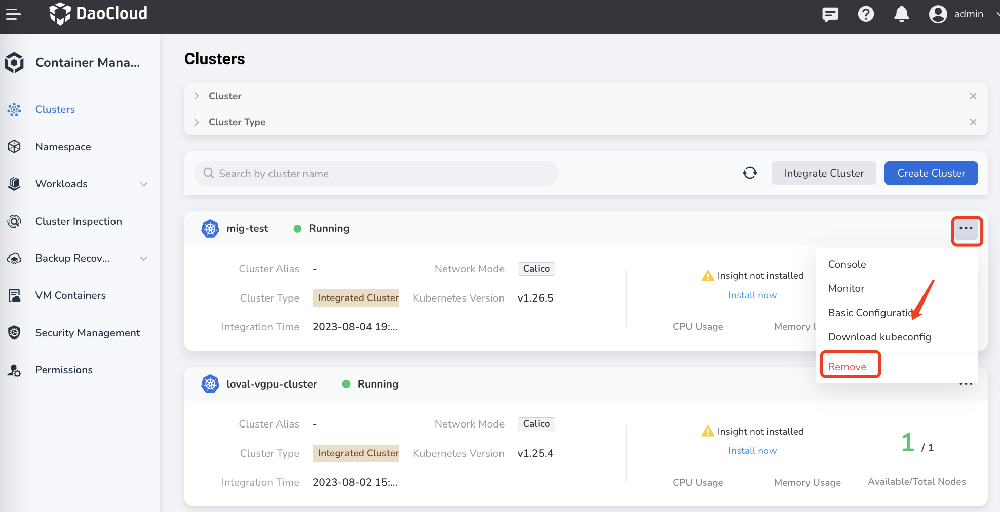
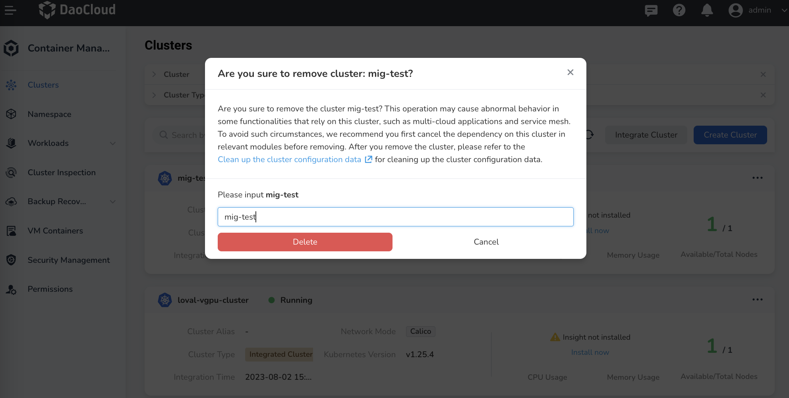

---
hide:
  - toc
---

# Delete/Remove Clusters

Clusters created in DCE 5.0 [Container Management](../../intro/index.md) can be either deleted or removed. Clusters integrated into DCE 5.0 can only be removed.

!!! Info

    If you want to delete an integrated cluster, you should delete it in the platform where it is created.

In DCE 5.0, the difference between `Delete` and `Remove` is:

- `Delete` will destroy the cluster and reset the data of all nodes under the cluster. All data will be totally cleared and lost. Making a backup before deleting a cluster is a recommended best practice. You can no longer use that cluster anymore.
- `Remove` just removes the cluster from DCE 5.0. It will not destroy the cluster and no data will be lost. You can still use the cluster in other platforms or re-integrate it into DCE 5.0 later if needed.

!!! note

    - The current user should have [Admin](../../../ghippo/user-guide/access-control/role.md) or [`Kpanda Owner`](../../../ghippo/user-guide/access-control/global.md) permissions to perform delete or remove operations.
    - Before deleting a cluster, you should turn off `Cluster Deletion Protection` in `Cluster Settings`->`Advanced Settings`, otherwise the `Delete Cluster` option will not be displayed.
    - The `global service cluster` cannot be deleted or removed.

1. Enter the Container Management module, find your target cluster, click `...` on the right, and select `Delete cluster`/`Remove` in the drop-down list.

    

2. Enter the cluster name to confirm and click `Delete`.

    

3. You will be auto directed to cluster lists. The status of this cluster will changed to `Deleting`. It may take a while to delete/remove a cluster.
