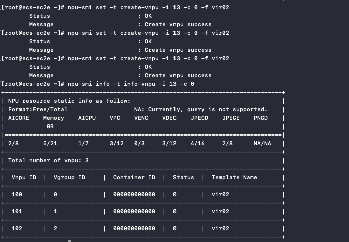
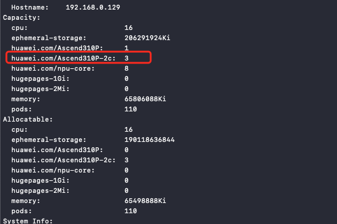

# Enable Ascend Virtualization

Ascend virtualization is divided into dynamic virtualization and static virtualization.
This document describes how to enable and use Ascend static virtualization capabilities.

## Prerequisites

- Setup of Kubernetes cluster environment.
- The current NPU node has the Ascend driver installed.
- The current NPU node has the Ascend-Docker-Runtime component installed.
- The NPU MindX DL suite is installed on the current cluster.
- Supported NPU models:

    - Ascend 310P, verified
    - Ascend 910b (20 cores), verified
    - Ascend 910 (32 cores), officially supported but not verified
    - Ascend 910 (30 cores), officially supported but not verified

    For more details, refer to the [official virtualization hardware documentation](https://www.hiascend.com/document/detail/zh/mindx-dl/50rc1/AVI/cpaug/cpaug_0005.html).

Refer to the [Ascend NPU Component Installation Documentation](./ascend_driver_install.md)
for the basic environment setup.

## Enable Virtualization Capabilities

To enable virtualization capabilities, you need to manually modify the startup parameters
of the `ascend-device-plugin-daemonset` component. Refer to the following command:

```init
- device-plugin -useAscendDocker=true -volcanoType=false -presetVirtualDevice=true
- logFile=/var/log/mindx-dl/devicePlugin/devicePlugin.log -logLevel=0
```

### Split VNPU Instances

Static virtualization requires manually splitting VNPU instances. Refer to the following command:

```bash
npu-smi set -t create-vnpu -i 13 -c 0 -f vir02
```

- `i` refers to the card id.
- `c` refers to the chip id.
- `vir02` refers to the split specification template.

Card id and chip id can be queried using `npu-smi info`. The split specifications can be found in the
[Ascend official templates](https://www.hiascend.com/document/detail/zh/mindx-dl/500/AVI/cpaug/cpaug_006.html).

After splitting the instance, you can query the split results using the following command:

```bash
npu-smi info -t info-vnpu -i 13 -c 0
```

The query result is as follows:



### Restart `ascend-device-plugin-daemonset`

After splitting the instance, manually restart the `device-plugin` pod,
then use the `kubectl describe` command to check the resources of the registered node:

```bash
kubectl describe node {{nodename}}
```



## How to Use the Device

When creating an application, specify the resource key as shown in the following YAML:

```yaml
......
resources:
  requests:
    huawei.com/Ascend310P-2c: 1
  limits:
    huawei.com/Ascend310P-2c: 1
......
```
