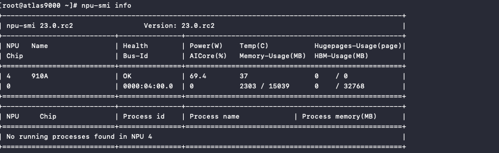
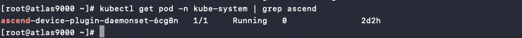

# Huawei Ascend NPU Quick Start Guide

This section will guide you through the process of quickly using the Huawei Ascend NPU for inference tasks.

## Prerequisites

1. Install the Ascend NPU driver.

    Make sure you have installed the Ascend NPU driver and can run the `npu-smi info` command,
    which should return NPU information indicating that the driver and firmware are ready.

    

2. Install the Ascend NPU Device Plugin.

    The NPU Device Plugin is installed by default in the `kube-system` namespace. It is a DaemonSet
    workload that can be verified by running the command `kubectl get pod -n kube-system | grep ascend`,
    which should output the following:

    

    If the driver and Device Plugin are not installed, please refer to the official Ascend documentation
    for installation instructions:

    - For example, for Ascend910, refer to the
      [910 Driver Installation Guide](https://www.hiascend.com/document/detail/en/Atlas%20200I%20A2/23.0.RC3/EP/installationguide/Install_87.html)
      and [other GPU models](https://support.huawei.com/enterprise/en/category/ascend-computing-pid-1557196528909).
    - [Ascend NPU Device Plugin](https://www.hiascend.com/document/detail/en/mindx-dl/50rc3/clusterscheduling/clusterschedulingig/dlug_installation_001.html)

3. Download the Ascend code repository.

    Run the following command to download the Ascend sample code repository and remember the
    location where the code is stored, as it will be needed later.

    ```git
    git clone https://gitee.com/ascend/samples.git
    ```

## Quick Start

This guide uses the [AscentCL Image Classification Application](https://gitee.com/ascend/samples/tree/master/inference/modelInference/sampleResnetQuickStart/python)
example from the Ascend sample repository.

### Prepare the base image

This example uses the Ascent-pytorch base image, which can be obtained from the
[Ascend Image Repository](https://ascendhub.huawei.com/#/index).

### Edit YAML

```yaml
apiVersion: batch/v1
kind: Job
metadata:
  name: resnetinfer1-1-1usoc
spec:
  template:
    spec:
      containers:
        - image: ascendhub.huawei.com/public-ascendhub/ascend-pytorch:23.0.RC2-ubuntu18.04 # Inference image name
          imagePullPolicy: IfNotPresent
          name: resnet50infer
          securityContext:
            runAsUser: 0
          command:
            - "/bin/bash"
            - "-c"
            - |
              source /usr/local/Ascend/ascend-toolkit/set_env.sh &&
              TEMP_DIR=/root/samples_copy_$(date '+%Y%m%d_%H%M%S_%N') &&
              cp -r /root/samples "$TEMP_DIR" &&
              cd "$TEMP_DIR"/inference/modelInference/sampleResnetQuickStart/python/model &&
              wget https://obs-9be7.obs.cn-east-2.myhuaweicloud.com/003_Atc_Models/resnet50/resnet50.onnx &&
              atc --model=resnet50.onnx --framework=5 --output=resnet50 --input_shape="actual_input_1:1,3,224,224"  --soc_version=Ascend910 &&
              cd ../data &&
              wget https://obs-9be7.obs.cn-east-2.myhuaweicloud.com/models/aclsample/dog1_1024_683.jpg &&
              cd ../scripts &&
              bash sample_run.sh
          resources:
            requests:
              huawei.com/Ascend910: 1 # Number of the Ascend 910 Processors.
            limits:
              huawei.com/Ascend910: 1 # The value should be the same as that of requests .
          volumeMounts:
            - name: hiai-driver
              mountPath: /usr/local/Ascend/driver
              readOnly: true
            - name: slog
              mountPath: /var/log/npu/conf/slog/slog.conf
            - name: localtime #The container time must be the same as the host time.
              mountPath: /etc/localtime
            - name: dmp
              mountPath: /var/dmp_daemon
            - name: slogd
              mountPath: /var/slogd
            - name: hbasic
              mountPath: /etc/hdcBasic.cfg
            - name: sys-version
              mountPath: /etc/sys_version.conf
            - name: aicpu
              mountPath: /usr/lib64/aicpu_kernels
            - name: tfso
              mountPath: /usr/lib64/libtensorflow.so
            - name: sample-path
              mountPath: /root/samples
      volumes:
        - name: hiai-driver
          hostPath:
            path: /usr/local/Ascend/driver
        - name: slog
          hostPath:
            path: /var/log/npu/conf/slog/slog.conf
        - name: localtime
          hostPath:
            path: /etc/localtime
        - name: dmp
          hostPath:
            path: /var/dmp_daemon
        - name: slogd
          hostPath:
            path: /var/slogd
        - name: hbasic
          hostPath:
            path: /etc/hdcBasic.cfg
        - name: sys-version
          hostPath:
            path: /etc/sys_version.conf
        - name: aicpu
          hostPath:
            path: /usr/lib64/aicpu_kernels
        - name: tfso
          hostPath:
            path: /usr/lib64/libtensorflow.so
        - name: sample-path
          hostPath:
            path: /root/samples
      restartPolicy: OnFailure
```

There are some fields in the above YAML that need to be modified according to your specific situation:

1. `atc ... --soc_version=Ascend910` is using `Ascend910` as an example. Please replace it with
   the actual model you are using. You can use the `npu-smi info` command to check the model of
   your card and add the Ascend prefix accordingly.
2. `samples-path` should be replaced with the actual path in your system.
3. `resources` should be adjusted based on your specific requirements.

### Deploy Job and View Results

Use the following command to create a Job:

```shell
kubectl apply -f ascend-demo.yaml
```

Check the Pod status:


Once the Pod is successfully running, view the log results. The key information displayed on the screen
is as shown in the following image. The label in the prompt represents the category label, conf represents
the maximum confidence of that category, and class represents the corresponding category. These values may
vary depending on the version and environment, so please refer to your actual situation.


Result is as follows:


