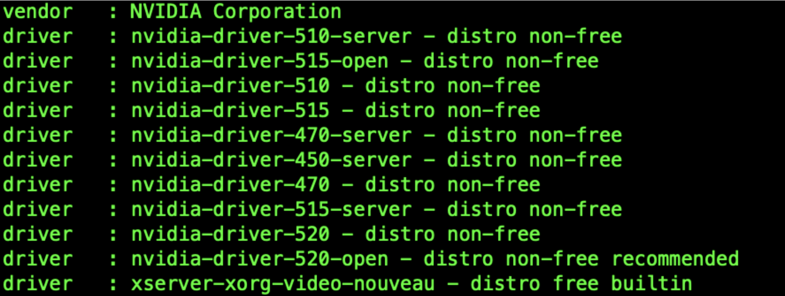

# Nvidia GPU Driver Installation

## GPU Driver Installation

> Two installation methods are provided: manual installation and installation using gpu-operator.
> Using gpu-operator simplifies the process, so it is recommended.

To use GPUs on Kubernetes, you need to install the relevant drivers and programs.
This involves the following steps:

- [ ] Install the GPU physical device driver
- [ ] Install the CUDA toolkit
- [ ] Modify the container runtime
- [ ] Install the device plugin

### Manual Installation

1. Install the physical device driver

    - Add the PPA repository

        ```shell
        add-apt-repository ppa:graphics-drivers/ppa
        apt-get update
        ```

    - View the available driver versions

        ```shell
        ubuntu-drivers devices
        ```

        

    - Select the appropriate version for installation

    - Recommended version for installation:

        ```shell
        ubuntu-drivers autoinstall
        ```

    - Install a specific version:

        ```shell
        apt-get install nvidia-driver-XXX
        ```

    - Install CUDA

        ```shell
        # https://docs.nvidia.com/cuda/cuda-installation-guide-linux/index.html#ubuntu
        $ apt-get install cuda
        ```

    - After installation, restart the system

        ```shell
        nvidia-smi
        nvcc -V
        ```

    - Check the driver version

        ```shell
        $ cat /proc/driver/nvidia/version
        NVRM version: NVIDIA UNIX x86_64 Kernel Module  525.105.17  Tue Mar 28 18:02:59 UTC 2023
        ```

2. Install the `cuda toolkit`

    - [https://github.com/NVIDIA/nvidia-container-toolkit](https://github.com/NVIDIA/nvidia-container-toolkit)
    - [https://docs.nvidia.com/datacenter/cloud-native/container-toolkit/latest/install-guide.html](https://docs.nvidia.com/datacenter/cloud-native/container-toolkit/latest/install-guide.html)

    - Conditions for running `nvidia-container-toolkit`:
        - Operating system kernel version > 3.10
        - Docker >= 19.03 or use Containerd.
        - NVIDIA GPU architecture above version 3.0
        - NVIDIA Linux drivers >= 418.81.07
    - The following demonstrates how to install using containerd:

        - Set nvidia-container-runtime in the /etc/containerd/config.toml configuration file and restart

            ```toml
                [plugins."io.containerd.grpc.v1.cri".containerd]
                default_runtime_name = "nvidia"
                [plugins."io.containerd.grpc.v1.cri".containerd.runtimes]
                [plugins."io.containerd.grpc.v1.cri".containerd.runtimes.runc.options]
                        SystemdCgroup = true
                [plugins."io.containerd.grpc.v1.cri".containerd.runtimes.nvidia]
                    privileged_without_host_devices = false
                    runtime_engine = ""
                    runtime_root = ""
                    runtime_type = "io.containerd.runc.v1"
                    [plugins."io.containerd.grpc.v1.cri".containerd.runtimes.nvidia.options]
                        BinaryName = "/usr/bin/nvidia-container-runtime"
                        SystemdCgroup = true
            ```

        - Set the package repository nvidia-container-toolkit

            ```shell
                $ distribution=$(. /etc/os-release;echo $ID$VERSION_ID) && curl -s -L https://nvidia.github.io/libnvidia-container/gpgkey | sudo apt-key add - && curl -s -L https://nvidia.github.io/libnvidia-container/$distribution/libnvidia-container.list | sudo tee /etc/apt/sources.list.d/nvidia-container-toolkit.list
            ```

        - Install:

            ```shell
            sudo apt-get update && sudo apt-get install -y nvidia-container-toolkit
            ```

3. Install the device plugin

    ```shell
    kubectl create -f https://raw.githubusercontent.com/NVIDIA/k8s-device-plugin/v0.14.0/nvidia-device-plugin.yml
    ```

### Installation using gpu-operator


GPU Operator can perform operations related to GPU underlying dependencies on top of Kubernetes,
including GPU drivers, Container ToolKit, automatic reporting of Device Plugin resources, and more.
You no longer need to worry about driver installation and other troublesome tasks. In theory,
as long as you have a GPU card installed, K8s is installed, and you use GPU Operator,
you can utilize all the capabilities.

- Check if the GPU card is mounted correctly

    ```shell
    $ lspci | grep -i nvidia
    1b:00.0 VGA compatible controller: NVIDIA Corporation GP102 [TITAN Xp] (rev a1)
    ```

- Determine the kernel version (this step is important, the nvidia driver image version needs
  to be compatible with the node's kernel version, including the minor version number)

    > To check if the driver version corresponds to the kernel, please visit the following website:
    > <https://catalog.ngc.nvidia.com/orgs/nvidia/containers/driver/tags>

    ```shell
    $ hostnamectl | grep Kernel
    Kernel: Linux 5.15.0-75-generic
    ```

- Install GPU Operator

    ```shell
    $ helm repo add nvidia https://helm.ngc.nvidia.com/nvidia && helm repo update
    $ helm install --wait --generate-name \
        -n gpu-operator --create-namespace \
        nvidia/gpu-operator \
        --set driver.version=525-5.15.0-69-generic
    ```

## Install vGPU Driver

After installing the above two methods, the pod can only use the entire GPU resources, and
cannot utilize the vGPU functionality. If you need to use vGPU, you need to search for
the nvidia-vgpu module in the Helm repository managed by DCE 5.0 container management and install it.
