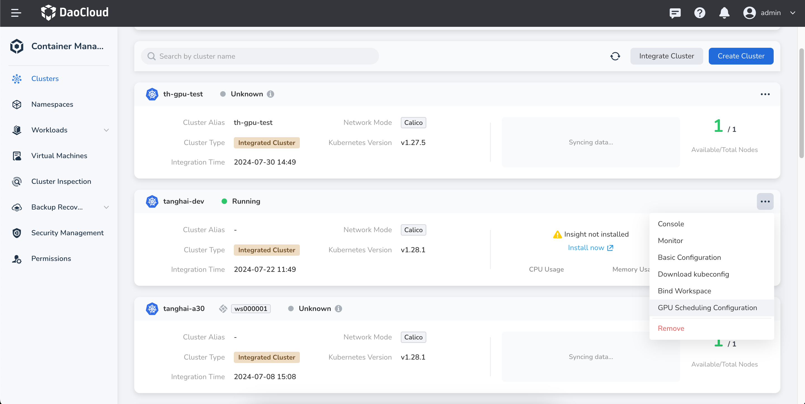
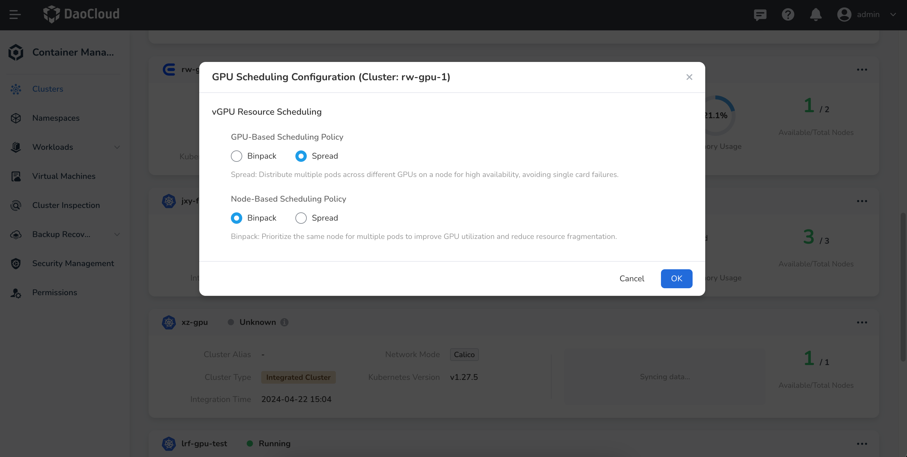
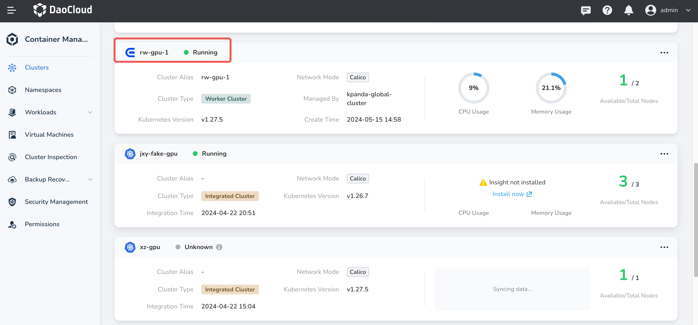
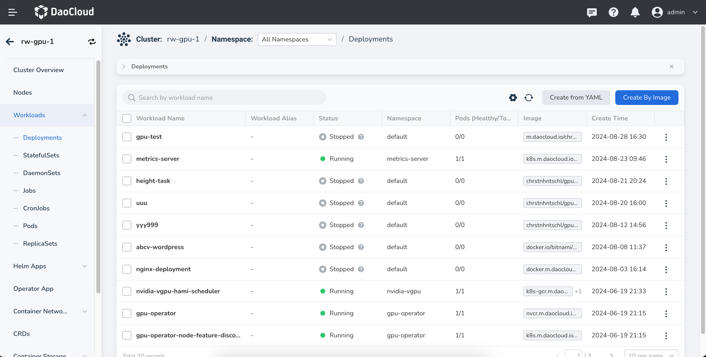

# GPU Scheduling Configuration (Binpack and Spread)

This page introduces how to reduce GPU resource fragmentation and prevent single points of failure through
Binpack and Spread when using NVIDIA vGPU, achieving advanced scheduling for vGPU. The DCE 5.0 platform
provides Binpack and Spread scheduling policies across two dimensions: clusters and workloads,
meeting different usage requirements in various scenarios.

## Prerequisites

- GPU devices are correctly installed on the cluster nodes.
- The [gpu-operator component](./nvidia/install_nvidia_driver_of_operator.md)
  and [Nvidia-vgpu component](./nvidia/vgpu/vgpu_addon.md) are correctly installed in the cluster.
- The NVIDIA-vGPU type exists in the GPU mode in the node list in the cluster.

## Use Cases

- Scheduling policy based on GPU dimension

    - Binpack: Prioritizes using the same GPU on a node, suitable for increasing GPU utilization and reducing resource fragmentation.
    - Spread: Multiple Pods are distributed across different GPUs on nodes, suitable for high availability scenarios to avoid single card failures.

- Scheduling policy based on node dimension

    - Binpack: Multiple Pods prioritize using the same node, suitable for increasing GPU utilization and reducing resource fragmentation.
    - Spread: Multiple Pods are distributed across different nodes, suitable for high availability scenarios to avoid single node failures.

## Use Binpack and Spread at Cluster-Level

!!! note

    By default, workloads will follow the cluster-level Binpack and Spread. If a workload sets its
    own Binpack and Spread scheduling policies that differ from the cluster, the workload will prioritize
    its own scheduling policy.

1. On the __Clusters__ page, select the cluster for which you want to adjust the Binpack and Spread scheduling
   policies. Click the __┇__ icon on the right and select __GPU Scheduling Configuration__ from the dropdown list.

    

2. Adjust the GPU scheduling configuration according to your business scenario, and click __OK__ to save.

    

## Use Binpack and Spread at Workload-Level

!!! note

    When the Binpack and Spread scheduling policies at the workload level conflict with the
    cluster-level configuration, the workload-level configuration takes precedence.

Follow the steps below to create a deployment using an image and configure Binpack and Spread
scheduling policies within the workload.

1. Click __Clusters__ in the left navigation bar, then click the name of the target cluster to
   enter the __Cluster Details__ page.

    

2. On the Cluster Details page, click __Workloads__ -> __Deployments__ in the left navigation bar,
   then click the __Create by Image__ button in the upper right corner of the page.

    

3. Sequentially fill in the [Basic Information](../workloads/create-deployment.md#basic-information),
   [Container Settings](../workloads/create-deployment.md#container-settings),
   and in the __Container Configuration__ section, enable GPU configuration, selecting the GPU type as NVIDIA vGPU.
   Click __Advanced Settings__, enable the Binpack / Spread scheduling policy, and adjust the GPU scheduling
   configuration according to the business scenario. After configuration, click __Next__ to proceed to
   [Service Settings](../workloads/create-deployment.md#service-settings)
   and [Advanced Settings](../workloads/create-deployment.md#advanced-settings).
   Finally, click __OK__ at the bottom right of the page to complete the creation.

