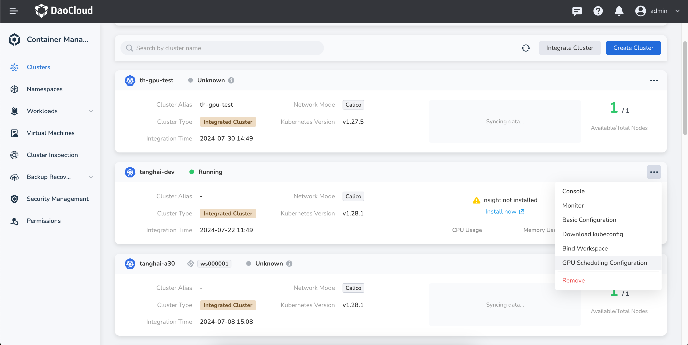
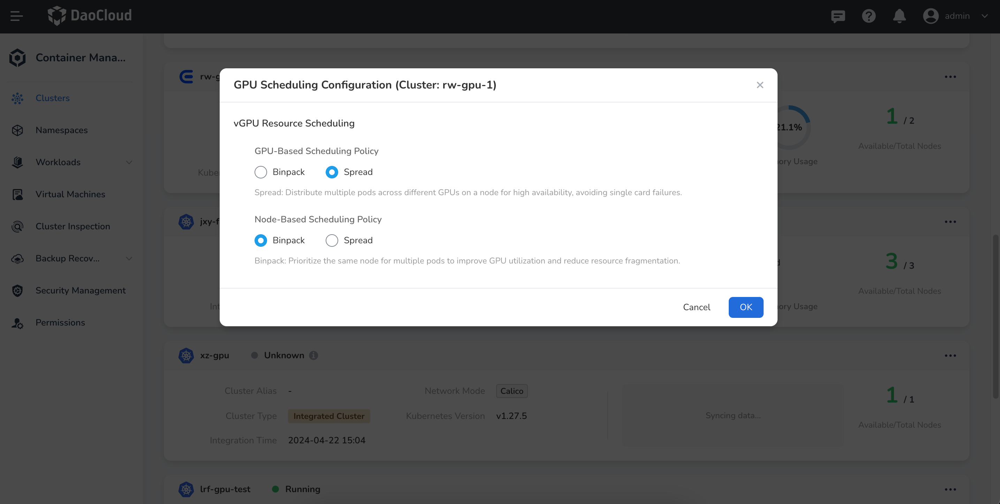
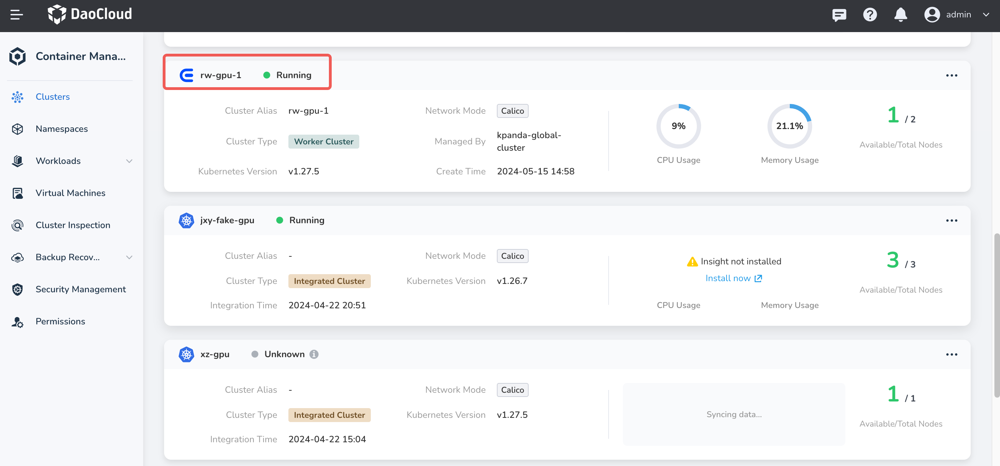
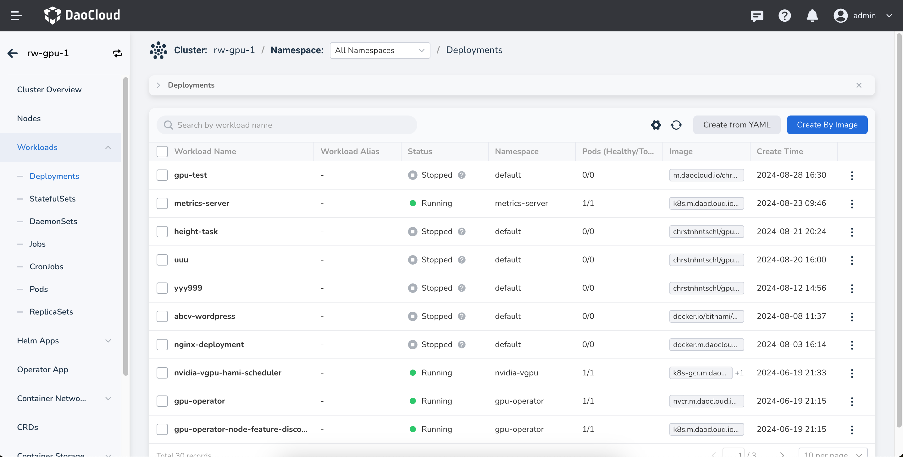

# GPU Scheduling Configuration (Binpack and Spread)

This document describes how to configure GPU scheduling using **Binpack** and **Spread** strategies when using NVIDIA vGPU. These configurations help reduce GPU resource fragmentation and prevent single points of failure, enabling advanced vGPU scheduling.

The **DCE 5.0 platform** provides Binpack and Spread scheduling strategies at both **cluster** and **workload** levels to suit various usage scenarios.

## Prerequisites

* GPU devices have been correctly installed on cluster nodes.
* The cluster has correctly installed the [gpu-operator component](./nvidia/install_nvidia_driver_of_operator.md) and the [Nvidia-vgpu component](./nvidia/vgpu/vgpu_addon.md).
* NVIDIA vGPU is available in the GPU mode of the node list.

## Usage Scenarios

* **Scheduling strategies at the GPU card level**

    * **Binpack** : Prioritizes assigning workloads to the same GPU card on a node. This improves GPU utilization and reduces resource fragmentation.
    * **Spread** : Distributes multiple Pods across different GPU cards on a node. Suitable for high availability scenarios to avoid single GPU card failure.

* **Scheduling strategies at the node level**

    * **Binpack** : Multiple Pods are prioritized to be scheduled on the same node. Suitable for improving GPU utilization and reducing resource fragmentation.
    * **Spread** : Distributes multiple Pods across different nodes. Suitable for high availability scenarios to avoid single node failure.

## Configuring Binpack and Spread Scheduling at the Cluster Level

!!! note

    By default, workloads follow the cluster-level Binpack and Spread scheduling configuration.  
    If a workload specifies a different Binpack or Spread strategy, the workload’s own configuration takes precedence.

1. On the **Clusters** page, select the target cluster you want to configure, click the **┇** action icon on the right, and choose **GPU Scheduling** from the dropdown menu.

    

2. Adjust the GPU scheduling configuration based on your business scenario and click **OK** to save.

    

## Configuring Binpack and Spread Scheduling at the Workload Level

!!! note

    If the workload-level Binpack and Spread strategy conflicts with the cluster-level configuration, the workload-level setting will take precedence.

Follow the steps below to create a stateless workload from an image and configure Binpack and Spread scheduling strategies within the workload:

1. Click **Clusters** in the left navigation pane, then click the target cluster name to enter the **Cluster Details** page.

    

2. In the Cluster Details page, click **Workloads** -> **Deployment** in the left navigation pane, then click the **Create from Image** button in the upper-right corner.

    

3. Fill in the [Basic Info](../workloads/create-deployment.md#_3) and [Container Config](../workloads/create-deployment.md#_4) sections.
   In the **Container Config** section, enable the GPU configuration and select **NVIDIA vGPU** as the GPU type.
   Then click **Advanced Settings**, enable the **Binpack / Spread scheduling policies**, and configure the GPU scheduling strategy based on your use case.
   Once configured, click **Next** to proceed to [Service Config](../workloads/create-deployment.md#_5) and [Advanced Config](../workloads/create-deployment.md#_6), then click **OK** in the bottom right corner to complete the creation.

    <!--  -->
