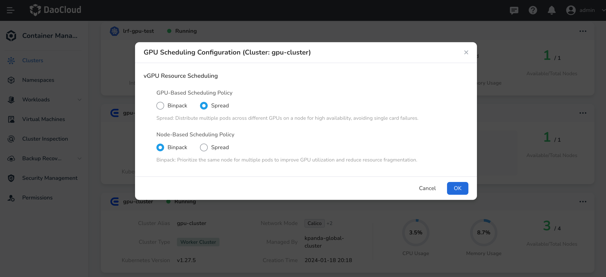

# GPU Scheduling Configuration

This document mainly introduces the configuration of `GPU` scheduling, which can implement
advanced scheduling policies. Currently, the primary implementation is the `vgpu` scheduling policy.

## vGPU Resource Scheduling Configuration

`vGPU` provides two policies for resource usage: `binpack` and `spread`. These correspond to node-level
and GPU-level dimensions, respectively. The use case is whether you want to distribute workloads more
sparsely across different nodes and GPUs or concentrate them on the same node and GPU,
thereby making resource utilization more efficient and reducing resource fragmentation.

You can modify the scheduling policy in your cluster by following these steps:

1. Go to the cluster management list in the container management interface.
2. Click the settings button **...** next to the cluster.
3. Click **GPU Scheduling Configuration**.
4. Toggle the scheduling policy between node-level and GPU-level. By default,
   the node-level policy is `binpack`, and the GPU-level policy is `spread`.



The above steps modify the cluster-level scheduling policy. Users can also specify their own
scheduling policy at the workload level to change the scheduling results. Below is an example
of modifying the scheduling policy at the workload level:

```yaml
apiVersion: v1
kind: Pod
metadata:
  name: gpu-pod
  annotations:
    hami.io/node-scheduler-policy: "binpack"
    hami.io/gpu-scheduler-policy: "binpack"
spec:
  containers:
    - name: ubuntu-container
      image: ubuntu:18.04
      command: ["bash", "-c", "sleep 86400"]
      resources:
        limits:
          nvidia.com/gpu: 1
          nvidia.com/gpumem: 3000
          nvidia.com/gpucores: 30
```

In this example, both the node- and GPU-level scheduling policies are set to `binpack`.
This ensures that the workload is scheduled to maximize resource utilization and reduce fragmentation.
