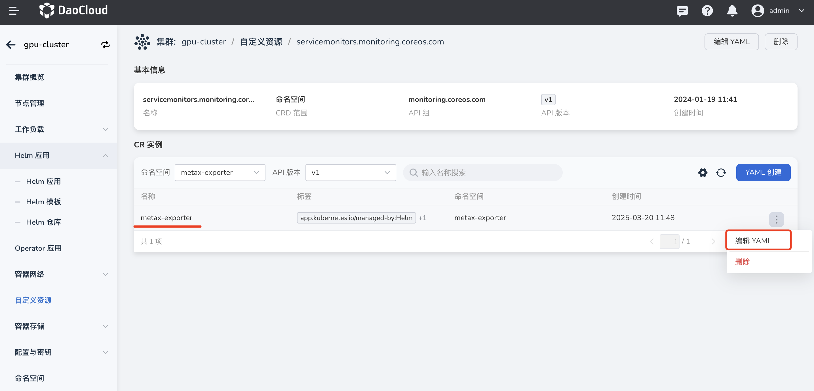

# Offline Installation and Usage of Metax GPU Components

This section provides guidance on the offline installation of Metax components—`metax-gpu-extensions`, `metax-operator`, and `metax-exporter`—as well as instructions for using Metax GPU cards.

## Prerequisites

* [DCE 5.0](../../../install/index.md) container management platform has been deployed and is functioning properly.
* The container management module has either [joined an existing Kubernetes cluster](../clusters/integrate-cluster.md) or [created a new one](../clusters/create-cluster.md), and the UI interface of the cluster is accessible.
* The GPU cards in the current cluster are not virtualized and are not in use by other applications.

## Component Overview

The container management system provides three Helm chart packages: `metax-gpu-extensions`, `metax-operator`, and `metax-exporter`. You may choose to install different components based on your use case.

1. **metax-gpu-extensions**: Includes `gpu-device` and `gpu-label` components. This package is intended **only for full GPU usage scenarios**.
2. **metax-operator**: Includes `gpu-device`, `gpu-label`, `driver-manager`, `container-runtime`, and `operator-controller` components. This package supports **both full GPU and vGPU scenarios**.
3. **metax-exporter**: Includes `ServiceAccount`, `ConfigMap`, `Service`, `DaemonSet`, and `ServiceMonitor`. It is primarily used for **monitoring Metax GPU cards**.

## Procedure

1. In the left-hand navigation bar, go to **Container Management** → **Cluster Management**, and click the name of the target cluster.
2. In the left-hand navigation bar, click **Helm Apps** → **Helm Templates**, then search for `metax`.
3. You will see the following three components. Select and install the ones you need.

   

## Installation Notes

1. **Issues with `metax-gpu-extensions` and `metax-operator`**:  
   These addons have a design flaw—each has a standalone `registry` field.  
   The `charts-syncer` tool only supports two-level fields and **cannot handle this structure**.  
   Therefore, **you must manually update the `registry` field in both addons to match the value of the `image.registry` field** during deployment.

    **Before modification:**

    

    The `charts-syncer` tool fails due to this nested field structure. You need to refactor it to a simpler form.

    **After modification:**

    

2. **Panel issue with `metax-exporter` v0.5.0**:

    In version `v0.5.0`, the metric names are prefixed with `mx_`.  
    To restore the original naming, you must add a `replace` configuration in the `ServiceMonitor`.

    - After installing `metax-exporter v0.5.0`, go to the target cluster and search for `servicemonitor` under **Custom Resources**, then click the item named `servicemonitors.monitoring.coreos.com`.

        

    - Edit the YAML of `metax-exporter`, and add the following content at the appropriate location:

        

        Content to add:

        ```yaml
        metricRelabelings:
         - action: replace
           regex: mx_(.*)
           sourceLabels:
           - __name__
           targetLabel: __name__
        ```

        Result after adding (make sure the format and indentation are correct):

        
