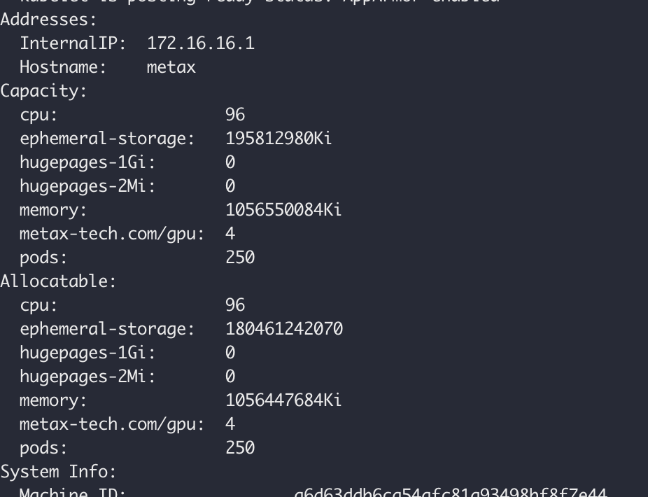
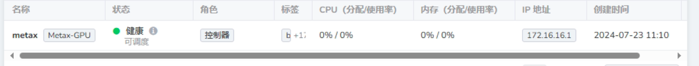
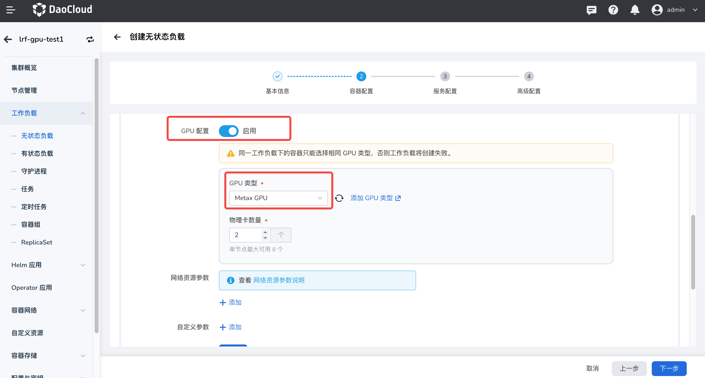
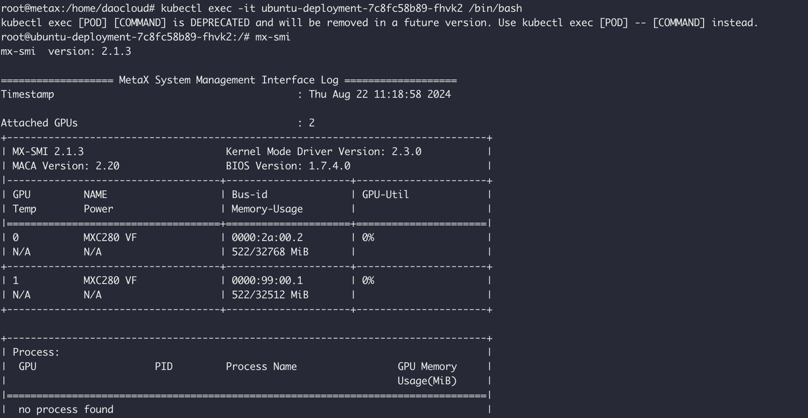

# Installing and Using Metax GPU Components

This section provides guidance on installing the Metax components—`gpu-extensions`, `gpu-operator`, etc.—as well as instructions for using Metax GPUs in both full-card and vGPU modes.

## Prerequisites

1. Download and install the required tar package from the [Metax Software Center](https://sw-download.metax-tech.com/software-list).
   This document uses `metax-gpu-k8s-package.0.7.10.tar.gz` as an example.
2. Prepare a basic Kubernetes environment.

## Component Overview

Metax provides two Helm chart packages: `metax-extensions` and `gpu-operator`. Choose which to install based on your usage scenario.

1. **metax-extensions**: Contains the `gpu-device` and `gpu-label` components. When using this approach, application container images **must be built based on the MXMACA® base image**. This solution **only supports full GPU usage**.
2. **gpu-operator**: Contains components such as `gpu-device`, `gpu-label`, `driver-manager`, `container-runtime`, and `operator-controller`.
   With this approach, application images **do not need to include the MXMACA® SDK**, and it supports **both full GPU and vGPU modes**.

## Installation Steps

1. Extract the contents from the tar file:

    From `/home/metax/metax-docs/k8s/metax-gpu-k8s-package.0.7.10.tar.gz`, extract:

    * `deploy-gpu-extensions.yaml` – deployment YAML file
    * `metax-gpu-extensions-0.7.10.tgz`, `metax-operator-0.7.10.tgz` – Helm chart packages
    * `metax-k8s-images.0.7.10.run` – offline image archive

2. Check if the driver is already installed:

    ```bash
    $ lsmod | grep metax 
    metax 1605632 0 
    ttm 86016 3 drm_vram_helper,metax,drm_ttm_helper 
    drm 618496 7 drm_kms_helper,drm_vram_helper,ast,metax,drm_ttm_helper,ttm
    ```

    * If no output appears, the driver is not installed.
    * If output appears, the driver is already installed.
    * When using `gpu-operator`, **it is not recommended** to pre-install the MXMACA kernel driver on worker nodes. If already installed, you **do not need to uninstall it**.

3. Install the driver

### Installing `gpu-extensions`

1. Push images:

    ```bash
    tar -xf metax-gpu-k8s-package.0.7.10.tar.gz
    ./metax-k8s-images.0.7.10.run push {registry}/metax
    ```

2. Push Helm charts:

    ```bash
    helm plugin install https://github.com/chartmuseum/helm-push
    helm repo add --username rootuser --password rootpass123 metax http://172.16.16.5:8081
    helm cm-push metax-operator-0.7.10.tgz metax
    helm cm-push metax-gpu-extensions-0.7.10.tgz metax
    ```

3. Install `metax-gpu-extensions` on the DCE 5.0 platform.

    After successful deployment, you can verify the resources on the nodes:

    

4. Once configured, nodes will be labeled with `Metax GPU`:

    

### Installing `gpu-operator`

Known issues when installing `gpu-operator`:

1. The images for `metax-operator`, `gpu-label`, `gpu-device`, and `container-runtime` **must include the `amd64` suffix**.
2. The `metax-maca` component image is **not included** in the `metax-k8s-images.0.7.13.run` package.
    You must manually download images like `maca-mxc500-2.23.0.23-ubuntu20.04-x86_64.tar.xz`, load them, and update the `metax-maca` component image accordingly.
3. The `metax-driver` image needs to be downloaded from
    [`https://pub-docstore.metax-tech.com:7001`](https://pub-docstore.metax-tech.com:7001) as `k8s-driver-image.2.23.0.25.run`.
    Then run:

    ```bash
    ./k8s-driver-image.2.23.0.25.run push {registry}/metax
    ```

    to push it to your image registry, and update the `metax-driver` image reference accordingly.

## Using the GPU

After installation, you can [use the Metax GPU in workloads](../../workloads/create-deployment.md#_5).
When enabling GPU support, be sure to select **Metax GPU** as the GPU type.



To check GPU usage, enter the container and run `mx-smi`.


