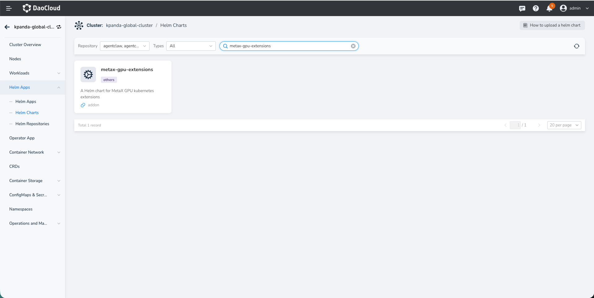
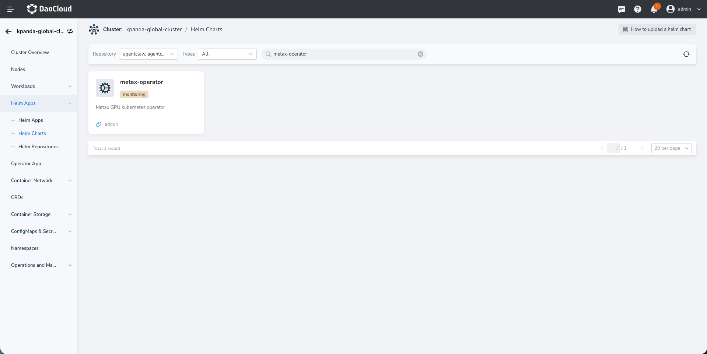
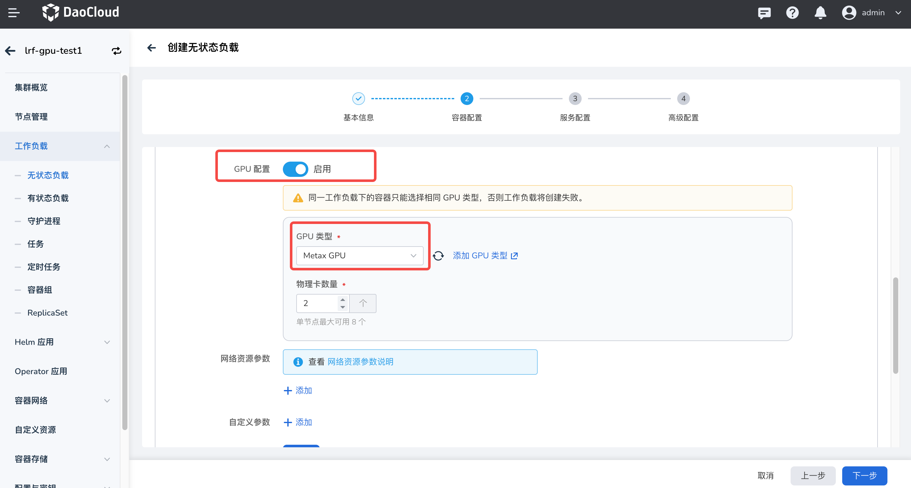

# Installing and Using Metax GPU Components

This section provides guidance on installing the Metax `metax-gpu-extensions` and `metax-operator` components, as well as instructions for using Metax GPUs in both full-card and vGPU modes.

## Prerequisites

1. A prepared DCE 5.0 base environment.

## Component Overview

DCE 5.0 ships with two built-in Helm chart packages: `metax-gpu-extensions` and `metax-operator`. Choose which to install based on your usage scenario.

1. **metax-gpu-extensions**: Contains the `gpu-device` and `gpu-label` components. When using the Metax-extensions solution, application container images must be built based on the MXMACA® base image. This solution only supports the full GPU usage scenario.
2. **metax-operator**: Contains the `gpu-device`, `gpu-label`, `driver-manager`, `container-runtime`, and `operator-controller` components.
   With this approach, you can build application container images that do not include the MXMACA® SDK. It supports both full GPU and vGPU scenarios.

## Installation Steps

### metax-gpu-extensions

1. In the left navigation bar, go to __Container Management__ -> __Cluster Management__, and click the name of the target cluster.
2. From the left navigation bar, click __Helm Apps__ -> __Helm Templates__, then search for __metax-gpu-extensions__.
3. When the component appears, start the installation.

    

    After successful deployment, you can verify the resources on the nodes.

    

    The node list in the DCE 5.0 platform will display the `Metax GPU` label.

    

### metax-operator

Similar to installing gpu-extensions, search for __metax-operator__ and start the installation once it is found.

## Using the GPU

After installation, you can [use the Metax GPU in workloads](../../workloads/create-deployment.md#_5).
When enabling GPU support, be sure to select **Metax GPU** as the GPU type.

To check GPU usage, enter the container and run `mx-smi`.

