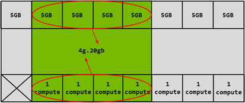
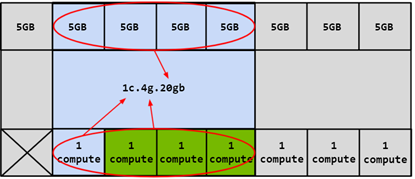

# NVIDIA Multi-Instance GPU (MIG) Overview

NVIDIA Multi-Instance GPU (MIG) is a new feature introduced by NVIDIA on H100, A100, and A30 series GPU cards.
It aims to partition a single physical GPU into multiple GPU instances to provide finer-grained resource sharing
and isolation. MIG can divide a GPU into up to seven GPU instances, allowing a single physical GPU card to
provide separate GPU resources to multiple users, achieving optimal GPU utilization.

This feature allows multiple applications or users to share GPU resources simultaneously, improving
the utilization of computational resources and increasing system scalability.

With MIG, each GPU instance's processor has an independent and isolated path throughout the entire
memory system - the cross-switch ports on the chip, L2 cache groups, memory controllers, and DRAM
address buses are all uniquely allocated to individual instances.

This ensures that the workload of a single user can run with predictable throughput and latency,
with the same L2 cache allocation and DRAM bandwidth. MIG can partition available GPU compute resources
(such as streaming multiprocessors or SMs and GPU engines like copy engines or decoders) to provide
defined quality of service (QoS) and fault isolation for different clients such as virtual machines,
containers, or processes. MIG enables multiple GPU instances to run in parallel on a single physical GPU.

MIG allows multiple vGPUs (as well as virtual machines) to run in parallel on a single GPU instance
while preserving the isolation guarantees provided by vGPU. For more detailed information on using
vGPU and MIG for GPU partitioning, please refer to
[NVIDIA Multi-Instance GPU and NVIDIA Virtual Compute Server](https://www.nvidia.com/content/dam/en-zz/Solutions/design-visualization/solutions/resources/documents1/TB-10226-001_v01.pdf).

## MIG Use Cases

The following is an overview of MIG, which shows how MIG virtualizes a single physical GPU card
into 7 GPU instances that can be used by multiple users.

**Important Concepts:**

* `SM` (Streaming Multiprocessor): The core computing unit of a GPU responsible for executing graphics
  rendering and general-purpose computing tasks. Each SM consists of a set of CUDA cores, as well as
  shared memory, register files, and other resources, capable of executing multiple threads concurrently.
  Each MIG instance has a certain number of SMs and other related resources, as well as dedicated divided VRAM.
* `GPU Memory Slice`: The smallest part of GPU memory, including the corresponding memory controller and cache.
  A GPU memory slice is approximately one-eighth of the total GPU memory resource in terms of capacity and bandwidth.
* `GPU SM Slice`: The smallest computational unit of an SM on the GPU. When configured in MIG mode,
  the GPU SM slice is approximately one-seventh of the available SM count in the GPU.
* `GPU Slice`: The combination of a single GPU memory slice and a single GPU SM slice in the GPU,
  forming the smallest part.
* `GPU Instance`: GPU Instance (GI) is a combination of GPU slices and GPU engines (DMA, NVDEC, etc.).
  Anything inside a GPU instance always shares all GPU memory slices and other GPU engines, but its SM
  slices can be further divided into Compute Instances (CI). A GPU instance provides memory QoS.
  Each GPU slice contains dedicated VRAM resources, limiting the available capacity and bandwidth and
  providing memory QoS. Each GPU memory slice gets 1/8th of the total GPU memory resource,
  and each GPU SM slice gets 1/7th of the total SM count.
* `Compute Instance`: The compute slice of a GPU instance can be further divided into multiple
  Compute Instances (CIs), where each CI shares the parent GI's engines and memory,
  but each CI has dedicated SM resources.

## GPU Instances (GI)

This section explains how to create various partitions on the GPU. A100-40GB will be used
as an example to demonstrate partitioning on a single physical GPU card.

The partitioning of a GPU is done using memory slices, so it can be understood that the A100-40GB GPU
has 8x5GB memory slices and 7 GPU SM slices, as shown in the following figure displaying
available memory slices on A100.

As mentioned earlier, creating a GPU instance (GI) requires combining a certain number of
memory slices with a certain number of compute slices. In the following diagram,
one 5GB memory slice is combined with 1 compute slice to create the `1g.5gb` GI configuration:

Similarly, 4x5GB memory slices can be combined with 4x1 compute slices to
create the `4g.20gb` GI configuration:

#### Compute Instances (CI)

The compute slices (GI) within a GPU instance can be further divided into multiple compute instances (CIs),
where each CI shares the engines and memory of its parent GI but has dedicated SM resources. Using
the same example of `4g.20gb`, a CI can be created that only utilizes the first compute slice
called `1c.4g.20gb` as shown in the blue portion of the diagram below:

In this case, it is possible to create four different CIs by selecting any of the compute slices.
Two compute slices can also be combined to create a compute configuration of `2c.4g.20gb`:

Additionally, three compute slices can be combined to create a compute configuration,
or all four compute slices can be combined to create `3c.4g.20gb` or `4c.4g.20gb` compute configurations.
When all four compute slices are combined, the configuration is simply referred to as `4g.20gb`.

## GPUs Supporting MIG Feature

GPUs starting from the NVIDIA Ampere generation (i.e., those with compute capability >= 8.0)
support MIG. The table below provides a list of GPUs that support MIG:

| GPU Model           | **Architecture** | **Microarchitecture** | **Compute Capability** | **Memory Size** | **Maximum GI Instances** |
| ------------------- | ---------------- | -------------------- | --------------------- | --------------- | ----------------------- |
| H100-SXM5 H100-SXM5 | Hopper        | GH100      | 9.0          | 80GB         | 7                  |
| H100-PCIE H100-PCIE | Hopper        | GH100      | 9.0          | 80GB         | 7                  |
| A100-SXM4 A100-SXM4 | NVIDIA Ampere | GA100      | 8.0          | 40GB         | 7                  |
| A100-SXM4 A100-SXM4 | NVIDIA Ampere | GA100      | 8.0          | 80GB         | 7                  |
| A100-PCIE A100-PCIE | NVIDIA Ampere | GA100      | 8.0          | 40GB         | 7                  |
| A100-PCIE A100-PCI  | NVIDIA Ampere | GA100      | 8.0          | 80GB         | 7                  |
| A30                 | NVIDIA Ampere | GA100      | 8.0          | 24GB         | 4                  |
