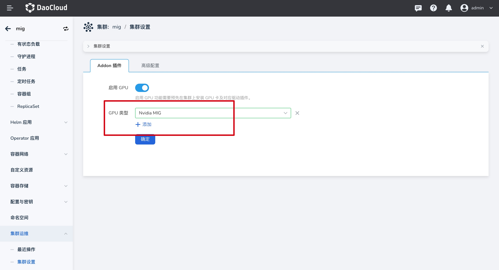

# Using MIG GPU Resources

This section explains how applications can utilize MIG GPU resources.

## Prerequisites

- Nvidia Driver is installed, refer to [Nvidia GPU Driver Installation](vgpu_driver.md)
- MIG capability is enabled, refer to [Creating MIG with GPU Operator](create_mig.md)
- Cluster nodes have MIG-enabled GPU cards inserted

## Using MIG GPU via GUI

1. Confirm if the cluster has recognized the GPU card type

    Go to `Cluster Details` -> `Cluster Settings` -> `Addon Settings` to check if the GPU card type is correctly recognized. The automatic recognition frequency is every `10 minutes`.

    

2. When deploying an application via an image, you can select and utilize Nvidia MIG resources.

    

    - When using `MIG Single` mode, the resource information to be added should be:

        ```yaml
        resources:
          limits:
            nvidia.com/gpu: 2
        ```

    - When using `MIG Mixed` mode, the resource information to be added should be:

        ```yaml
        resources:
          limits:
            nvidia.com/mig-4g.20gb: 1 # (1)
        ```

        1. The resource type nvidia.com/mig-<slice_count>g.<memory_size>gb exposes individual MIG devices.

3. Once inside the container, you can see that only one MIG device is being used.

    
