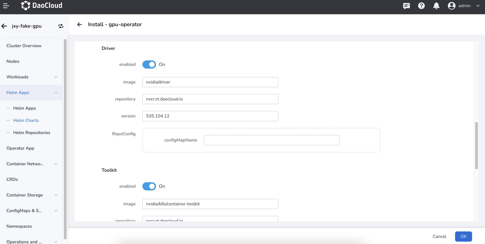
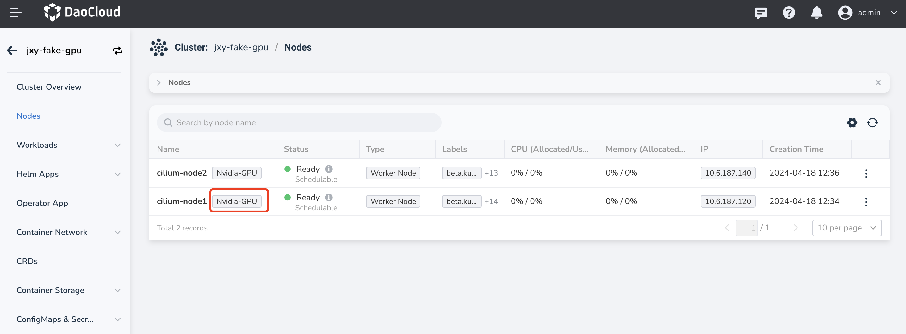
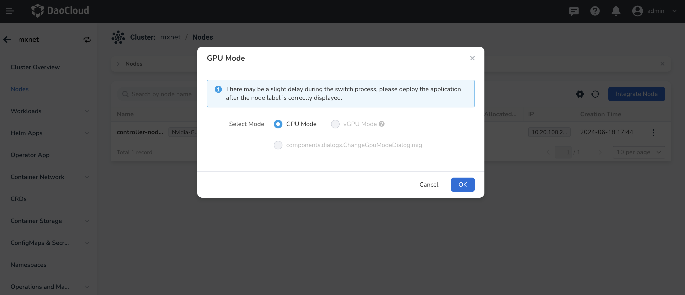

# Enabling MIG Function

This section describes how to enable NVIDIA MIG function. NVIDIA currently provides two strategies for exposing MIG devices on Kubernetes nodes:

- **Single mode** : Nodes expose a single type of MIG device on all their GPUs.
- **Mixed mode** : Nodes expose a mixture of MIG device types on all their GPUs.

For more details, refer to the [NVIDIA GPU Card Usage Modes](../index.md).

## Prerequisites

- Check the system requirements for the GPU driver installation on the target node: [GPU Support Matrix](../../gpu_matrix.md)
- Ensure that the cluster nodes have GPUs of the corresponding models
  ([NVIDIA H100](https://www.nvidia.com/en-us/data-center/h100/),
  [A100](https://www.nvidia.com/en-us/data-center/a100/),
  and [A30](https://www.nvidia.com/en-us/data-center/products/a30-gpu/) Tensor Core GPUs).
  For more information, see the [GPU Support Matrix](gpu_matrix.md).
- All GPUs on the nodes must belong to the same product line (e.g., A100-SXM-40GB).

## Install GPU Operator Addon

### Parameter Configuration

When [installing the Operator](../install_nvidia_driver_of_operator.md), you need to set the MigManager Config parameter accordingly. The default setting is **default-mig-parted-config**. You can also customize the sharding policy configuration file:



### Custom Sharding Policy

```yaml
  ## Custom GI Instance Configuration
  all-disabled:
    - devices: all
      mig-enabled: false
  all-enabled:
    - devices: all
      mig-enabled: true
      mig-devices: {}
  all-1g.10gb:
    - devices: all
      mig-enabled: true
      mig-devices:
        1g.5gb: 7
  all-1g.10gb.me:
    - devices: all
      mig-enabled: true
      mig-devices:
        1g.10gb+me: 1
  all-1g.20gb:
    - devices: all
      mig-enabled: true
      mig-devices:
        1g.20gb: 4
  all-2g.20gb:
    - devices: all
      mig-enabled: true
      mig-devices:
        2g.20gb: 3
  all-3g.40gb:
    - devices: all
      mig-enabled: true
      mig-devices:
        3g.40gb: 2
  all-4g.40gb:
    - devices: all
      mig-enabled: true
      mig-devices:
        4g.40gb: 1
  all-7g.80gb:
    - devices: all
      mig-enabled: true
      mig-devices:
        7g.80gb: 1
  all-balanced:
    - device-filter: ["0x233110DE", "0x232210DE", "0x20B210DE", "0x20B510DE", "0x20F310DE", "0x20F510DE"]
      devices: all
      mig-enabled: true
      mig-devices:
        1g.10gb: 2
        2g.20gb: 1
        3g.40gb: 1
  # After setting, CI instances will be partitioned according to the specified configuration
  custom-config:
    - devices: all
      mig-enabled: true
      mig-devices:
        3g.40gb: 2
```

In the above **YAML**, set **custom-config** to partition **CI** instances according to the specifications.

```yaml
custom-config:
  - devices: all
    mig-enabled: true
    mig-devices:
      1c.3g.40gb: 6
```

After completing the settings, you can [use GPU MIG resources](mig_usage.md) when confirming the deployment of the application.

## Switch Node GPU Mode

After successfully installing the GPU operator, the node is in full card mode by default. There will be an indicator on the node management page, as shown below:



Click the __┇__ at the right side of the node list, select a GPU mode to switch,
and then choose the proper MIG mode and sharding policy. Here, we take MIXED mode as an example:



There are two configurations here:

1. MIG Policy: Mixed and Single.
2. Sharding Policy: The policy here needs to match the key in the **default-mig-parted-config** (or user-defined sharding policy) configuration file.

After clicking **OK** button, wait for about a minute and refresh the page. The MIG mode will be switched to:

