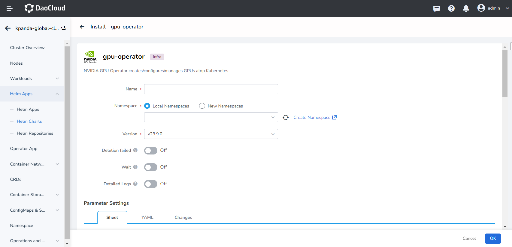
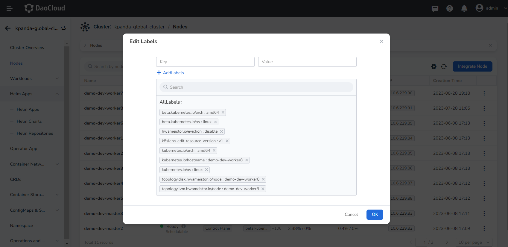
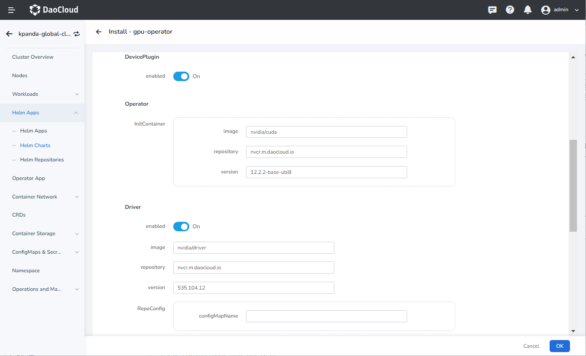
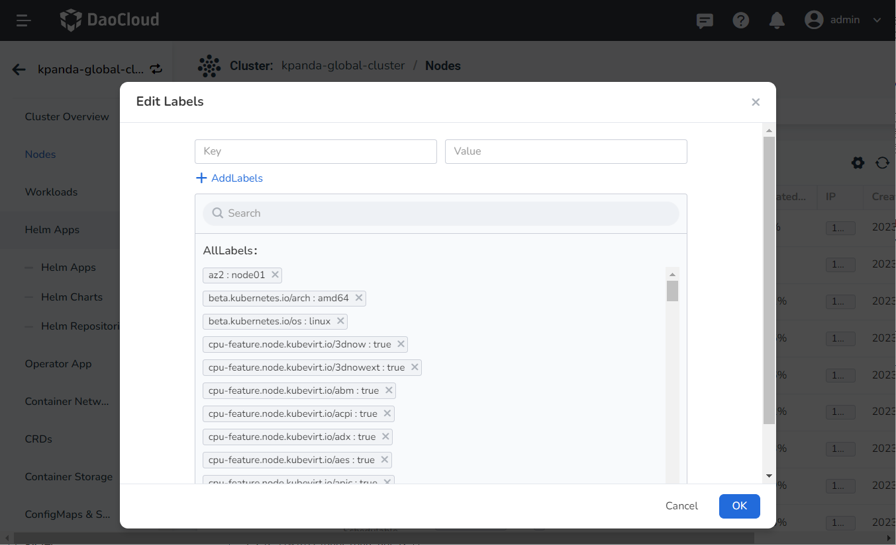

# Enabling MIG Function

This section describes how to enable NVIDIA MIG function. NVIDIA currently provides two strategies for exposing MIG devices on Kubernetes nodes:
> Tips: After the MIG mode is disabled, you need to restart the physical node in order to use the whole card mode normally.

- **Single mode** : Nodes expose a single type of MIG device on all their GPUs.
- **Mixed mode** : Nodes expose a mixture of MIG device types on all their GPUs.

For more details, refer to the [NVIDIA GPU Card Usage Modes](../index.md).

## Prerequisites

- Check the system requirements for the GPU driver installation on the target node: [GPU Support Matrix](../../gpu_matrix.md)
- Ensure that the cluster nodes have GPUs of the corresponding models
  ([NVIDIA H100](https://www.nvidia.com/en-us/data-center/h100/),
  [A100](https://www.nvidia.com/en-us/data-center/a100/),
  and [A30](https://www.nvidia.com/en-us/data-center/products/a30-gpu/) Tensor Core GPUs).
  For more information, see the [GPU Support Matrix](gpu_matrix.md).
- All GPUs on the nodes must belong to the same product line (e.g., A100-SXM-40GB).

## Enable GPU MIG single mode

1. [Enable MIG Single mode](../install_nvidia_driver_of_operator.md) through the Operator. Configure the parameters in the installation interface:

      

    - Set __DevicePlugin__ to __enable__
    - Set __MIG strategy__ to __single__
    - Enable the __enabled__ parameter under __Mig Manager__
    - Set __MigManager Config__ to the default MIG partitioning strategy __default-mig-parted-config__

    **GUI configuration** : Find the corresponding node, select __Modify Labels__ ,
    and add __nvidia.com/mig.config="all-1g.10gb"__ .

    

    **Command-line configuration** :

    ```sh
    kubectl label nodes {node} nvidia.com/mig.config="all-1g.10gb" --overwrite
    ```

3. Check the configuration result:

    ```sh
    kubectl get node 10.206.0.17 -o yaml|grep nvidia.com/mig.config
    ```

## Enable GPU MIG Mixed mode

1. [Enable MIG Mixed mode](../install_nvidia_driver_of_operator.md) through the Operator.
   Configure the parameters in the installation interface:

    

    - Set __DevicePlugin__ to __enable__
    - Set __MIG strategy__ to __mixed__
    - Enable the __enabled__ parameter under __Mig Manager__
    - Set __MigManager Config__ to the default MIG partitioning strategy __default-mig-parted-config__ ,
      or customize the partitioning strategy configuration file.

    ??? note "Click to view detailed YAML configuration instructions"

        The following YAML is an example of custom configuration __custom-mig-parted-config__ .
        The name of the file you create cannot be the same as the default __default-mig-parted-config__ .

        Create a configuration file named __custom-mig-parted-config__ and the __key__
        of the configuration data must be the same as the content in __config.yaml__ below.

        ```yaml title="config.yaml"
          ## Custom split GI instance configuration
          version: v1
          mig-configs:
            all-disabled:
              - devices: all
                mig-enabled: false

            # A100-40GB, A800-40GB
              all-1g.5gb:
                - devices: all
                  mig-enabled: true
                  mig-devices:
                    "1g.5gb": 7

            all-1g.5gb.me:
              - devices: all
                mig-enabled: true
                mig-devices:
                  "1g.5gb+me": 1

            all-2g.10gb:
              - devices: all
                mig-enabled: true
                mig-devices:
                  "2g.10gb": 3

            all-3g.20gb:
              - devices: all
                mig-enabled: true
                mig-devices:
                  "3g.20gb": 2

            all-4g.20gb:
              - devices: all
                mig-enabled: true
                mig-devices:
                  "4g.20gb": 1

            all-7g.40gb:
              - devices: all
                mig-enabled: true
                mig-devices:
                  "7g.40gb": 1

            # H100-80GB, H800-80GB, A100-80GB, A800-80GB, A100-40GB, A800-40GB
            all-1g.10gb:
              # H100-80GB, H800-80GB, A100-80GB, A800-80GB
              - device-filter: ["0x233010DE", "0x233110DE", "0x232210DE", "0x20B210DE", "0x20B510DE", "0x20F310DE", "0x20F510DE"]
                devices: all
                mig-enabled: true
                mig-devices:
                  "1g.10gb": 7

              # A100-40GB, A800-40GB
              - device-filter: ["0x20B010DE", "0x20B110DE", "0x20F110DE", "0x20F610DE"]
                devices: all
                mig-enabled: true
                mig-devices:
                  "1g.10gb": 4

            # H100-80GB, H800-80GB, A100-80GB, A800-80GB
            all-1g.10gb.me:
              - devices: all
                mig-enabled: true
                mig-devices:
                  "1g.10gb+me": 1

            # H100-80GB, H800-80GB, A100-80GB, A800-80GB
            all-1g.20gb:
              - devices: all
                mig-enabled: true
                mig-devices:
                  "1g.20gb": 4

            all-2g.20gb:
              - devices: all
                mig-enabled: true
                mig-devices:
                  "2g.20gb": 3

            all-3g.40gb:
              - devices: all
                mig-enabled: true
                mig-devices:
                  "3g.40gb": 2

            all-4g.40gb:
              - devices: all
                mig-enabled: true
                mig-devices:
                  "4g.40gb": 1

            all-7g.80gb:
              - devices: all
                mig-enabled: true
                mig-devices:
                  "7g.80gb": 1

            # A30-24GB
            all-1g.6gb:
              - devices: all
                mig-enabled: true
                mig-devices:
                  "1g.6gb": 4

            all-1g.6gb.me:
              - devices: all
                mig-enabled: true
                mig-devices:
                  "1g.6gb+me": 1

            all-2g.12gb:
              - devices: all
                mig-enabled: true
                mig-devices:
                  "2g.12gb": 2

            all-2g.12gb.me:
              - devices: all
                mig-enabled: true
                mig-devices:
                  "2g.12gb+me": 1

            all-4g.24gb:
              - devices: all
                mig-enabled: true
                mig-devices:
                  "4g.24gb": 1

            # H100 NVL, H800 NVL
            all-1g.12gb:
              - devices: all
                mig-enabled: true
                mig-devices:
                  "1g.12gb": 7

            all-1g.12gb.me:
              - devices: all
                mig-enabled: true
                mig-devices:
                  "1g.12gb+me": 1

            all-2g.24gb:
              - devices: all
                mig-enabled: true
                mig-devices:
                  "2g.24gb": 3

            all-3g.47gb:
              - devices: all
                mig-enabled: true
                mig-devices:
                  "3g.47gb": 2

            all-4g.47gb:
              - devices: all
                mig-enabled: true
                mig-devices:
                  "4g.47gb": 1

            all-7g.94gb:
              - devices: all
                mig-enabled: true
                mig-devices:
                  "7g.94gb": 1

            # H100-96GB, PG506-96GB
            all-3g.48gb:
              - devices: all
                mig-enabled: true
                mig-devices:
                  "3g.48gb": 2

            all-4g.48gb:
              - devices: all
                mig-enabled: true
                mig-devices:
                  "4g.48gb": 1

            all-7g.96gb:
              - devices: all
                mig-enabled: true
                mig-devices:
                  "7g.96gb": 1

            # H100-96GB, H100 NVL, H800 NVL, H100-80GB, H800-80GB, A800-40GB, A800-80GB, A100-40GB, A100-80GB, A30-24GB, PG506-96GB
            all-balanced:
              # H100 NVL, H800 NVL
              - device-filter: ["0x232110DE", "0x233A10DE"]
                devices: all
                mig-enabled: true
                mig-devices:
                  "1g.12gb": 1
                  "2g.24gb": 1
                  "3g.47gb": 1

              # H100-80GB, H800-80GB, A100-80GB, A800-80GB
              - device-filter: ["0x233010DE", "0x233110DE", "0x232210DE", "0x20B210DE", "0x20B510DE", "0x20F310DE", "0x20F510DE"]
                devices: all
                mig-enabled: true
                mig-devices:
                  "1g.10gb": 2
                  "2g.20gb": 1
                  "3g.40gb": 1

              # A100-40GB, A800-40GB
              - device-filter: ["0x20B010DE", "0x20B110DE", "0x20F110DE", "0x20F610DE"]
                devices: all
                mig-enabled: true
                mig-devices:
                  "1g.5gb": 2
                  "2g.10gb": 1
                  "3g.20gb": 1

              # A30-24GB
              - device-filter: "0x20B710DE"
                devices: all
                mig-enabled: true
                mig-devices:
                  "1g.6gb": 2
                  "2g.12gb": 1

              # H100-96GB, PG506-96GB
              - device-filter: ["0x233D10DE", "0x20B610DE"]
                devices: all
                mig-enabled: true
                mig-devices:
                  "1g.12gb": 2
                  "2g.24gb": 1
                  "3g.48gb": 1

           # After setting, the CI instance will be partitioned according to the set specifications 
            custom-config:    
              - devices: all
                mig-enabled: true
                mig-devices:
                  "1g.10gb": 4
                  "1g.20gb": 2

        ```

        Set __custom-config__ in the above __YAML__, and after setting, the __CI__ instance will be partitioned according to the specification.

        ```yaml
        custom-config:
             devices: all
            mig-enabled: true
            mig-devices:
              1c.3g.40gb: 6
        ```

   

2. If you need to split the instance according to custom rules, you can add the partitioning specification to the corresponding node. If this step is not performed, the default values will be used for partitioning.

    **GUI configuration** : Find the corresponding node, select __Modify Labels__ ,
    and add __nvidia.com/mig.config="custom-config"__ .
   
    

    **Command-line configuration** :

    ```sh
    kubectl label nodes {node} nvidia.com/mig.config="custom-config" --overwrite
    ```

3. Check the configuration result.

    ```sh
    kubectl get node 10.206.0.17 -o yaml|grep nvidia.com/mig.config
    ```

   ```sh
   kubectl get node 10.206.0.17 -o yaml | grep nvidia.com/mig.config
   ```

Once you have completed these steps, you can [use MIG GPU resources](mig_usage.md) when deploying your applications.
