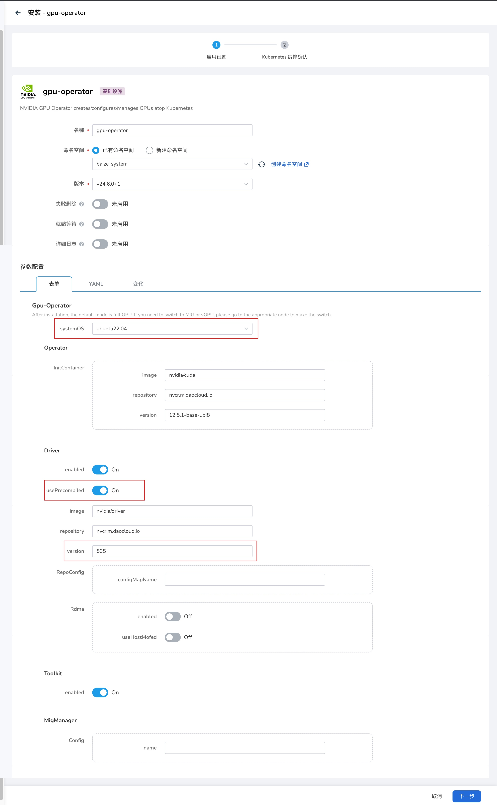

# Offline Install gpu-operator Driver on Ubuntu 22.04

Prerequisite: Installed gpu-operator v23.9.0+2 or higher versions

## Prepare Offline Image

1. Check the kernel version

    ```bash
    $ uname -r
    5.15.0-78-generic
    ```

1. Check the GPU Driver image version applicable to your kernel,
   at `https://catalog.ngc.nvidia.com/orgs/nvidia/containers/driver/tags`.
   Use the kernel to query the image version and save the image using `ctr export`.

    ```bash
    ctr i pull nvcr.io/nvidia/driver:535-5.15.0-78-generic-ubuntu22.04
    ctr i export --all-platforms driver.tar.gz nvcr.io/nvidia/driver:535-5.15.0-78-generic-ubuntu22.04 
    ```

1. Import the image into the cluster's container registry

    ```bash
    ctr i import driver.tar.gz
    ctr i tag nvcr.io/nvidia/driver:535-5.15.0-78-generic-ubuntu22.04 {your_registry}/nvcr.m.daocloud.io/nvidia/driver:535-5.15.0-78-generic-ubuntu22.04
    ctr i push {your_registry}/nvcr.m.daocloud.io/nvidia/driver:535-5.15.0-78-generic-ubuntu22.04 --skip-verify=true
    ```

## Install the Driver

1. Install the gpu-operator addon and set `driver.usePrecompiled=true`
2. Set `driver.version=535`, note that it should be 535, not 535.104.12


