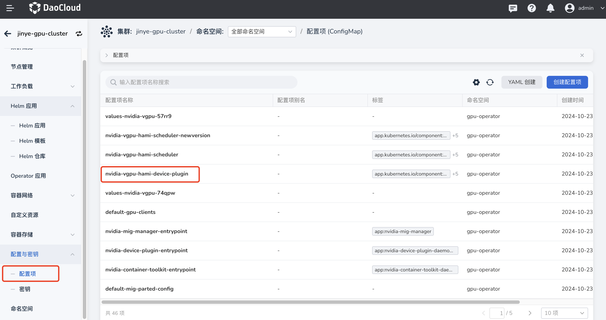

# How to Let the Cluster Manage Specified GPU Cards

This document describes how to enable the cluster to manage specified GPU cards.

## Use Cases

* When customer server resources are limited and some applications do not support container deployment mode, there is a need to balance both traditional application deployment and containerized deployment. This allows customers to have the cluster manage part of the GPU cards while reserving some GPU cards for their traditional applications.
* In fault isolation mechanisms, the device-plugin can automatically detect and isolate faulty GPU cards to ensure these faulty cards are no longer scheduled for any tasks. For some faulty GPU cards that may not be automatically detected by the device-plugin, manual selective management can be used to isolate them.

## Prerequisites

* The DCE 5.0 container management platform has been [deployed](../../../../../install/index.md) and is running normally.
* The container management module has either [connected to a Kubernetes cluster](../../../clusters/integrate-cluster.md) or [created a Kubernetes cluster](../../../clusters/create-cluster.md), and the cluster UI is accessible.
* The current cluster has installed the [GPU operator](../install_nvidia_driver_of_operator.md).
* The current cluster has installed [NVIDIA-vGPU](./vgpu_addon.md), with NVIDIA-vGPU version 2.4.0+1 or above.

## Steps

!!! note

    Only vGPU mode supports managing specified GPU cards.

1. Modify the `nvidia-vgpu-hami-device-plugin`. Go to **Cluster** -> **Config & Secrets** -> **ConfigMaps**, search for `nvidia-vgpu-hami-device-plugin`, then click the name to enter the details.

    

2. Edit the YAML to specify the UUID or index of the GPU cards to be filtered out.
   After filtering, pods will not be scheduled on these GPU cards.

    `filterdevices`: Devices to be filtered out. The filter can be one of the following:

    * `uuid`: the device UUID
    * `index`: the device index

    

3. Restart the `nvidia-vgpu-hami-device-plugin`.

    

4. Deploy workloads and check scheduling status.

    

    
