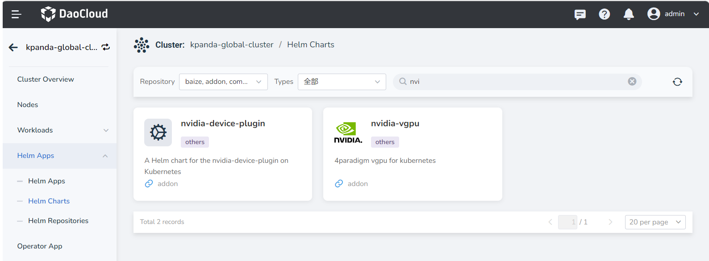
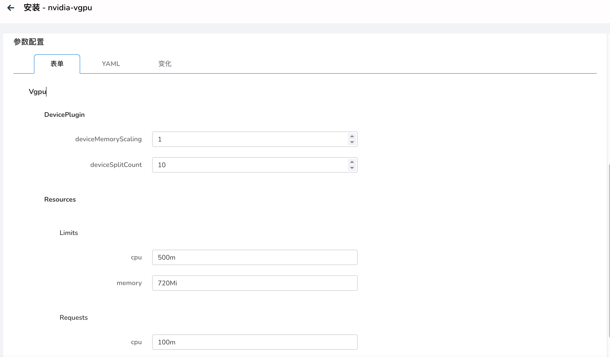

# vGPU Addon Installation

This section explains how to use vGPU capability on the DCE 5.0 platform.

## Prerequisites

- Ensure that the cluster nodes have the corresponding GPU card model
  ([NVIDIA H100](https://www.nvidia.com/en-us/data-center/h100/),
  [A100](https://www.nvidia.com/en-us/data-center/a100/),
  and [A30](https://www.nvidia.com/en-us/data-center/products/a30-gpu/) Tensor Core GPU).
- The current cluster has been deployed through an operator or manual method,
  refer to [Nvidia Driver Deployment](vgpu_driver.md)

## Procedure

1. Module path: `Container Management` -> `Cluster Management` -> Click on the target cluster -> `Helm Applications` -> `Helm Repository` -> Search for nvidia-vgpu.

    

2. During the installation of vGPU, several basic modification parameters are provided.
   If you need to modify advanced parameters, click on the YAML column to make the changes:

    - `deviceMemoryScaling`:

        Floating-point number type with a default value of 1. It represents the NVIDIA device memory
        scaling factor, which can be greater than 1 (enabling virtual memory, experimental feature).
        For an NVIDIA GPU with a memory size of M, if we configure the `devicePlugin.deviceMemoryScaling`
        parameter as S, in a Kubernetes cluster where we have deployed our device plugin,
        the vGPU allocated from this GPU will have a total memory of `S * M`.

    - `deviceSplitCount`:

        Integer type with a default value of 10. It defines the number of GPU splits, where each GPU
        cannot be assigned more tasks than its configured count. If it is configured as N, each GPU
        can have a maximum of N tasks simultaneously.

    - `Resources`:
    
        This corresponds to the resource usage of the vgpu-device-plugin and vgpu-schedule pods.

    

3. After a successful installation, the following two types of pods will appear in the
   specified `Namespace`, indicating that the Nvidia GPU plugin has been installed successfully:

    
