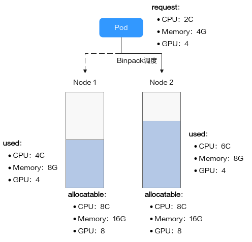

# Using Volcano Binpack Scheduling Strategy

The goal of the Binpack scheduling algorithm is to fill up already occupied nodes as much as possible (avoiding scheduling onto empty nodes). Specifically, Binpack scores candidate nodes—the higher the score, the higher the resource utilization of the node. By packing workloads tightly onto fewer nodes, this scheduling algorithm minimizes resource fragmentation within nodes and reserves sufficient space on idle machines for Pods requesting large resources, thus maximizing cluster resource utilization.

## Prerequisites

Volcano must be pre-installed on DCE 5.0. See [Volcano Installation Guide](./volcano_user_guide.md).

## Binpack Algorithm Principle

When scoring a node, Binpack calculates a weighted score based on its own weight and the weights of each resource. For example, for CPU:

```
CPU.weight * (request + used) / allocatable
```

- The higher the CPU weight, the higher the score.
- The more the node’s CPU resources are used, the higher the score.
- The same logic applies for Memory, GPU, and other resources.

Where:

- `CPU.weight` is the user-configured CPU weight
- `request` is the CPU requested by the Pod
- `used` is the CPU already allocated on the node
- `allocatable` is the total allocatable CPU on the node

The total node score for Binpack is calculated as:

```
binpack.weight - (CPU.score + Memory.score + GPU.score) / (CPU.weight + Memory.weight + GPU.weight) - 100
```

Where:

- `binpack.weight` is the user-configured weight of the Binpack plugin
- `CPU.score`, `Memory.score`, `GPU.score` are the resource scores
- `CPU.weight`, `Memory.weight`, `GPU.weight` are the configured weights for each resource



Example:

A cluster has two nodes, Node1 and Node2. When scheduling Pods, Binpack scores the nodes as follows. Assume:

- `CPU.weight = 1`
- `Memory.weight = 1`
- `GPU.weight = 2`
- `binpack.weight = 5`

1. Node1 resource scores:

    - CPU Score：
    
        CPU.weight - (request + used) / allocatable = 1 - (2 + 4) / 8 = 0.75

    - Memory Score：
    
        Memory.weight - (request + used) / allocatable = 1 - (4 + 8) / 16 = 0.75

    - GPU Score：
    
        GPU.weight - (request + used) / allocatable = 2 - (4 + 4) / 8 = 2

2. Node1 total score:  

    ```
    binpack.weight - (CPU.score + Memory.score + GPU.score) / (CPU.weight + Memory.weight + GPU.weight) - 100
    ```

    If binpack.weight is 5, Node 1 has a score as below with the Binpack policy:
    
    ```
    5 - (0.75 + 0.75 + 2) / (1 + 1 + 2) - 100 = 437.5
    ```

3. Node2 resource scores:

    - CPU Score：
   
        CPU.weight - (request + used) / allocatable = 1 - (2 + 6) / 8 = 1

    - Memory Score：
   
        Memory.weight - (request + used) / allocatable = 1 - (4 + 8) / 16 = 0.75

    - GPU Score：
   
        GPU.weight - (request + used) / allocatable = 2 - (4 + 4) / 8 = 2

4. Node2 total score:

    ```
    5 - (1 + 0.75 + 2) / (1 + 1 + 2) - 100 = 468.75
    ```

Since Node2’s score is higher than Node1’s, the Pod will be scheduled on Node2 according to the Binpack strategy.

## Usage Example

The Binpack scheduling plugin is enabled by default when Volcano is installed. If weights are not configured by the user, the following defaults are used:

```yaml
- plugins:
    - name: binpack
      arguments:
        binpack.weight: 1
        binpack.cpu: 1
        binpack.memory: 1
```

Since the default weight cannot reflect stacking characteristics, it’s recommended to modify it to `binpack.weight: 10`.

Edit the Volcano scheduler configmap:

```shell
kubectl -n volcano-system edit configmaps volcano-scheduler-configmap
```

Modify the config:

```yaml
- plugins:
    - name: binpack
      arguments:
        binpack.weight: 10
        binpack.cpu: 1
        binpack.memory: 1
        binpack.resources: nvidia.com/gpu, example.com/foo
        binpack.resources.nvidia.com/gpu: 2
        binpack.resources.example.com/foo: 3
```

After editing, restart the `volcano-scheduler` Pod to apply changes.

Create the following Deployment:

```yaml
apiVersion: apps/v1
kind: Deployment
metadata:
  name: binpack-test
  labels:
    app: binpack-test
spec:
  replicas: 2
  selector:
    matchLabels:
      app: test
  template:
    metadata:
      labels:
        app: test
    spec:
      schedulerName: volcano
      containers:
        - name: test
          image: busybox
          imagePullPolicy: IfNotPresent
          command: ["sh", "-c", 'echo "Hello, Kubernetes!" && sleep 3600']
          resources:
            requests:
              cpu: 500m
            limits:
              cpu: 500m
```

On a cluster with two nodes, the Pods will be scheduled onto a single node.


