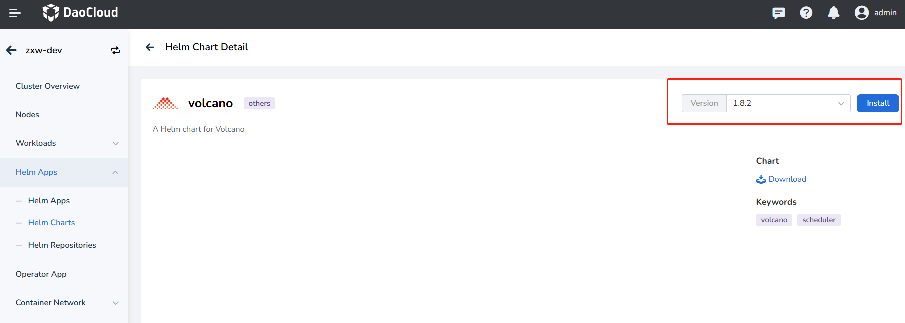
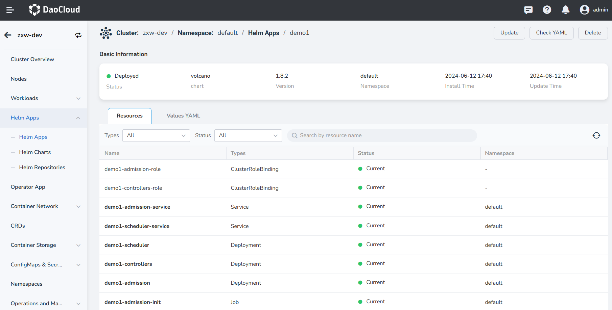

# Use Volcano for AI Compute

## Usage Scenarios

Kubernetes has become the de facto standard for orchestrating and managing cloud-native applications,
and an increasing number of applications are choosing to migrate to K8s. The fields of artificial intelligence
and machine learning inherently involve a large number of compute-intensive tasks, and developers are very willing
to build AI platforms based on Kubernetes to fully leverage its resource management, application orchestration,
and operations monitoring capabilities. However, the default Kubernetes scheduler was initially designed
primarily for long-running services and has many shortcomings in batch and elastic scheduling for AI and
big data tasks. For example, resource contention issues:

Take TensorFlow job scenarios as an example. TensorFlow jobs include two different roles, PS and Worker,
and the Pods for these two roles need to work together to complete the entire job. If only one type of
role Pod is running, the entire job cannot be executed properly. The default scheduler schedules Pods
one by one and is unaware of the PS and Worker roles in a Kubeflow TFJob. In a high-load cluster
(insufficient resources), multiple jobs may each be allocated some resources to run a portion of
their Pods, but the jobs cannot complete successfully, leading to resource waste. For instance,
if a cluster has 4 GPU cards and both TFJob1 and TFJob2 each have 4 Workers, TFJob1 and TFJob2
might each be allocated 2 GPUs. However, both TFJob1 and TFJob2 require 4 GPUs to run.
This mutual waiting for resource release creates a deadlock situation, resulting in GPU resource waste.

## Volcano Batch Scheduling System

Volcano is the first Kubernetes-based container batch computing platform under CNCF, focusing on
high-performance computing scenarios. It fills in the missing functionalities of Kubernetes
in fields such as machine learning, big data, and scientific computing, providing essential
support for these high-performance workloads. Additionally, Volcano seamlessly integrates
with mainstream computing frameworks like Spark, TensorFlow, and PyTorch, and supports
hybrid scheduling of heterogeneous devices, including CPUs and GPUs, effectively resolving
the deadlock issues mentioned above.

The following sections will introduce how to install and use Volcano.

## Install Volcano

1. Find Volcano in **Cluster Details** -> **Helm Apps** -> **Helm Charts** and install it.

    
   
    

2. Check and confirm whether Volcano is installed successfully, that is, whether the components volcano-admission, 
   volcano-controllers, and volcano-scheduler are running properly.

    

Typically, Volcano is used in conjunction with the [Intelligent Engine](../../../../baize/intro/index.md)
to achieve an effective closed-loop process for the development and training of datasets, Notebooks, and task training.

## Volcano Use Cases

- Volcano is a standalone scheduler. To enable the Volcano scheduler when creating workloads,
  simply specify the scheduler's name (`schedulerName: volcano`).
- The `volcanoJob` resource is an extension of the Job in Volcano,
  breaking the Job down into smaller working units called tasks, which can interact with each other.

### Volcano Supports TensorFlow

Here is an example:

```yaml
apiVersion: batch.volcano.sh/v1alpha1
kind: Job
metadata:
  name: tensorflow-benchmark
  labels:
    "volcano.sh/job-type": "Tensorflow"
spec:
  minAvailable: 3
  schedulerName: volcano
  plugins:
    env: []
    svc: []
  policies:
    - event: PodEvicted
      action: RestartJob
  tasks:
    - replicas: 1
      name: ps
      template:
        spec:
          imagePullSecrets:
            - name: default-secret
          containers:
            - command:
                - sh
                - -c
                - |
                  PS_HOST=`cat /etc/volcano/ps.host | sed 's/$/&:2222/g' | tr "\n" ","`;
                  WORKER_HOST=`cat /etc/volcano/worker.host | sed 's/$/&:2222/g' | tr "\n" ","`;
                  python tf_cnn_benchmarks.py --batch_size=32 --model=resnet50 --variable_update=parameter_server --flush_stdout=true --num_gpus=1 --local_parameter_device=cpu --device=cpu --data_format=NHWC --job_name=ps --task_index=${VK_TASK_INDEX} --ps_hosts=${PS_HOST} --worker_hosts=${WORKER_HOST}
              image: docker.m.daocloud.io/volcanosh/example-tf:0.0.1
              name: tensorflow
              ports:
                - containerPort: 2222
                  name: tfjob-port
              resources:
                requests:
                  cpu: "1000m"
                  memory: "2048Mi"
                limits:
                  cpu: "1000m"
                  memory: "2048Mi"
              workingDir: /opt/tf-benchmarks/scripts/tf_cnn_benchmarks
          restartPolicy: OnFailure
    - replicas: 2
      name: worker
      policies:
        - event: TaskCompleted
          action: CompleteJob
      template:
        spec:
          imagePullSecrets:
            - name: default-secret
          containers:
            - command:
                - sh
                - -c
                - |
                  PS_HOST=`cat /etc/volcano/ps.host | sed 's/$/&:2222/g' | tr "\n" ","`;
                  WORKER_HOST=`cat /etc/volcano/worker.host | sed 's/$/&:2222/g' | tr "\n" ","`;
                  python tf_cnn_benchmarks.py --batch_size=32 --model=resnet50 --variable_update=parameter_server --flush_stdout=true --num_gpus=1 --local_parameter_device=cpu --device=cpu --data_format=NHWC --job_name=worker --task_index=${VK_TASK_INDEX} --ps_hosts=${PS_HOST} --worker_hosts=${WORKER_HOST}
              image: docker.m.daocloud.io/volcanosh/example-tf:0.0.1
              name: tensorflow
              ports:
                - containerPort: 2222
                  name: tfjob-port
              resources:
                requests:
                  cpu: "2000m"
                  memory: "2048Mi"
                limits:
                  cpu: "2000m"
                  memory: "4096Mi"
              workingDir: /opt/tf-benchmarks/scripts/tf_cnn_benchmarks
          restartPolicy: OnFailure
```

### Parallel Computing with MPI

In multi-threaded parallel computing communication scenarios under the MPI computing framework,
we need to ensure that all Pods are successfully scheduled to guarantee the task's proper completion.
Setting `minAvailable` to 4 indicates that 1 `mpimaster` and 3 `mpiworkers` are required to run.
By simply setting the `schedulerName` field value to "volcano," you can enable the Volcano scheduler.

Here is an example:

```yaml
apiVersion: batch.volcano.sh/v1alpha1
kind: Job
metadata:
  name: lm-mpi-job
  labels:
    "volcano.sh/job-type": "MPI"
spec:
  minAvailable: 4
  schedulerName: volcano
  plugins:
    ssh: []
    svc: []
  policies:
    - event: PodEvicted
      action: RestartJob
  tasks:
    - replicas: 1
      name: mpimaster
      policies:
        - event: TaskCompleted
          action: CompleteJob
      template:
        spec:
          containers:
            - command:
                - /bin/sh
                - -c
                - |
                  MPI_HOST=`cat /etc/volcano/mpiworker.host | tr "\n" ","`;
                  mkdir -p /var/run/sshd; /usr/sbin/sshd;
                  mpiexec --allow-run-as-root --host ${MPI_HOST} -np 3 mpi_hello_world;
              image: docker.m.daocloud.io/volcanosh/example-mpi:0.0.1
              name: mpimaster
              ports:
                - containerPort: 22
                  name: mpijob-port
              workingDir: /home
              resources:
                requests:
                  cpu: "500m"
                limits:
                  cpu: "500m"
          restartPolicy: OnFailure
          imagePullSecrets:
            - name: default-secret
    - replicas: 3
      name: mpiworker
      template:
        spec:
          containers:
            - command:
                - /bin/sh
                - -c
                - |
                  mkdir -p /var/run/sshd; /usr/sbin/sshd -D;
              image: docker.m.daocloud.io/volcanosh/example-mpi:0.0.1
              name: mpiworker
              ports:
                - containerPort: 22
                  name: mpijob-port
              workingDir: /home
              resources:
                requests:
                  cpu: "1000m"
                limits:
                  cpu: "1000m"
          restartPolicy: OnFailure
          imagePullSecrets:
            - name: default-secret
```

Resources to generate PodGroup:

```yaml
apiVersion: scheduling.volcano.sh/v1beta1
kind: PodGroup
metadata:
  annotations:
  creationTimestamp: "2024-05-28T09:18:50Z"
  generation: 5
  labels:
    volcano.sh/job-type: MPI
  name: lm-mpi-job-9c571015-37c7-4a1a-9604-eaa2248613f2
  namespace: default
  ownerReferences:
  - apiVersion: batch.volcano.sh/v1alpha1
    blockOwnerDeletion: true
    controller: true
    kind: Job
    name: lm-mpi-job
    uid: 9c571015-37c7-4a1a-9604-eaa2248613f2
  resourceVersion: "25173454"
  uid: 7b04632e-7cff-4884-8e9a-035b7649d33b
spec:
  minMember: 4
  minResources:
    count/pods: "4"
    cpu: 3500m
    limits.cpu: 3500m
    pods: "4"
    requests.cpu: 3500m
  minTaskMember:
    mpimaster: 1
    mpiworker: 3
  queue: default
status:
  conditions:
  - lastTransitionTime: "2024-05-28T09:19:01Z"
    message: '3/4 tasks in gang unschedulable: pod group is not ready, 1 Succeeded,
      3 Releasing, 4 minAvailable'
    reason: NotEnoughResources
    status: "True"
    transitionID: f875efa5-0358-4363-9300-06cebc0e7466
    type: Unschedulable
  - lastTransitionTime: "2024-05-28T09:18:53Z"
    reason: tasks in gang are ready to be scheduled
    status: "True"
    transitionID: 5a7708c8-7d42-4c33-9d97-0581f7c06dab
    type: Scheduled
  phase: Pending
  succeeded: 1
```

From the PodGroup, it can be seen that it is associated with the workload through
`ownerReferences` and sets the minimum number of running Pods to 4.

If you want to learn more about the features and usage scenarios of Volcano,
refer to [Volcano Introduction](https://volcano.sh/en/docs/).
